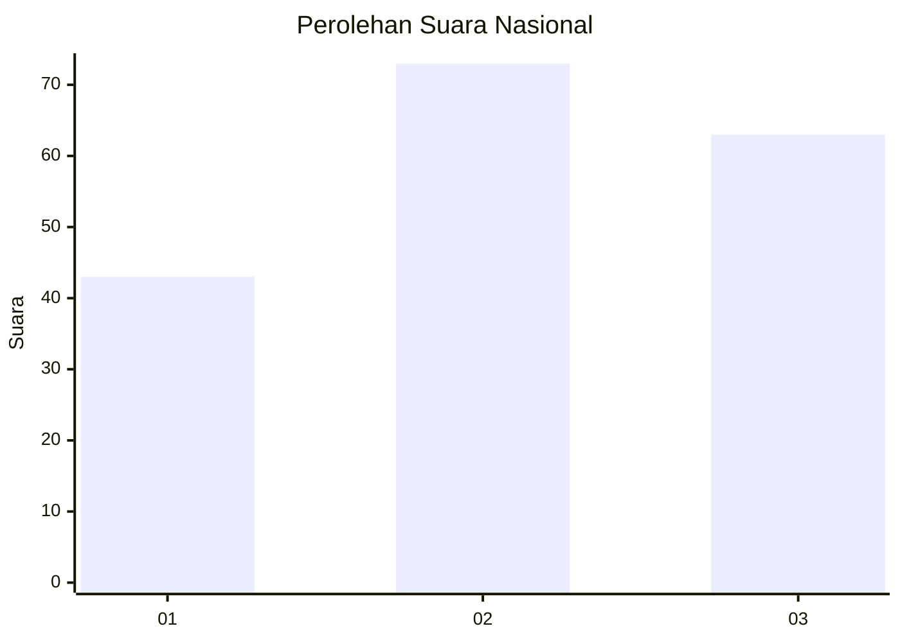
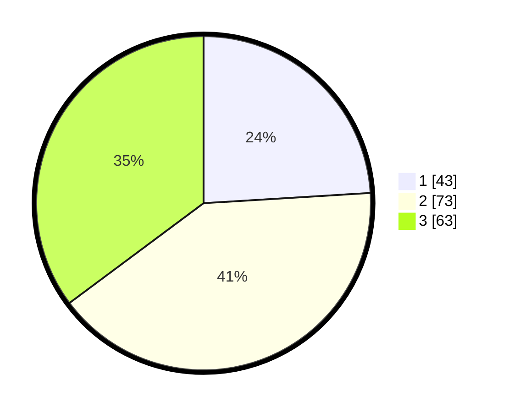

# Hasil

## Grafik

## Tabel

| No. | Nama Paslon    | Suara | Suara (raw) | Persentase |
|:--- |:-------------- | -----:| -----------:| ----------:|
| 1   | ANIES MUHAIMIN | 43    | [43][p-1]   | 24,02      |
| 2   | PRABOWO GIBRAN | 73    | [73][p-2]   | 40,78      |
| 3   | GANJAR MAHFUD  | 63    | [63][p-3]   | 35,20      |

[p-1]: https://github.com/gigit-pemilu/pemilu-2024/blob/main/pilpres/hitung-suara/sub/34-di-yogyakarta/sub/03-gunungkidul/sub/14-gedangsari/sub/2004-sampang/sub/005-tps/sub/paslon-1.txt
[p-2]: https://github.com/gigit-pemilu/pemilu-2024/blob/main/pilpres/hitung-suara/sub/34-di-yogyakarta/sub/03-gunungkidul/sub/14-gedangsari/sub/2004-sampang/sub/005-tps/sub/paslon-2.txt
[p-3]: https://github.com/gigit-pemilu/pemilu-2024/blob/main/pilpres/hitung-suara/sub/34-di-yogyakarta/sub/03-gunungkidul/sub/14-gedangsari/sub/2004-sampang/sub/005-tps/sub/paslon-3.txt

## Foto C Plano

https://sirekap-obj-formc.kpu.go.id/20cf/pemilu/ppwp/34/03/14/20/04/3403142004005-20240214-231737--199f795e-d427-43a8-9402-87db7b0ce7df.jpg

https://sirekap-obj-formc.kpu.go.id/20cf/pemilu/ppwp/34/03/14/20/04/3403142004005-20240214-231743--85a52bb0-4139-4fe9-8760-fb07be04f248.jpg

## Metadata

| Key        | Value               |
| ---------- | ------------------- |
| Time Stamp | 2024-02-24 22:31:28 |

