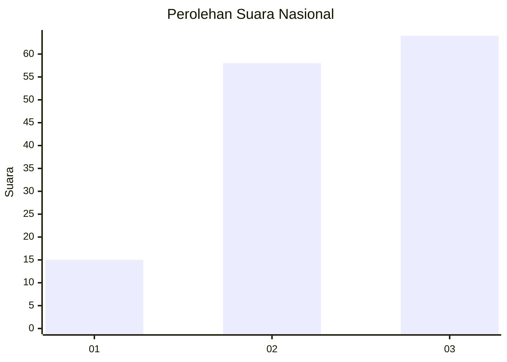
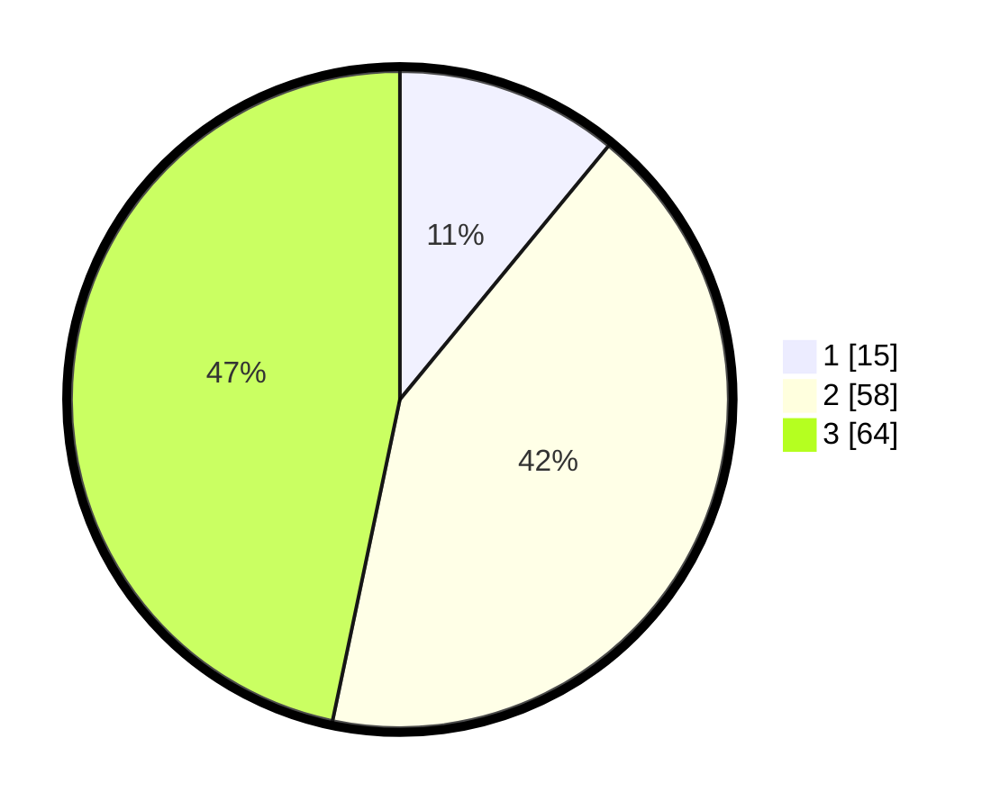

# Hasil

## Grafik

## Tabel

| No. | Nama Paslon    | Suara | Suara (raw) | Persentase |
|:--- |:-------------- | -----:| -----------:| ----------:|
| 1   | ANIES MUHAIMIN | 15    | [15][p-1]   | 10,95      |
| 2   | PRABOWO GIBRAN | 58    | [58][p-2]   | 42,34      |
| 3   | GANJAR MAHFUD  | 64    | [64][p-3]   | 46,72      |

[p-1]: https://github.com/gigit-pemilu/pemilu-2024/blob/main/pilpres/hitung-suara/sub/34-di-yogyakarta/sub/03-gunungkidul/sub/14-gedangsari/sub/2004-sampang/sub/009-tps/sub/paslon-1.txt
[p-2]: https://github.com/gigit-pemilu/pemilu-2024/blob/main/pilpres/hitung-suara/sub/34-di-yogyakarta/sub/03-gunungkidul/sub/14-gedangsari/sub/2004-sampang/sub/009-tps/sub/paslon-2.txt
[p-3]: https://github.com/gigit-pemilu/pemilu-2024/blob/main/pilpres/hitung-suara/sub/34-di-yogyakarta/sub/03-gunungkidul/sub/14-gedangsari/sub/2004-sampang/sub/009-tps/sub/paslon-3.txt

## Foto C Plano

https://sirekap-obj-formc.kpu.go.id/157b/pemilu/ppwp/34/03/14/20/04/3403142004009-20240214-215543--a073e815-97fd-439d-81c8-c78668f968b1.jpg

https://sirekap-obj-formc.kpu.go.id/157b/pemilu/ppwp/34/03/14/20/04/3403142004009-20240214-215753--44fa6b8f-8e47-4f3a-ab67-650dd20e0608.jpg

https://sirekap-obj-formc.kpu.go.id/157b/pemilu/ppwp/34/03/14/20/04/3403142004009-20240215-005351--375bd51b-a2e1-49e6-be28-41163484dcf1.jpg

## Metadata

| Key        | Value               |
| ---------- | ------------------- |
| Time Stamp | 2024-02-17 19:30:00 |

