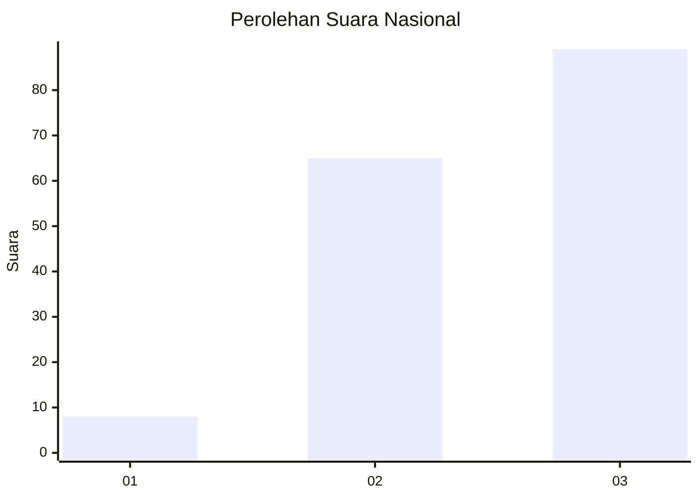
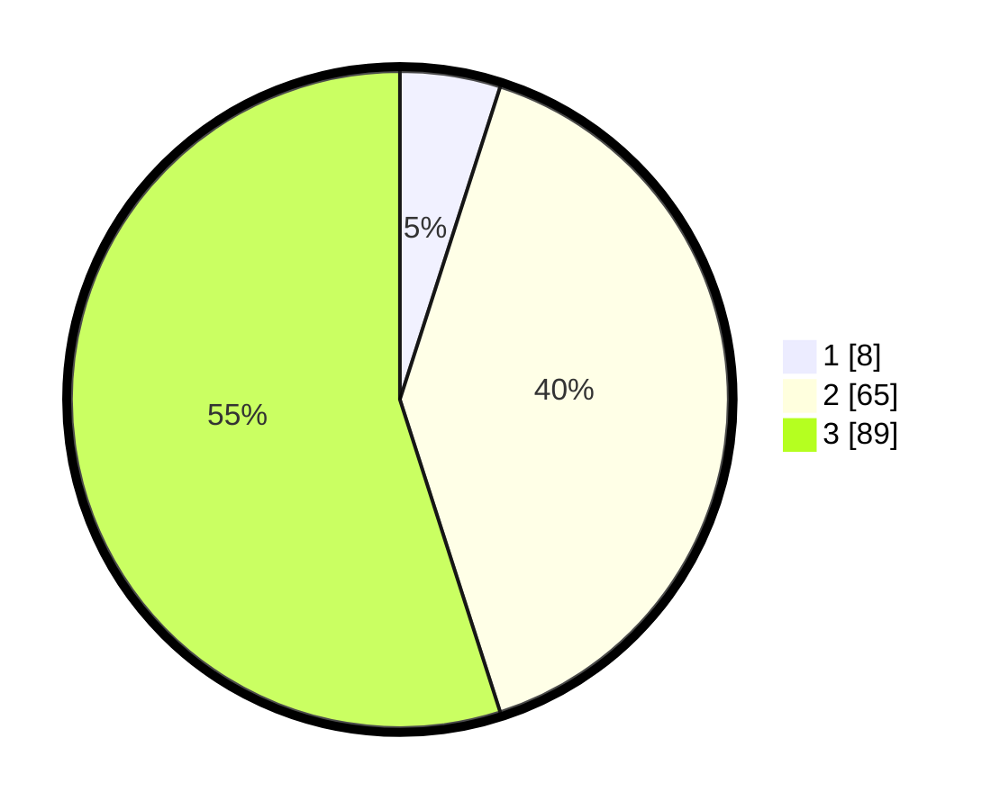

# Hasil

## Grafik

## Tabel

| No. | Nama Paslon    | Suara | Suara (raw) | Persentase |
|:--- |:-------------- | -----:| -----------:| ----------:|
| 1   | ANIES MUHAIMIN | 8     | [8][p-1]    | 4,94       |
| 2   | PRABOWO GIBRAN | 65    | [65][p-2]   | 40,12      |
| 3   | GANJAR MAHFUD  | 89    | [89][p-3]   | 54,94      |

[p-1]: https://github.com/gigit-pemilu/pemilu-2024/blob/main/pilpres/hitung-suara/sub/34-di-yogyakarta/sub/03-gunungkidul/sub/14-gedangsari/sub/2004-sampang/sub/012-tps/sub/paslon-1.txt
[p-2]: https://github.com/gigit-pemilu/pemilu-2024/blob/main/pilpres/hitung-suara/sub/34-di-yogyakarta/sub/03-gunungkidul/sub/14-gedangsari/sub/2004-sampang/sub/012-tps/sub/paslon-2.txt
[p-3]: https://github.com/gigit-pemilu/pemilu-2024/blob/main/pilpres/hitung-suara/sub/34-di-yogyakarta/sub/03-gunungkidul/sub/14-gedangsari/sub/2004-sampang/sub/012-tps/sub/paslon-3.txt

## Foto C Plano

https://sirekap-obj-formc.kpu.go.id/e23c/pemilu/ppwp/34/03/14/20/04/3403142004012-20240214-214305--8d9df372-935b-4126-ac7b-2dca172cf81e.jpg

https://sirekap-obj-formc.kpu.go.id/e23c/pemilu/ppwp/34/03/14/20/04/3403142004012-20240214-214328--edd23367-1af6-454c-8c5c-c6a296528346.jpg

https://sirekap-obj-formc.kpu.go.id/e23c/pemilu/ppwp/34/03/14/20/04/3403142004012-20240214-214338--52c1acb7-e434-4f28-9792-c21b0759c3b4.jpg

## Metadata

| Key        | Value               |
| ---------- | ------------------- |
| Time Stamp | 2024-02-17 19:30:00 |

