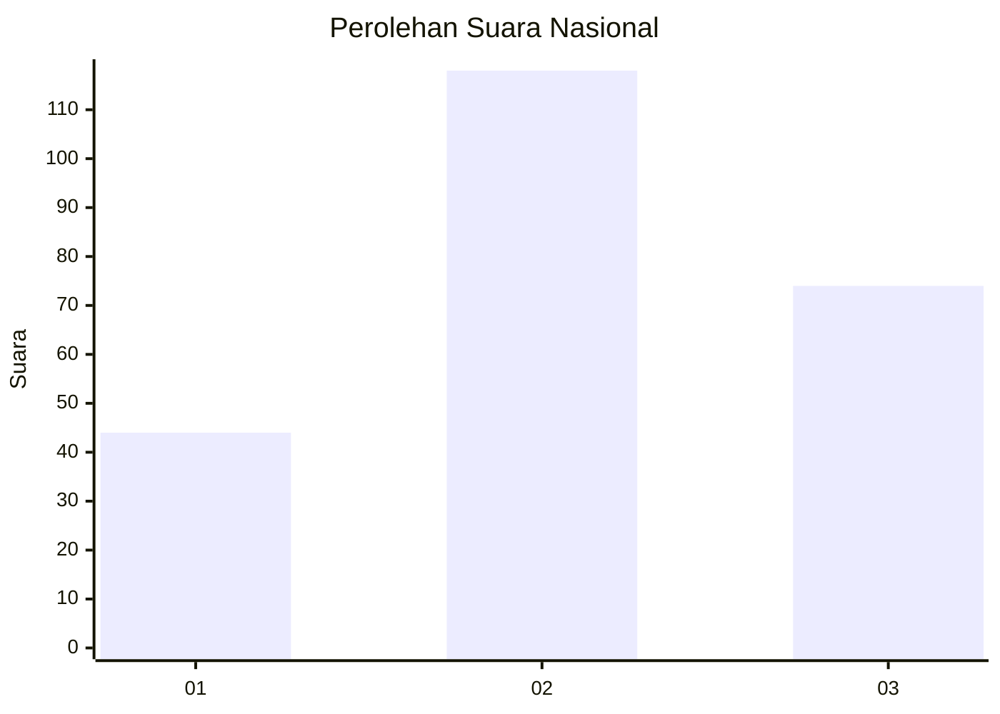
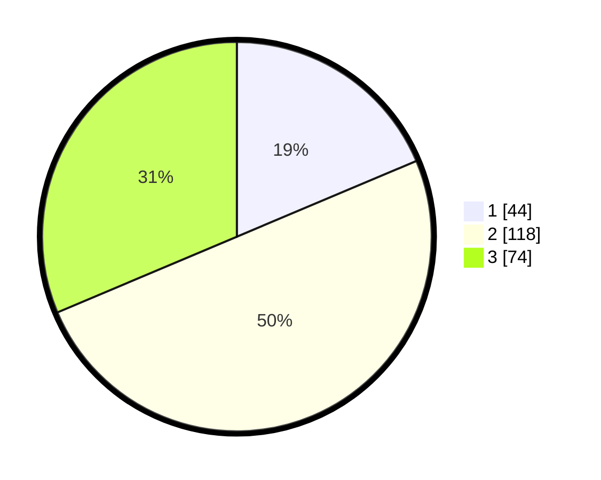

# Hasil

## Grafik

## Tabel

| No. | Nama Paslon    | Suara | Suara (raw) | Persentase |
|:--- |:-------------- | -----:| -----------:| ----------:|
| 1   | ANIES MUHAIMIN | 44    | [44][p-1]   | 18,64      |
| 2   | PRABOWO GIBRAN | 118   | [118][p-2]  | 50,00      |
| 3   | GANJAR MAHFUD  | 74    | [74][p-3]   | 31,36      |

[p-1]: https://github.com/gigit-pemilu/pemilu-2024/blob/main/pilpres/hitung-suara/sub/34-di-yogyakarta/sub/03-gunungkidul/sub/14-gedangsari/sub/2005-serut/sub/001-tps/sub/paslon-1.txt
[p-2]: https://github.com/gigit-pemilu/pemilu-2024/blob/main/pilpres/hitung-suara/sub/34-di-yogyakarta/sub/03-gunungkidul/sub/14-gedangsari/sub/2005-serut/sub/001-tps/sub/paslon-2.txt
[p-3]: https://github.com/gigit-pemilu/pemilu-2024/blob/main/pilpres/hitung-suara/sub/34-di-yogyakarta/sub/03-gunungkidul/sub/14-gedangsari/sub/2005-serut/sub/001-tps/sub/paslon-3.txt

## Foto C Plano

https://sirekap-obj-formc.kpu.go.id/066f/pemilu/ppwp/34/03/14/20/05/3403142005001-20240214-220245--8d80ec7d-f6e7-48a8-84c2-3354d930e9b0.jpg

https://sirekap-obj-formc.kpu.go.id/066f/pemilu/ppwp/34/03/14/20/05/3403142005001-20240214-215508--f55cce1f-ab47-4475-97d6-91fd85ab9e9b.jpg

https://sirekap-obj-formc.kpu.go.id/066f/pemilu/ppwp/34/03/14/20/05/3403142005001-20240214-215613--0966b3c2-bc4d-456f-9aa5-5f43127c7b62.jpg

## Metadata

| Key        | Value               |
| ---------- | ------------------- |
| Time Stamp | 2024-02-17 19:30:00 |

