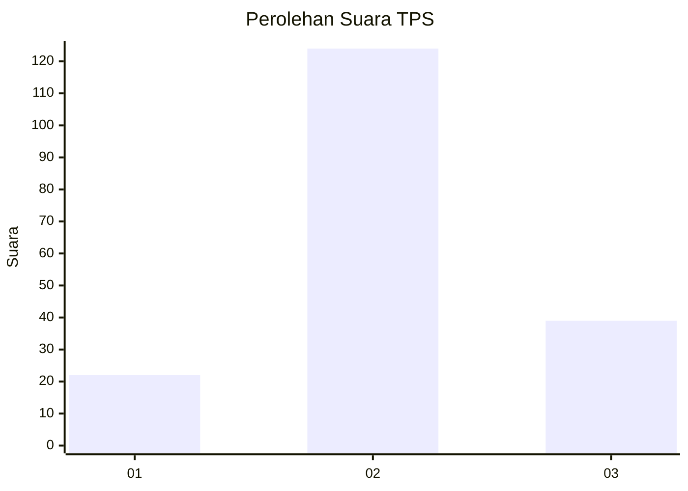
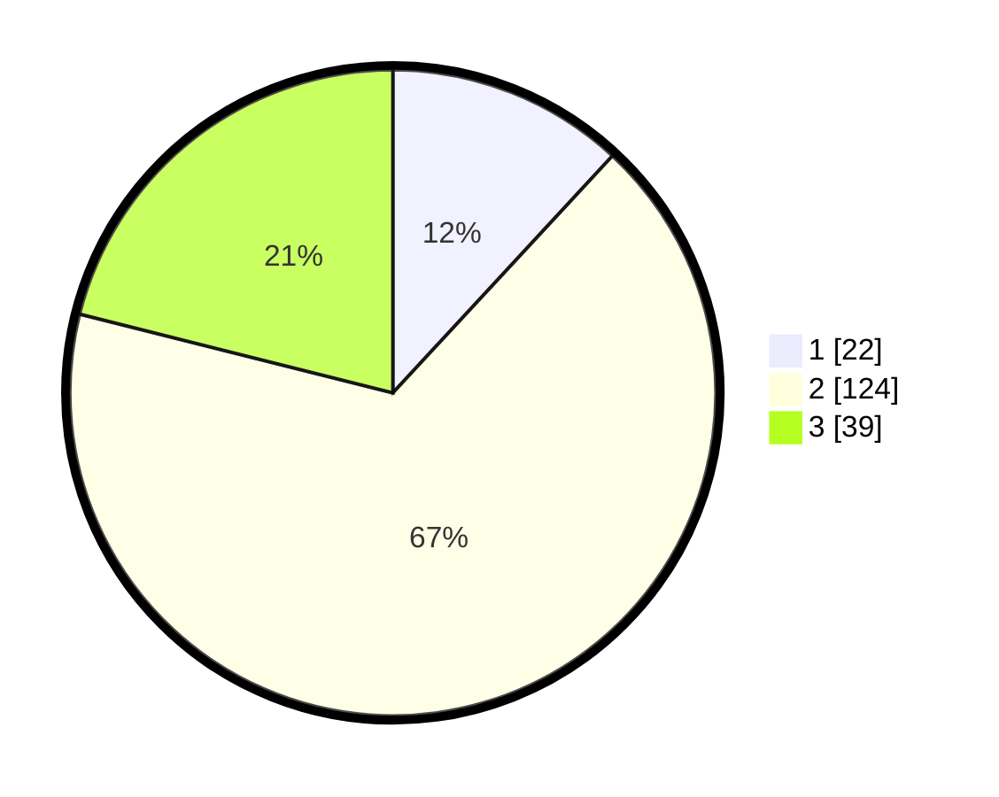

# Hasil

## Grafik

## Tabel

| No. | Nama Paslon    | Suara | Suara (raw) | Persentase |
|:--- |:-------------- | -----:| -----------:| ----------:|
| 1   | ANIES MUHAIMIN | 22    | [22][p-1]   | 11,89      |
| 2   | PRABOWO GIBRAN | 124   | [124][p-2]  | 67,03      |
| 3   | GANJAR MAHFUD  | 39    | [39][p-3]   | 21,08      |

[p-1]: https://github.com/gigit-pemilu/pemilu-2024-34-di-yogyakarta/blob/main/pilpres/hitung-suara/sub/34-di-yogyakarta/sub/03-gunungkidul/sub/14-gedangsari/sub/2005-serut/sub/007-tps/sub/paslon-1.txt
[p-2]: https://github.com/gigit-pemilu/pemilu-2024-34-di-yogyakarta/blob/main/pilpres/hitung-suara/sub/34-di-yogyakarta/sub/03-gunungkidul/sub/14-gedangsari/sub/2005-serut/sub/007-tps/sub/paslon-2.txt
[p-3]: https://github.com/gigit-pemilu/pemilu-2024-34-di-yogyakarta/blob/main/pilpres/hitung-suara/sub/34-di-yogyakarta/sub/03-gunungkidul/sub/14-gedangsari/sub/2005-serut/sub/007-tps/sub/paslon-3.txt

## Foto C Plano

https://sirekap-obj-formc.kpu.go.id/fc37/pemilu/ppwp/34/03/14/20/05/3403142005007-20240215-002853--1ccfe27d-552d-42b1-8818-a66cd56f4905.jpg

https://sirekap-obj-formc.kpu.go.id/fc37/pemilu/ppwp/34/03/14/20/05/3403142005007-20240215-003417--5b07ca25-257b-4206-be93-96ab227f5738.jpg

https://sirekap-obj-formc.kpu.go.id/fc37/pemilu/ppwp/34/03/14/20/05/3403142005007-20240215-003726--479cc8fc-2605-4950-a6ca-87f0fe975098.jpg

## Metadata

| Key        | Value               |
| ---------- | ------------------- |
| Time Stamp | 2024-02-24 22:31:28 |

