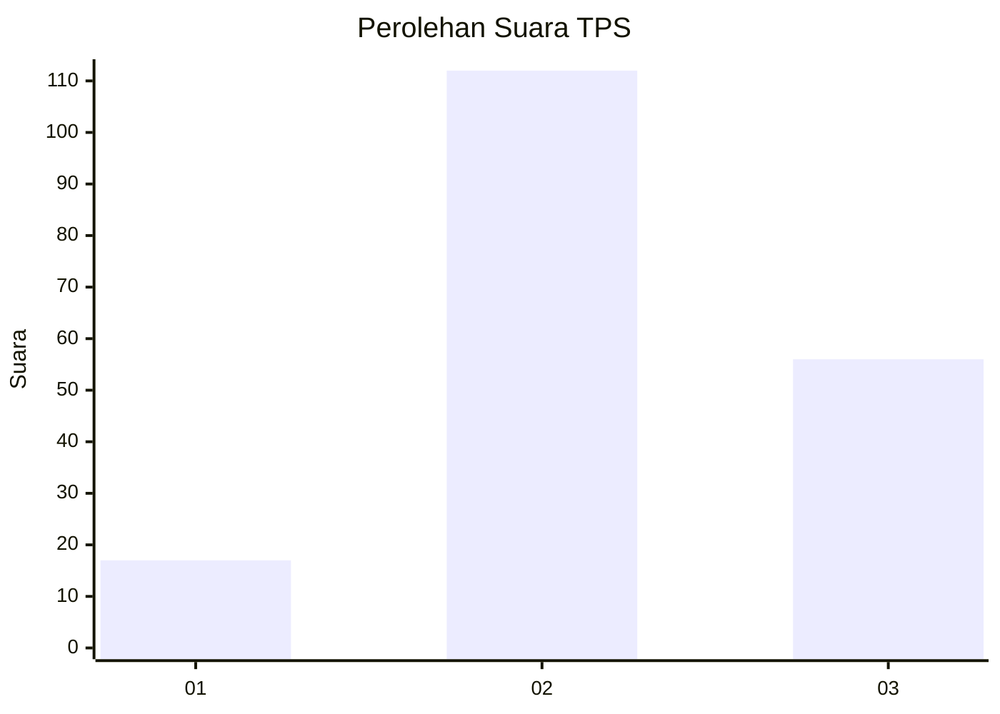
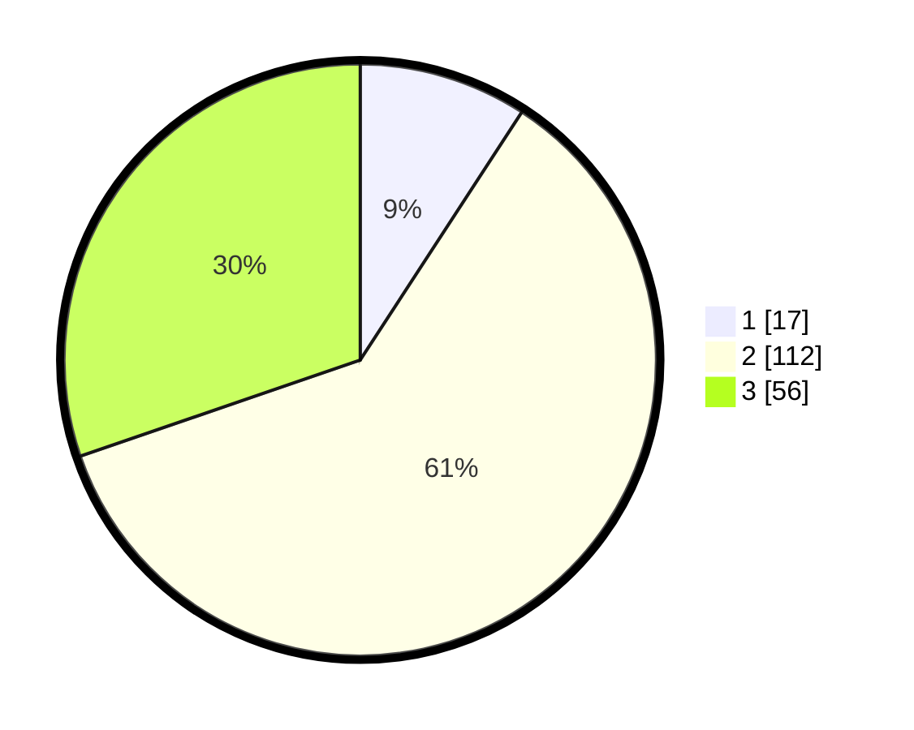

# Hasil

## Grafik

## Tabel

| No. | Nama Paslon    | Suara | Suara (raw) | Persentase |
|:--- |:-------------- | -----:| -----------:| ----------:|
| 1   | ANIES MUHAIMIN | 17    | [17][p-1]   | 9,19       |
| 2   | PRABOWO GIBRAN | 112   | [112][p-2]  | 60,54      |
| 3   | GANJAR MAHFUD  | 56    | [56][p-3]   | 30,27      |

[p-1]: https://github.com/gigit-pemilu/pemilu-2024-34-di-yogyakarta/blob/main/pilpres/hitung-suara/sub/34-di-yogyakarta/sub/03-gunungkidul/sub/14-gedangsari/sub/2005-serut/sub/015-tps/sub/paslon-1.txt
[p-2]: https://github.com/gigit-pemilu/pemilu-2024-34-di-yogyakarta/blob/main/pilpres/hitung-suara/sub/34-di-yogyakarta/sub/03-gunungkidul/sub/14-gedangsari/sub/2005-serut/sub/015-tps/sub/paslon-2.txt
[p-3]: https://github.com/gigit-pemilu/pemilu-2024-34-di-yogyakarta/blob/main/pilpres/hitung-suara/sub/34-di-yogyakarta/sub/03-gunungkidul/sub/14-gedangsari/sub/2005-serut/sub/015-tps/sub/paslon-3.txt

## Foto C Plano

https://sirekap-obj-formc.kpu.go.id/8330/pemilu/ppwp/34/03/14/20/05/3403142005015-20240214-235824--4276d7a9-a25e-4f91-b35f-831955a2f9f4.jpg

https://sirekap-obj-formc.kpu.go.id/8330/pemilu/ppwp/34/03/14/20/05/3403142005015-20240214-211435--f9236fda-e9fc-4857-a85e-2cd422d109a3.jpg

https://sirekap-obj-formc.kpu.go.id/8330/pemilu/ppwp/34/03/14/20/05/3403142005015-20240214-234910--52e127c3-a75f-4567-bf41-0751ad279edf.jpg

## Metadata

| Key        | Value               |
| ---------- | ------------------- |
| Time Stamp | 2024-02-15 15:00:29 |

