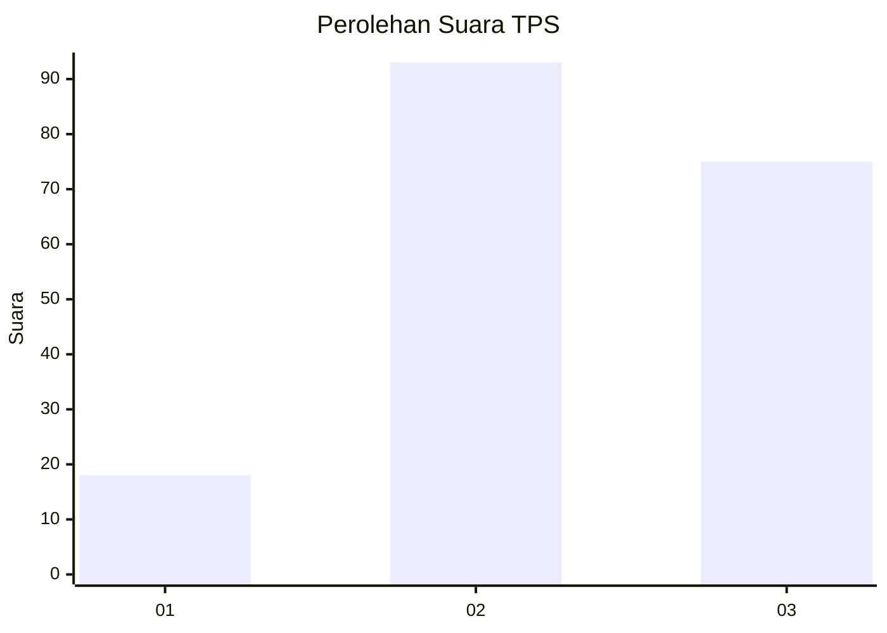
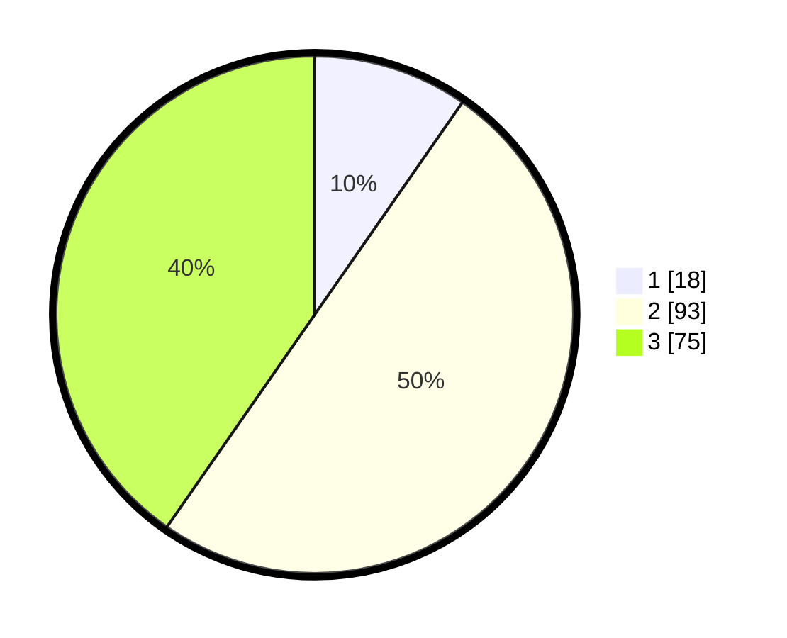

# Hasil

## Grafik

## Tabel

| No. | Nama Paslon    | Suara | Suara (raw) | Persentase |
|:--- |:-------------- | -----:| -----------:| ----------:|
| 1   | ANIES MUHAIMIN | 18    | [18][p-1]   | 9,68       |
| 2   | PRABOWO GIBRAN | 93    | [93][p-2]   | 50,00      |
| 3   | GANJAR MAHFUD  | 75    | [75][p-3]   | 40,32      |

[p-1]: https://github.com/gigit-pemilu/pemilu-2024-34-di-yogyakarta/blob/main/pilpres/hitung-suara/sub/34-di-yogyakarta/sub/03-gunungkidul/sub/14-gedangsari/sub/2006-ngalang/sub/012-tps/sub/paslon-1.txt
[p-2]: https://github.com/gigit-pemilu/pemilu-2024-34-di-yogyakarta/blob/main/pilpres/hitung-suara/sub/34-di-yogyakarta/sub/03-gunungkidul/sub/14-gedangsari/sub/2006-ngalang/sub/012-tps/sub/paslon-2.txt
[p-3]: https://github.com/gigit-pemilu/pemilu-2024-34-di-yogyakarta/blob/main/pilpres/hitung-suara/sub/34-di-yogyakarta/sub/03-gunungkidul/sub/14-gedangsari/sub/2006-ngalang/sub/012-tps/sub/paslon-3.txt

## Foto C Plano

https://sirekap-obj-formc.kpu.go.id/0e13/pemilu/ppwp/34/03/14/20/06/3403142006012-20240214-234643--2958c699-4f0b-4e1b-aa98-61134fc447e5.jpg

https://sirekap-obj-formc.kpu.go.id/0e13/pemilu/ppwp/34/03/14/20/06/3403142006012-20240214-234719--ef4b5758-797a-457b-a754-96f08a73255c.jpg

https://sirekap-obj-formc.kpu.go.id/0e13/pemilu/ppwp/34/03/14/20/06/3403142006012-20240214-234746--b83c1688-609c-4ba5-9884-a2c14b29e840.jpg

## Metadata

| Key        | Value               |
| ---------- | ------------------- |
| Time Stamp | 2024-02-17 19:30:00 |

