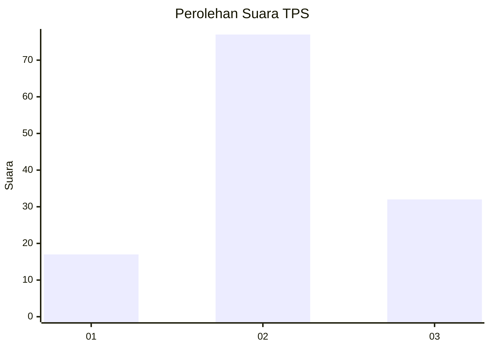
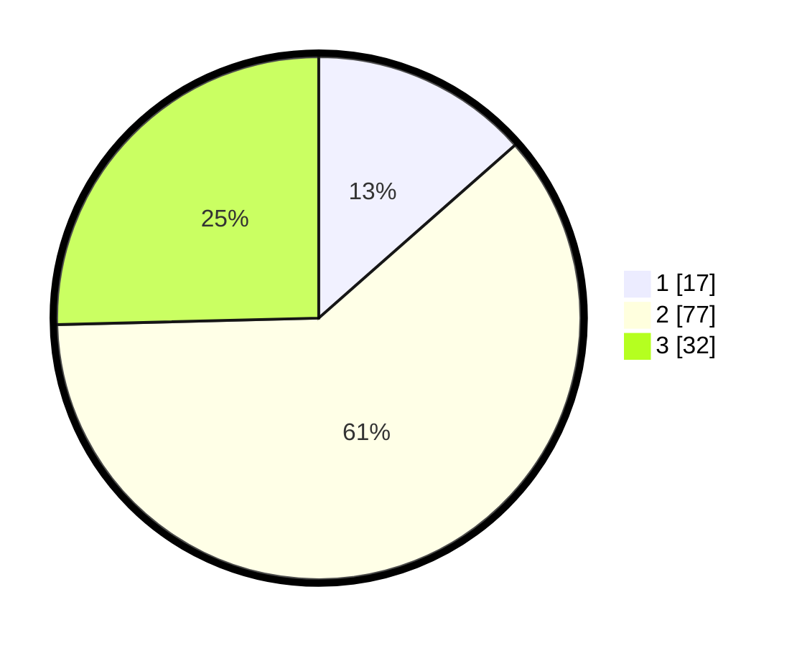

# Hasil

## Grafik

## Tabel

| No. | Nama Paslon    | Suara | Suara (raw) | Persentase |
|:--- |:-------------- | -----:| -----------:| ----------:|
| 1   | ANIES MUHAIMIN | 17    | [17][p-1]   | 13,49      |
| 2   | PRABOWO GIBRAN | 77    | [77][p-2]   | 61,11      |
| 3   | GANJAR MAHFUD  | 32    | [32][p-3]   | 25,40      |

[p-1]: https://github.com/gigit-pemilu/pemilu-2024-34-di-yogyakarta/blob/main/pilpres/hitung-suara/sub/34-di-yogyakarta/sub/03-gunungkidul/sub/14-gedangsari/sub/2006-ngalang/sub/022-tps/sub/paslon-1.txt
[p-2]: https://github.com/gigit-pemilu/pemilu-2024-34-di-yogyakarta/blob/main/pilpres/hitung-suara/sub/34-di-yogyakarta/sub/03-gunungkidul/sub/14-gedangsari/sub/2006-ngalang/sub/022-tps/sub/paslon-2.txt
[p-3]: https://github.com/gigit-pemilu/pemilu-2024-34-di-yogyakarta/blob/main/pilpres/hitung-suara/sub/34-di-yogyakarta/sub/03-gunungkidul/sub/14-gedangsari/sub/2006-ngalang/sub/022-tps/sub/paslon-3.txt

## Foto C Plano

https://sirekap-obj-formc.kpu.go.id/52ba/pemilu/ppwp/34/03/14/20/06/3403142006022-20240217-215454--64719d59-bd83-4db2-b03e-35644bd9fe74.jpg

https://sirekap-obj-formc.kpu.go.id/52ba/pemilu/ppwp/34/03/14/20/06/3403142006022-20240217-215455--91c98662-9b82-4897-a7fe-1874a2f18eeb.jpg

https://sirekap-obj-formc.kpu.go.id/52ba/pemilu/ppwp/34/03/14/20/06/3403142006022-20240217-215454--6b719b7e-c9ed-4ed6-bf12-142696ed3c26.jpg

## Metadata

| Key        | Value               |
| ---------- | ------------------- |
| Time Stamp | 2024-02-21 13:00:00 |

## DATA PEMILIH TETAP

Jumlah pemilih dalam DPT: **148**.
 * L: **66**.
 * P: **82**.

## DATA PENGGUNA HAK PILIH

Jumlah pengguna hak pilih dalam DPT: **117**.
 * L: **49**.
 * P: **68**.

Jumlah pengguna hak pilih dalam DPTb: **10**.
 * L: **8**.
 * P: **2**.

Jumlah pengguna hak pilih dalam DPK: **2**.
 * L: **1**.
 * P: **1**.

Jumlah pengguna hak pilih: **129**.
 * L: **58**.
 * P: **71**.

## JUMLAH SUARA SAH DAN TIDAK SAH

JUMLAH SELURUH SUARA SAH: **126**.

JUMLAH SUARA TIDAK SAH: **3**.

JUMLAH SELURUH SUARA SAH DAN SUARA TIDAK SAH: **129**.

