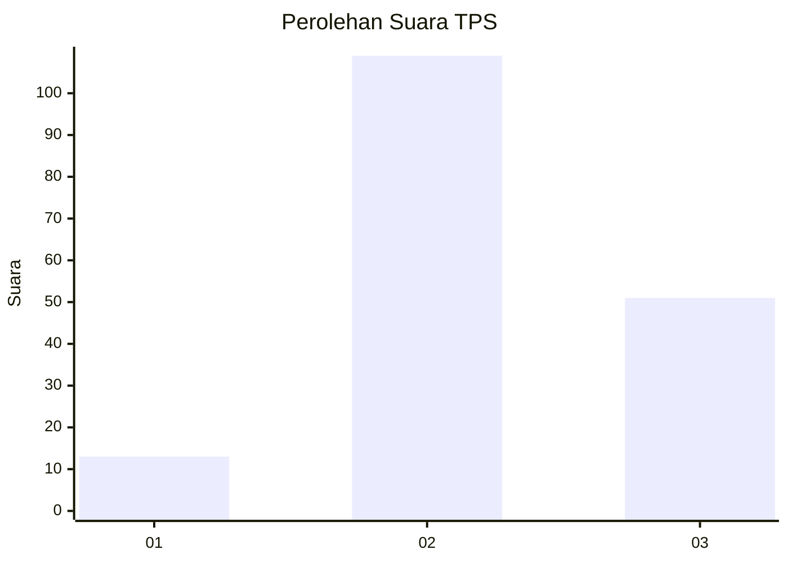
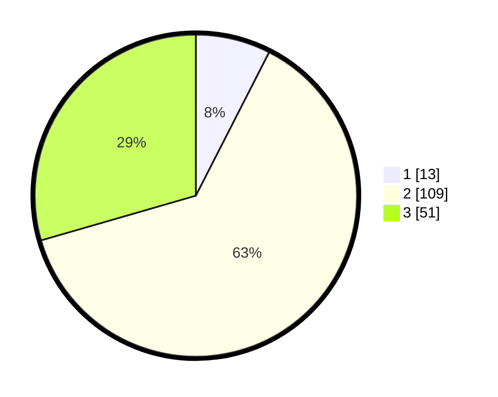

# Hasil

## Grafik

## Tabel

| No. | Nama Paslon    | Suara | Suara (raw) | Persentase |
|:--- |:-------------- | -----:| -----------:| ----------:|
| 1   | ANIES MUHAIMIN | 13    | [13][p-1]   | 7,51       |
| 2   | PRABOWO GIBRAN | 109   | [109][p-2]  | 63,01      |
| 3   | GANJAR MAHFUD  | 51    | [51][p-3]   | 29,48      |

[p-1]: https://github.com/gigit-pemilu/pemilu-2024-34-di-yogyakarta/blob/main/pilpres/hitung-suara/sub/34-di-yogyakarta/sub/03-gunungkidul/sub/14-gedangsari/sub/2006-ngalang/sub/023-tps/sub/paslon-1.txt
[p-2]: https://github.com/gigit-pemilu/pemilu-2024-34-di-yogyakarta/blob/main/pilpres/hitung-suara/sub/34-di-yogyakarta/sub/03-gunungkidul/sub/14-gedangsari/sub/2006-ngalang/sub/023-tps/sub/paslon-2.txt
[p-3]: https://github.com/gigit-pemilu/pemilu-2024-34-di-yogyakarta/blob/main/pilpres/hitung-suara/sub/34-di-yogyakarta/sub/03-gunungkidul/sub/14-gedangsari/sub/2006-ngalang/sub/023-tps/sub/paslon-3.txt

## Foto C Plano

https://sirekap-obj-formc.kpu.go.id/93ba/pemilu/ppwp/34/03/14/20/06/3403142006023-20240214-221147--5514c0df-395e-4b42-8a3b-6b43c13fa1f6.jpg

https://sirekap-obj-formc.kpu.go.id/93ba/pemilu/ppwp/34/03/14/20/06/3403142006023-20240219-173203--d81605a4-2c6a-4f41-b7c1-0657ed0ca7e9.jpg

https://sirekap-obj-formc.kpu.go.id/93ba/pemilu/ppwp/34/03/14/20/06/3403142006023-20240219-173523--93623129-213d-4247-94a7-07e38b6cf967.jpg

## Metadata

| Key        | Value               |
| ---------- | ------------------- |
| Time Stamp | 2024-02-19 18:00:00 |

