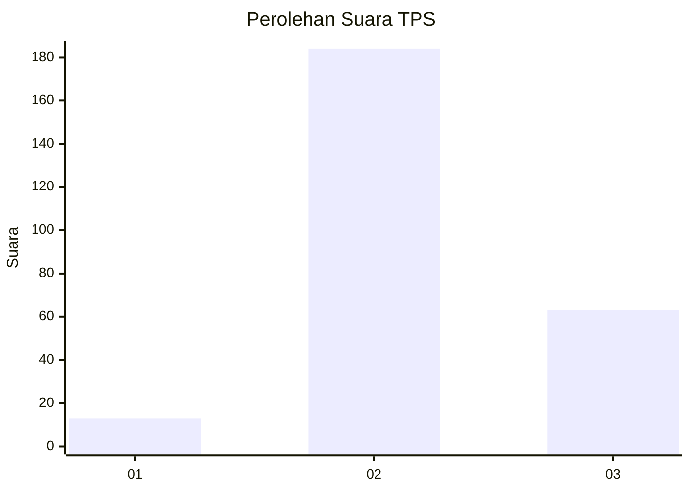
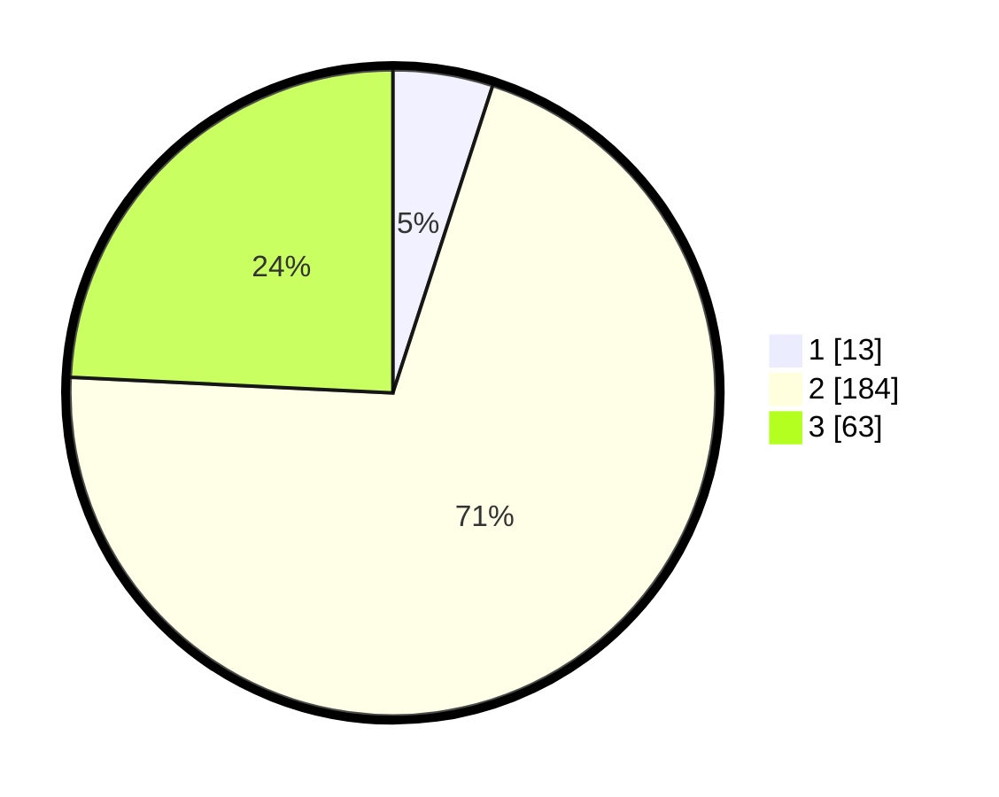

# Hasil

## Grafik

## Tabel

| No. | Nama Paslon    | Suara | Suara (raw) | Persentase |
|:--- |:-------------- | -----:| -----------:| ----------:|
| 1   | ANIES MUHAIMIN | 13    | [13][p-1]   | 5,00       |
| 2   | PRABOWO GIBRAN | 184   | [184][p-2]  | 70,77      |
| 3   | GANJAR MAHFUD  | 63    | [63][p-3]   | 24,23      |

[p-1]: https://github.com/gigit-pemilu/pemilu-2024-34-di-yogyakarta/blob/main/pilpres/hitung-suara/sub/34-di-yogyakarta/sub/03-gunungkidul/sub/14-gedangsari/sub/2007-tegalrejo/sub/015-tps/sub/paslon-1.txt
[p-2]: https://github.com/gigit-pemilu/pemilu-2024-34-di-yogyakarta/blob/main/pilpres/hitung-suara/sub/34-di-yogyakarta/sub/03-gunungkidul/sub/14-gedangsari/sub/2007-tegalrejo/sub/015-tps/sub/paslon-2.txt
[p-3]: https://github.com/gigit-pemilu/pemilu-2024-34-di-yogyakarta/blob/main/pilpres/hitung-suara/sub/34-di-yogyakarta/sub/03-gunungkidul/sub/14-gedangsari/sub/2007-tegalrejo/sub/015-tps/sub/paslon-3.txt

## Foto C Plano

https://sirekap-obj-formc.kpu.go.id/7abb/pemilu/ppwp/34/03/14/20/07/3403142007015-20240214-231413--16445bea-10b2-43f6-94b9-969fbb7809c5.jpg

https://sirekap-obj-formc.kpu.go.id/7abb/pemilu/ppwp/34/03/14/20/07/3403142007015-20240214-231445--1829c652-2615-4fce-bd5f-febee3dab2de.jpg

https://sirekap-obj-formc.kpu.go.id/7abb/pemilu/ppwp/34/03/14/20/07/3403142007015-20240214-231649--5d867a3b-8faf-441c-a7a4-966175a7033e.jpg

## Metadata

| Key        | Value               |
| ---------- | ------------------- |
| Time Stamp | 2024-02-25 10:00:00 |

