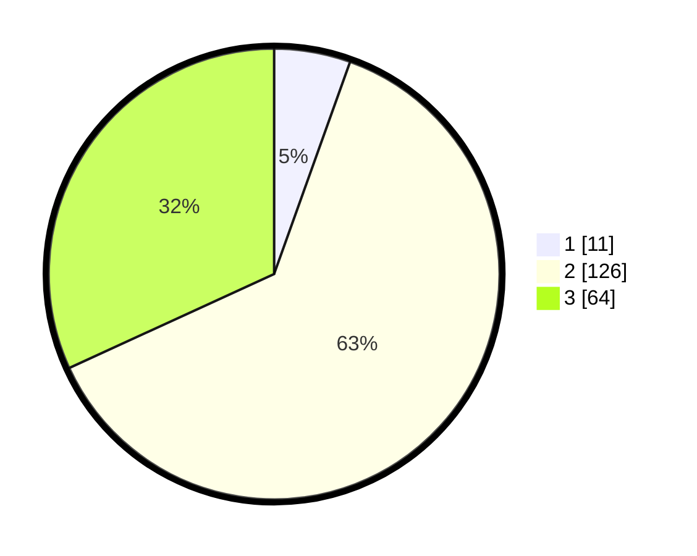

# Hasil

## Grafik

## Tabel

| No. | Nama Paslon    | Suara | Suara (raw) | Persentase |
|:--- |:-------------- | -----:| -----------:| ----------:|
| 1   | ANIES MUHAIMIN | 11    | [11][p-1]   | 5,47       |
| 2   | PRABOWO GIBRAN | 126   | [126][p-2]  | 62,69      |
| 3   | GANJAR MAHFUD  | 64    | [64][p-3]   | 31,84      |

[p-1]: https://github.com/gigit-pemilu/pemilu-2024-34-di-yogyakarta/blob/main/pilpres/hitung-suara/sub/34-di-yogyakarta/sub/03-gunungkidul/sub/14-gedangsari/sub/2007-tegalrejo/sub/021-tps/sub/paslon-1.txt
[p-2]: https://github.com/gigit-pemilu/pemilu-2024-34-di-yogyakarta/blob/main/pilpres/hitung-suara/sub/34-di-yogyakarta/sub/03-gunungkidul/sub/14-gedangsari/sub/2007-tegalrejo/sub/021-tps/sub/paslon-2.txt
[p-3]: https://github.com/gigit-pemilu/pemilu-2024-34-di-yogyakarta/blob/main/pilpres/hitung-suara/sub/34-di-yogyakarta/sub/03-gunungkidul/sub/14-gedangsari/sub/2007-tegalrejo/sub/021-tps/sub/paslon-3.txt

## Foto C Plano

https://sirekap-obj-formc.kpu.go.id/61fd/pemilu/ppwp/34/03/14/20/07/3403142007021-20240215-010039--92778ad8-2d12-4cd1-bcdc-cf67fe21d898.jpg

https://sirekap-obj-formc.kpu.go.id/61fd/pemilu/ppwp/34/03/14/20/07/3403142007021-20240214-234925--bbabec9e-7737-40c0-9910-4ad47b261bf7.jpg

https://sirekap-obj-formc.kpu.go.id/61fd/pemilu/ppwp/34/03/14/20/07/3403142007021-20240214-235101--7fb25d41-e208-48ed-bcfe-ffc69d7bd89a.jpg

## Metadata

| Key        | Value               |
| ---------- | ------------------- |
| Time Stamp | 2024-02-17 19:30:00 |

