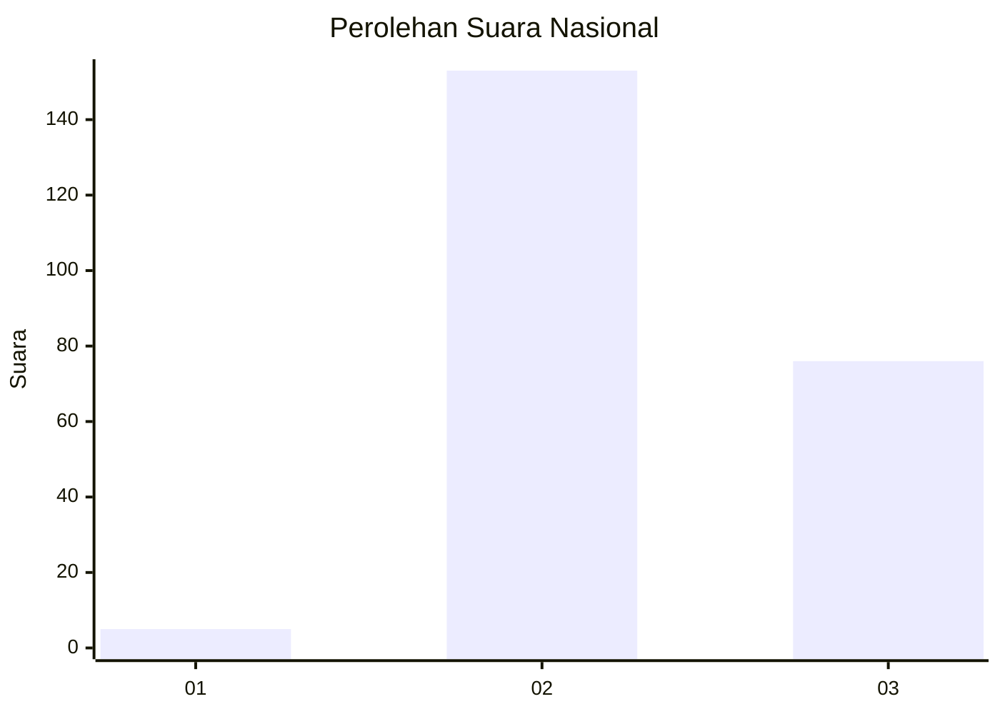
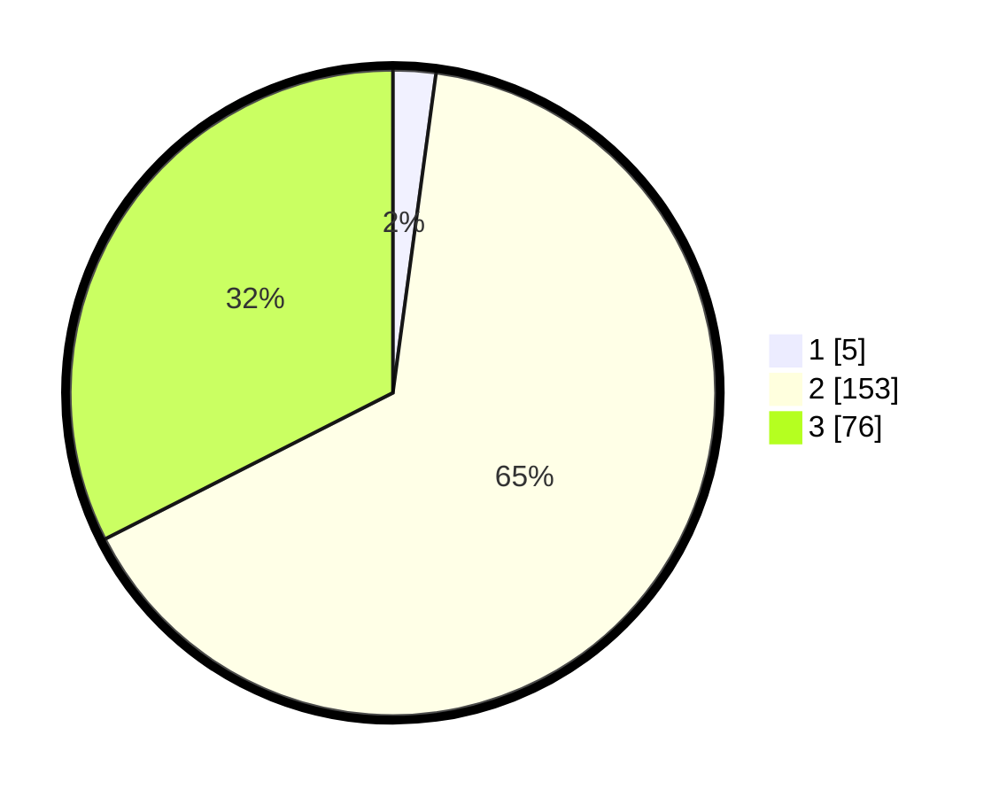

# Hasil

## Grafik

## Tabel

| No. | Nama Paslon    | Suara | Suara (raw) | Persentase |
|:--- |:-------------- | -----:| -----------:| ----------:|
| 1   | ANIES MUHAIMIN | 5     | [5][p-1]    | 2,14       |
| 2   | PRABOWO GIBRAN | 153   | [153][p-2]  | 65,38      |
| 3   | GANJAR MAHFUD  | 76    | [76][p-3]   | 32,48      |

[p-1]: https://github.com/gigit-pemilu/pemilu-2024/blob/main/pilpres/hitung-suara/sub/34-di-yogyakarta/sub/03-gunungkidul/sub/14-gedangsari/sub/2007-tegalrejo/sub/024-tps/sub/paslon-1.txt
[p-2]: https://github.com/gigit-pemilu/pemilu-2024/blob/main/pilpres/hitung-suara/sub/34-di-yogyakarta/sub/03-gunungkidul/sub/14-gedangsari/sub/2007-tegalrejo/sub/024-tps/sub/paslon-2.txt
[p-3]: https://github.com/gigit-pemilu/pemilu-2024/blob/main/pilpres/hitung-suara/sub/34-di-yogyakarta/sub/03-gunungkidul/sub/14-gedangsari/sub/2007-tegalrejo/sub/024-tps/sub/paslon-3.txt

## Foto C Plano

https://sirekap-obj-formc.kpu.go.id/6bf3/pemilu/ppwp/34/03/14/20/07/3403142007024-20240215-050854--2e97f280-60b5-444d-aa32-cda624d0d64e.jpg

https://sirekap-obj-formc.kpu.go.id/6bf3/pemilu/ppwp/34/03/14/20/07/3403142007024-20240215-050046--5434f09b-b9d9-4b30-b80a-aa3ea5693dd5.jpg

https://sirekap-obj-formc.kpu.go.id/6bf3/pemilu/ppwp/34/03/14/20/07/3403142007024-20240215-050223--ca4c40a6-c23a-4ffa-849f-7feb1ed9be00.jpg

## Metadata

| Key        | Value               |
| ---------- | ------------------- |
| Time Stamp | 2024-02-15 19:30:26 |

