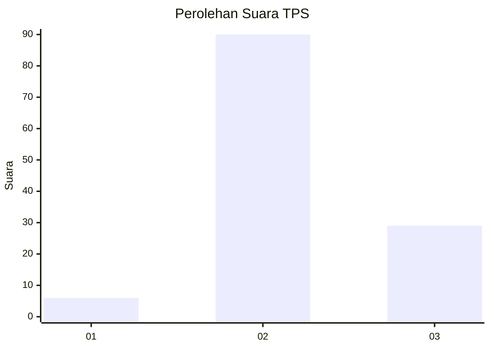
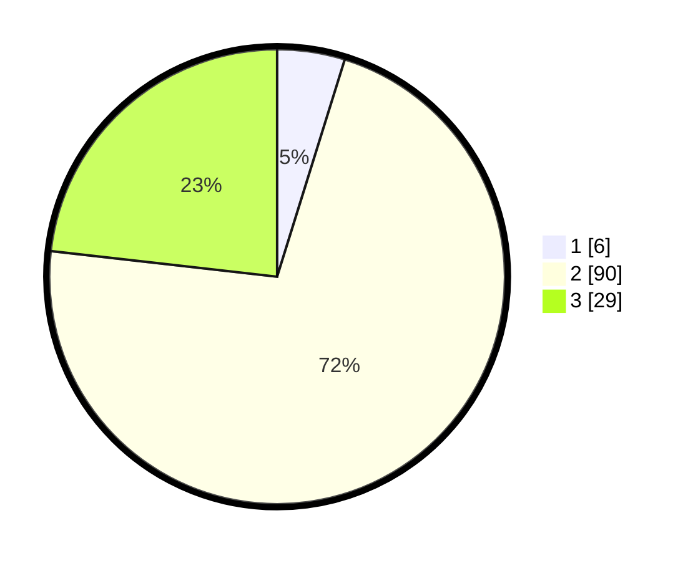

# Hasil

## Grafik

## Tabel

| No. | Nama Paslon    | Suara | Suara (raw) | Persentase |
|:--- |:-------------- | -----:| -----------:| ----------:|
| 1   | ANIES MUHAIMIN | 6     | [6][p-1]    | 4,80       |
| 2   | PRABOWO GIBRAN | 90    | [90][p-2]   | 72,00      |
| 3   | GANJAR MAHFUD  | 29    | [29][p-3]   | 23,20      |

[p-1]: https://github.com/gigit-pemilu/pemilu-2024-34-di-yogyakarta/blob/main/pilpres/hitung-suara/sub/34-di-yogyakarta/sub/03-gunungkidul/sub/15-saptosari/sub/2001-krambilsawit/sub/002-tps/sub/paslon-1.txt
[p-2]: https://github.com/gigit-pemilu/pemilu-2024-34-di-yogyakarta/blob/main/pilpres/hitung-suara/sub/34-di-yogyakarta/sub/03-gunungkidul/sub/15-saptosari/sub/2001-krambilsawit/sub/002-tps/sub/paslon-2.txt
[p-3]: https://github.com/gigit-pemilu/pemilu-2024-34-di-yogyakarta/blob/main/pilpres/hitung-suara/sub/34-di-yogyakarta/sub/03-gunungkidul/sub/15-saptosari/sub/2001-krambilsawit/sub/002-tps/sub/paslon-3.txt

## Foto C Plano

https://sirekap-obj-formc.kpu.go.id/505e/pemilu/ppwp/34/03/15/20/01/3403152001002-20240216-091931--437064d2-3df7-43e2-980b-dd26ea34d1a8.jpg

https://sirekap-obj-formc.kpu.go.id/505e/pemilu/ppwp/34/03/15/20/01/3403152001002-20240216-091938--eecb9fd3-c155-4926-81a3-e0d28b5f70b1.jpg

https://sirekap-obj-formc.kpu.go.id/505e/pemilu/ppwp/34/03/15/20/01/3403152001002-20240216-091935--1e9a21ed-7fa7-4835-b5e4-04852563dd3a.jpg

## Metadata

| Key        | Value               |
| ---------- | ------------------- |
| Time Stamp | 2024-02-16 09:30:28 |

## DATA PEMILIH TETAP

Jumlah pemilih dalam DPT: **141**.
 * L: **74**.
 * P: **67**.

## DATA PENGGUNA HAK PILIH

Jumlah pengguna hak pilih dalam DPT: **126**.
 * L: **70**.
 * P: **56**.

Jumlah pengguna hak pilih dalam DPTb: **0**.
 * L: **0**.
 * P: **0**.

Jumlah pengguna hak pilih dalam DPK: **0**.
 * L: **0**.
 * P: **0**.

Jumlah pengguna hak pilih: **126**.
 * L: **70**.
 * P: **56**.

## JUMLAH SUARA SAH DAN TIDAK SAH

JUMLAH SELURUH SUARA SAH: **125**.

JUMLAH SUARA TIDAK SAH: **1**.

JUMLAH SELURUH SUARA SAH DAN SUARA TIDAK SAH: **126**.

