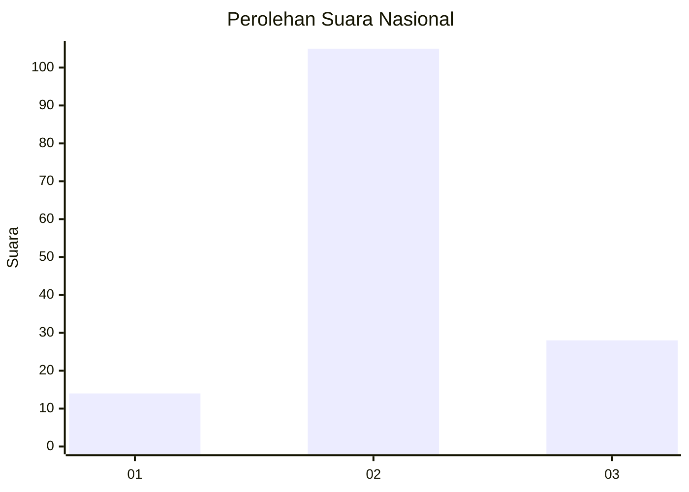
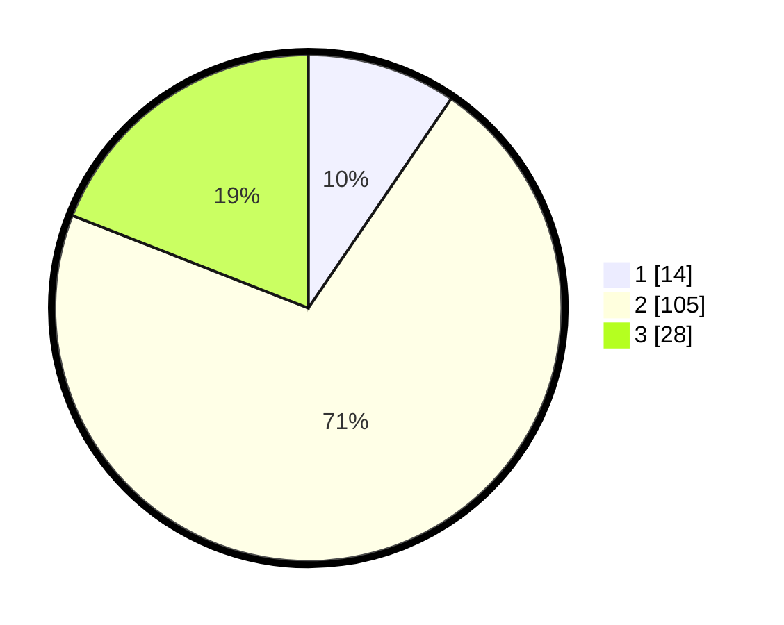

# Hasil

## Grafik

## Tabel

| No. | Nama Paslon    | Suara | Suara (raw) | Persentase |
|:--- |:-------------- | -----:| -----------:| ----------:|
| 1   | ANIES MUHAIMIN | 14    | [14][p-1]   | 9,52       |
| 2   | PRABOWO GIBRAN | 105   | [105][p-2]  | 71,43      |
| 3   | GANJAR MAHFUD  | 28    | [28][p-3]   | 19,05      |

[p-1]: https://github.com/gigit-pemilu/pemilu-2024/blob/main/pilpres/hitung-suara/sub/34-di-yogyakarta/sub/03-gunungkidul/sub/15-saptosari/sub/2001-krambilsawit/sub/003-tps/sub/paslon-1.txt
[p-2]: https://github.com/gigit-pemilu/pemilu-2024/blob/main/pilpres/hitung-suara/sub/34-di-yogyakarta/sub/03-gunungkidul/sub/15-saptosari/sub/2001-krambilsawit/sub/003-tps/sub/paslon-2.txt
[p-3]: https://github.com/gigit-pemilu/pemilu-2024/blob/main/pilpres/hitung-suara/sub/34-di-yogyakarta/sub/03-gunungkidul/sub/15-saptosari/sub/2001-krambilsawit/sub/003-tps/sub/paslon-3.txt

## Foto C Plano

https://sirekap-obj-formc.kpu.go.id/5610/pemilu/ppwp/34/03/15/20/01/3403152001003-20240216-150106--e2bda577-ca7b-4b1c-92dc-e779ea7e21bb.jpg

https://sirekap-obj-formc.kpu.go.id/5610/pemilu/ppwp/34/03/15/20/01/3403152001003-20240216-150107--3fabf9fe-a1d6-4ac8-b9c4-1cac363d9a9c.jpg

https://sirekap-obj-formc.kpu.go.id/5610/pemilu/ppwp/34/03/15/20/01/3403152001003-20240216-150106--e2b87aa2-3f28-430d-9fac-69e9db3c96b9.jpg

## Metadata

| Key        | Value               |
| ---------- | ------------------- |
| Time Stamp | 2024-02-16 21:01:00 |

## DATA PEMILIH TETAP

Jumlah pemilih dalam DPT: **172**.
 * L: **84**.
 * P: **88**.

## DATA PENGGUNA HAK PILIH

Jumlah pengguna hak pilih dalam DPT: **158**.
 * L: **78**.
 * P: **80**.

Jumlah pengguna hak pilih dalam DPTb: **0**.
 * L: **0**.
 * P: **0**.

Jumlah pengguna hak pilih dalam DPK: **0**.
 * L: **0**.
 * P: **0**.

Jumlah pengguna hak pilih: **158**.
 * L: **78**.
 * P: **80**.

## JUMLAH SUARA SAH DAN TIDAK SAH

JUMLAH SELURUH SUARA SAH: **147**.

JUMLAH SUARA TIDAK SAH: **11**.

JUMLAH SELURUH SUARA SAH DAN SUARA TIDAK SAH: **158**.

