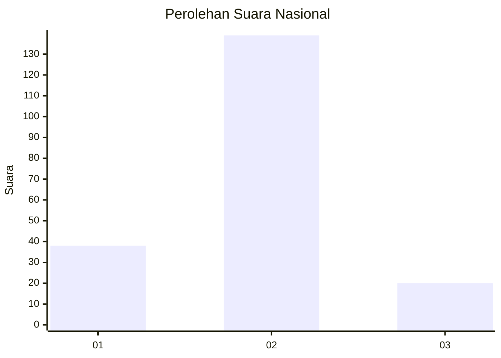
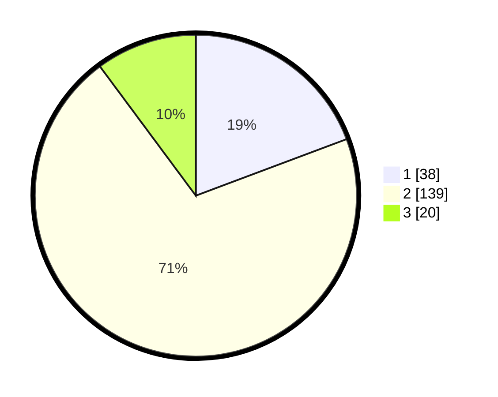

# Hasil

## Grafik

## Tabel

| No. | Nama Paslon    | Suara | Suara (raw) | Persentase |
|:--- |:-------------- | -----:| -----------:| ----------:|
| 1   | ANIES MUHAIMIN | 38    | [38][p-1]   | 19,29      |
| 2   | PRABOWO GIBRAN | 139   | [139][p-2]  | 70,56      |
| 3   | GANJAR MAHFUD  | 20    | [20][p-3]   | 10,15      |

[p-1]: https://github.com/gigit-pemilu/pemilu-2024/blob/main/pilpres/hitung-suara/sub/34-di-yogyakarta/sub/03-gunungkidul/sub/15-saptosari/sub/2001-krambilsawit/sub/004-tps/sub/paslon-1.txt
[p-2]: https://github.com/gigit-pemilu/pemilu-2024/blob/main/pilpres/hitung-suara/sub/34-di-yogyakarta/sub/03-gunungkidul/sub/15-saptosari/sub/2001-krambilsawit/sub/004-tps/sub/paslon-2.txt
[p-3]: https://github.com/gigit-pemilu/pemilu-2024/blob/main/pilpres/hitung-suara/sub/34-di-yogyakarta/sub/03-gunungkidul/sub/15-saptosari/sub/2001-krambilsawit/sub/004-tps/sub/paslon-3.txt

## Foto C Plano

https://sirekap-obj-formc.kpu.go.id/aa06/pemilu/ppwp/34/03/15/20/01/3403152001004-20240216-132229--718f1b65-c5f8-4004-a840-3c1479a3c22f.jpg

https://sirekap-obj-formc.kpu.go.id/aa06/pemilu/ppwp/34/03/15/20/01/3403152001004-20240216-132230--052363d8-2d55-43f4-ae8b-2119715a2dea.jpg

https://sirekap-obj-formc.kpu.go.id/aa06/pemilu/ppwp/34/03/15/20/01/3403152001004-20240216-132229--83e1a7f8-0099-4fb4-87aa-d2a890eefbea.jpg

## Metadata

| Key        | Value               |
| ---------- | ------------------- |
| Time Stamp | 2024-02-16 21:01:00 |

## DATA PEMILIH TETAP

Jumlah pemilih dalam DPT: **236**.
 * L: **109**.
 * P: **127**.

## DATA PENGGUNA HAK PILIH

Jumlah pengguna hak pilih dalam DPT: **201**.
 * L: **92**.
 * P: **109**.

Jumlah pengguna hak pilih dalam DPTb: **0**.
 * L: **0**.
 * P: **0**.

Jumlah pengguna hak pilih dalam DPK: **0**.
 * L: **0**.
 * P: **0**.

Jumlah pengguna hak pilih: **201**.
 * L: **92**.
 * P: **109**.

## JUMLAH SUARA SAH DAN TIDAK SAH

JUMLAH SELURUH SUARA SAH: **197**.

JUMLAH SUARA TIDAK SAH: **4**.

JUMLAH SELURUH SUARA SAH DAN SUARA TIDAK SAH: **201**.

