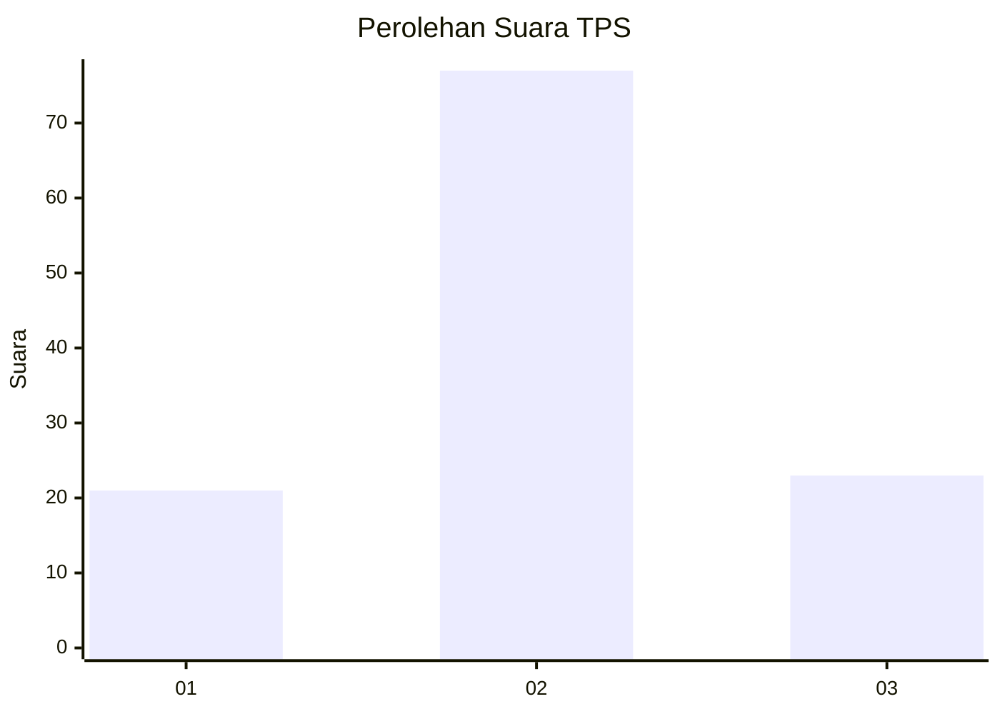
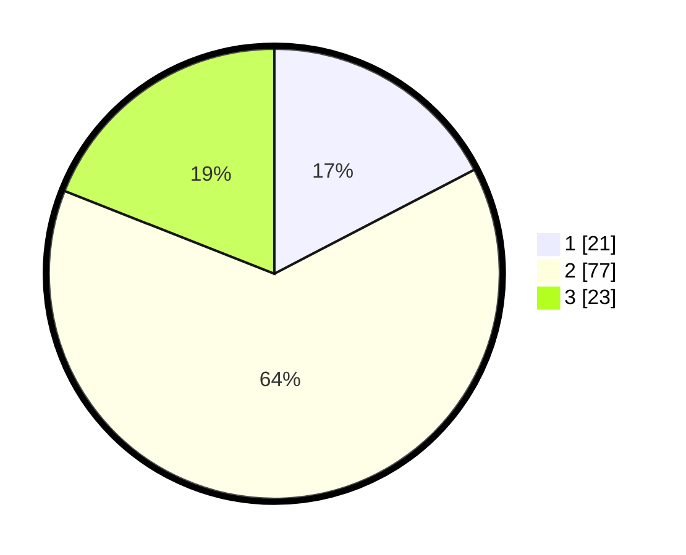

# Hasil

## Grafik

## Tabel

| No. | Nama Paslon    | Suara | Suara (raw) | Persentase |
|:--- |:-------------- | -----:| -----------:| ----------:|
| 1   | ANIES MUHAIMIN | 21    | [21][p-1]   | 17,36      |
| 2   | PRABOWO GIBRAN | 77    | [77][p-2]   | 63,64      |
| 3   | GANJAR MAHFUD  | 23    | [23][p-3]   | 19,01      |

[p-1]: https://github.com/gigit-pemilu/pemilu-2024-34-di-yogyakarta/blob/main/pilpres/hitung-suara/sub/34-di-yogyakarta/sub/03-gunungkidul/sub/15-saptosari/sub/2001-krambilsawit/sub/005-tps/sub/paslon-1.txt
[p-2]: https://github.com/gigit-pemilu/pemilu-2024-34-di-yogyakarta/blob/main/pilpres/hitung-suara/sub/34-di-yogyakarta/sub/03-gunungkidul/sub/15-saptosari/sub/2001-krambilsawit/sub/005-tps/sub/paslon-2.txt
[p-3]: https://github.com/gigit-pemilu/pemilu-2024-34-di-yogyakarta/blob/main/pilpres/hitung-suara/sub/34-di-yogyakarta/sub/03-gunungkidul/sub/15-saptosari/sub/2001-krambilsawit/sub/005-tps/sub/paslon-3.txt

## Foto C Plano

https://sirekap-obj-formc.kpu.go.id/35dd/pemilu/ppwp/34/03/15/20/01/3403152001005-20240216-133543--1fc91bef-e21b-46ad-b7f2-d44e225ae382.jpg

https://sirekap-obj-formc.kpu.go.id/35dd/pemilu/ppwp/34/03/15/20/01/3403152001005-20240216-133544--5f2b462b-b9f5-4527-bff0-c32847be7585.jpg

https://sirekap-obj-formc.kpu.go.id/35dd/pemilu/ppwp/34/03/15/20/01/3403152001005-20240216-133544--bf44caa9-43ad-4b66-b85b-1e58335147f7.jpg

## Metadata

| Key        | Value               |
| ---------- | ------------------- |
| Time Stamp | 2024-02-16 21:01:00 |

## DATA PEMILIH TETAP

Jumlah pemilih dalam DPT: **148**.
 * L: **69**.
 * P: **79**.

## DATA PENGGUNA HAK PILIH

Jumlah pengguna hak pilih dalam DPT: **124**.
 * L: **60**.
 * P: **64**.

Jumlah pengguna hak pilih dalam DPTb: **1**.
 * L: **0**.
 * P: **1**.

Jumlah pengguna hak pilih dalam DPK: **0**.
 * L: **0**.
 * P: **0**.

Jumlah pengguna hak pilih: **125**.
 * L: **60**.
 * P: **65**.

## JUMLAH SUARA SAH DAN TIDAK SAH

JUMLAH SELURUH SUARA SAH: **121**.

JUMLAH SUARA TIDAK SAH: **4**.

JUMLAH SELURUH SUARA SAH DAN SUARA TIDAK SAH: **125**.

