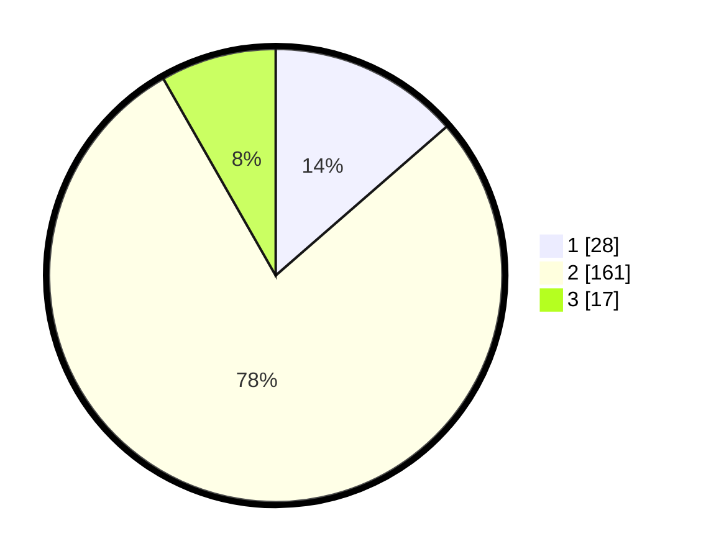

# Hasil

## Grafik

## Tabel

| No. | Nama Paslon    | Suara | Suara (raw) | Persentase |
|:--- |:-------------- | -----:| -----------:| ----------:|
| 1   | ANIES MUHAIMIN | 28    | [28][p-1]   | 13,59      |
| 2   | PRABOWO GIBRAN | 161   | [161][p-2]  | 78,16      |
| 3   | GANJAR MAHFUD  | 17    | [17][p-3]   | 8,25       |

[p-1]: https://github.com/gigit-pemilu/pemilu-2024/blob/main/pilpres/hitung-suara/sub/34-di-yogyakarta/sub/03-gunungkidul/sub/15-saptosari/sub/2001-krambilsawit/sub/006-tps/sub/paslon-1.txt
[p-2]: https://github.com/gigit-pemilu/pemilu-2024/blob/main/pilpres/hitung-suara/sub/34-di-yogyakarta/sub/03-gunungkidul/sub/15-saptosari/sub/2001-krambilsawit/sub/006-tps/sub/paslon-2.txt
[p-3]: https://github.com/gigit-pemilu/pemilu-2024/blob/main/pilpres/hitung-suara/sub/34-di-yogyakarta/sub/03-gunungkidul/sub/15-saptosari/sub/2001-krambilsawit/sub/006-tps/sub/paslon-3.txt

## Foto C Plano

https://sirekap-obj-formc.kpu.go.id/8753/pemilu/ppwp/34/03/15/20/01/3403152001006-20240216-054358--e93e675d-1675-4b1a-bcd4-ce0bb820e159.jpg

https://sirekap-obj-formc.kpu.go.id/8753/pemilu/ppwp/34/03/15/20/01/3403152001006-20240216-054412--b0a3fbd9-7204-4f61-863b-3cc0f66831fc.jpg

https://sirekap-obj-formc.kpu.go.id/8753/pemilu/ppwp/34/03/15/20/01/3403152001006-20240216-100522--1b0dcc5f-4ac0-4381-b58a-72cbd97e46a0.jpg

## Metadata

| Key        | Value               |
| ---------- | ------------------- |
| Time Stamp | 2024-02-16 21:01:00 |

## DATA PEMILIH TETAP

Jumlah pemilih dalam DPT: **236**.
 * L: **118**.
 * P: **118**.

## DATA PENGGUNA HAK PILIH

Jumlah pengguna hak pilih dalam DPT: **208**.
 * L: **104**.
 * P: **104**.

Jumlah pengguna hak pilih dalam DPTb: **0**.
 * L: **0**.
 * P: **0**.

Jumlah pengguna hak pilih dalam DPK: **0**.
 * L: **0**.
 * P: **0**.

Jumlah pengguna hak pilih: **208**.
 * L: **104**.
 * P: **104**.

## JUMLAH SUARA SAH DAN TIDAK SAH

JUMLAH SELURUH SUARA SAH: **206**.

JUMLAH SUARA TIDAK SAH: **2**.

JUMLAH SELURUH SUARA SAH DAN SUARA TIDAK SAH: **208**.

