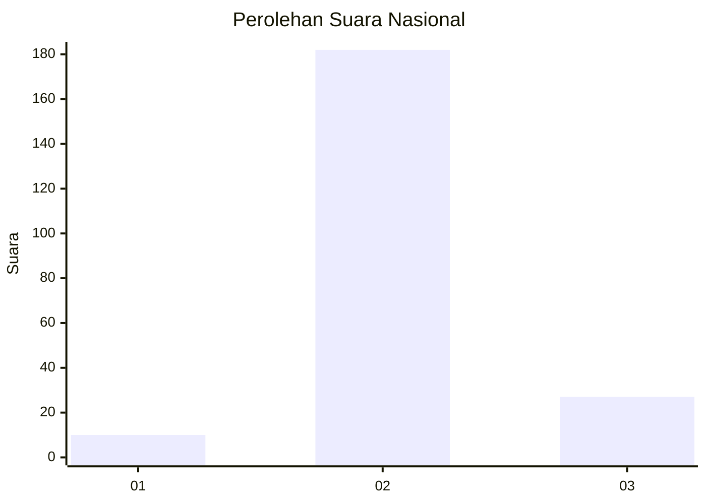
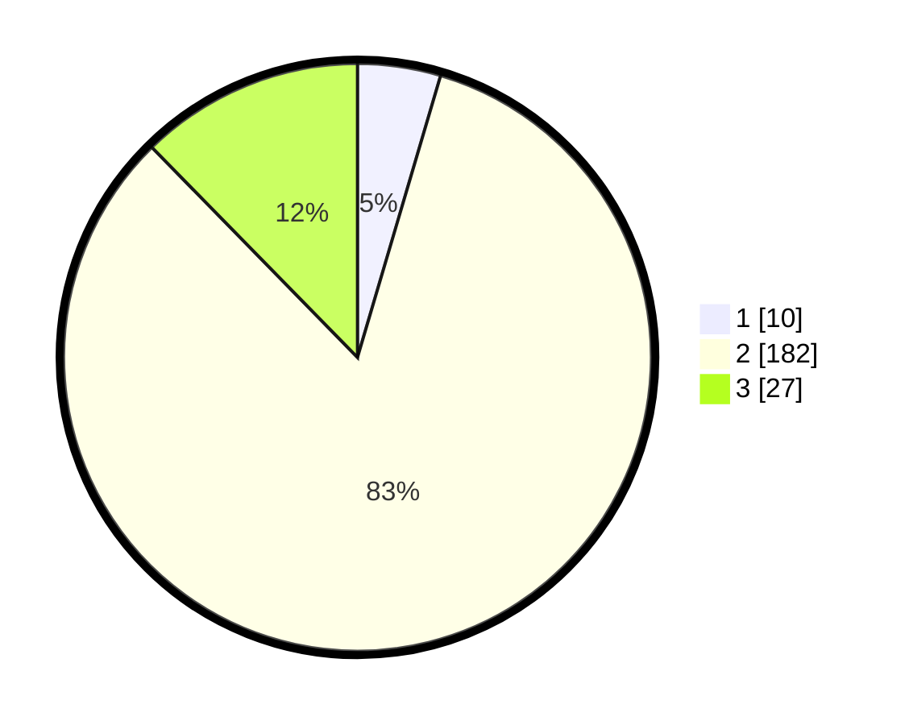

# Hasil

## Grafik

## Tabel

| No. | Nama Paslon    | Suara | Suara (raw) | Persentase |
|:--- |:-------------- | -----:| -----------:| ----------:|
| 1   | ANIES MUHAIMIN | 10    | [10][p-1]   | 4,57       |
| 2   | PRABOWO GIBRAN | 182   | [182][p-2]  | 83,11      |
| 3   | GANJAR MAHFUD  | 27    | [27][p-3]   | 12,33      |

[p-1]: https://github.com/gigit-pemilu/pemilu-2024/blob/main/pilpres/hitung-suara/sub/34-di-yogyakarta/sub/03-gunungkidul/sub/15-saptosari/sub/2001-krambilsawit/sub/016-tps/sub/paslon-1.txt
[p-2]: https://github.com/gigit-pemilu/pemilu-2024/blob/main/pilpres/hitung-suara/sub/34-di-yogyakarta/sub/03-gunungkidul/sub/15-saptosari/sub/2001-krambilsawit/sub/016-tps/sub/paslon-2.txt
[p-3]: https://github.com/gigit-pemilu/pemilu-2024/blob/main/pilpres/hitung-suara/sub/34-di-yogyakarta/sub/03-gunungkidul/sub/15-saptosari/sub/2001-krambilsawit/sub/016-tps/sub/paslon-3.txt

## Foto C Plano

https://sirekap-obj-formc.kpu.go.id/9cd3/pemilu/ppwp/34/03/15/20/01/3403152001016-20240215-043527--e727155c-056b-4d1c-88c4-7ad4746f2c9f.jpg

https://sirekap-obj-formc.kpu.go.id/9cd3/pemilu/ppwp/34/03/15/20/01/3403152001016-20240215-043705--cd60c2b6-0583-4913-9d94-c6aeb764f7ab.jpg

https://sirekap-obj-formc.kpu.go.id/9cd3/pemilu/ppwp/34/03/15/20/01/3403152001016-20240215-043835--2c364866-d391-4175-9049-2b9835e52dad.jpg

## Metadata

| Key        | Value               |
| ---------- | ------------------- |
| Time Stamp | 2024-02-15 15:00:29 |

