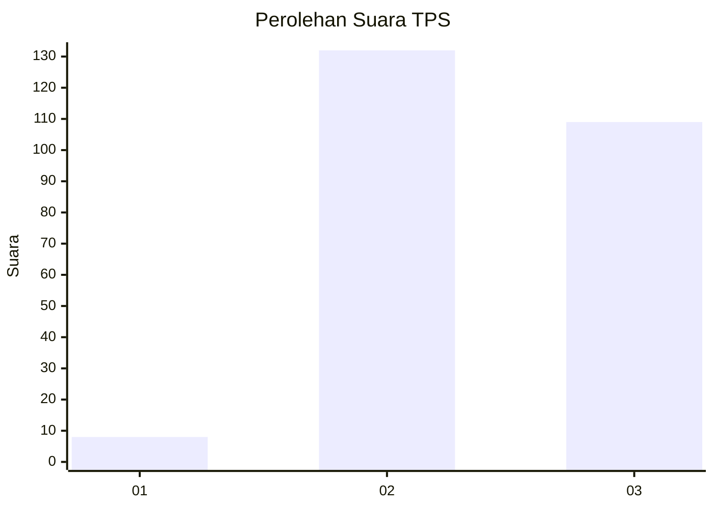
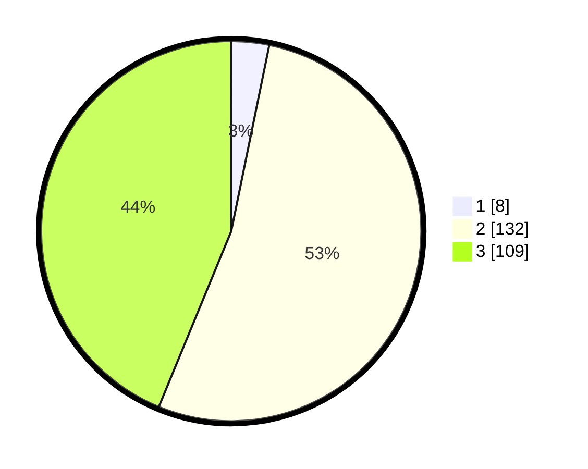

# Hasil

## Grafik

## Tabel

| No. | Nama Paslon    | Suara | Suara (raw) | Persentase |
|:--- |:-------------- | -----:| -----------:| ----------:|
| 1   | ANIES MUHAIMIN | 8     | [8][p-1]    | 3,21       |
| 2   | PRABOWO GIBRAN | 132   | [132][p-2]  | 53,01      |
| 3   | GANJAR MAHFUD  | 109   | [109][p-3]  | 43,78      |

[p-1]: https://github.com/gigit-pemilu/pemilu-2024-34-di-yogyakarta/blob/main/pilpres/hitung-suara/sub/34-di-yogyakarta/sub/03-gunungkidul/sub/15-saptosari/sub/2001-krambilsawit/sub/023-tps/sub/paslon-1.txt
[p-2]: https://github.com/gigit-pemilu/pemilu-2024-34-di-yogyakarta/blob/main/pilpres/hitung-suara/sub/34-di-yogyakarta/sub/03-gunungkidul/sub/15-saptosari/sub/2001-krambilsawit/sub/023-tps/sub/paslon-2.txt
[p-3]: https://github.com/gigit-pemilu/pemilu-2024-34-di-yogyakarta/blob/main/pilpres/hitung-suara/sub/34-di-yogyakarta/sub/03-gunungkidul/sub/15-saptosari/sub/2001-krambilsawit/sub/023-tps/sub/paslon-3.txt

## Foto C Plano

https://sirekap-obj-formc.kpu.go.id/af9d/pemilu/ppwp/34/03/15/20/01/3403152001023-20240215-060611--6439ef61-aae6-4b1f-a94b-8ff148adef24.jpg

https://sirekap-obj-formc.kpu.go.id/af9d/pemilu/ppwp/34/03/15/20/01/3403152001023-20240214-212136--844774ee-5ef4-48da-82f1-a8d9f61415aa.jpg

https://sirekap-obj-formc.kpu.go.id/af9d/pemilu/ppwp/34/03/15/20/01/3403152001023-20240214-212349--cd0232e6-91cb-4937-bc8e-aa7c7d99c1d1.jpg

## Metadata

| Key        | Value               |
| ---------- | ------------------- |
| Time Stamp | 2024-02-15 12:00:28 |

