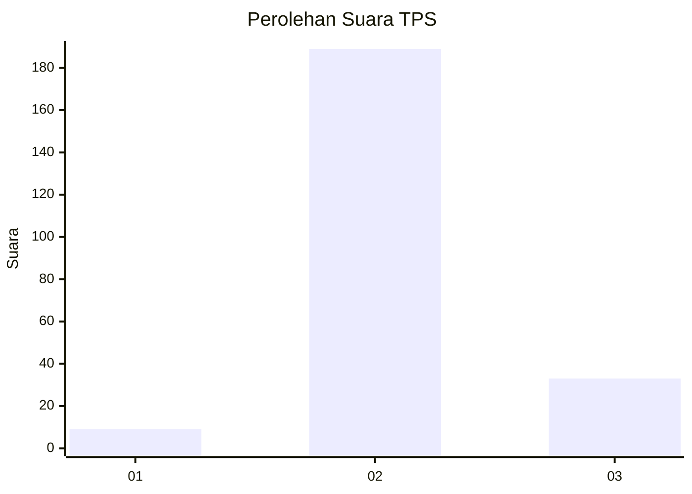
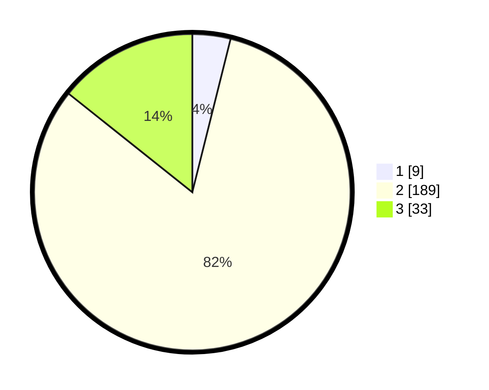

# Hasil

## Grafik

## Tabel

| No. | Nama Paslon    | Suara | Suara (raw) | Persentase |
|:--- |:-------------- | -----:| -----------:| ----------:|
| 1   | ANIES MUHAIMIN | 9     | [9][p-1]    | 3,90       |
| 2   | PRABOWO GIBRAN | 189   | [189][p-2]  | 81,82      |
| 3   | GANJAR MAHFUD  | 33    | [33][p-3]   | 14,29      |

[p-1]: https://github.com/gigit-pemilu/pemilu-2024-34-di-yogyakarta/blob/main/pilpres/hitung-suara/sub/34-di-yogyakarta/sub/03-gunungkidul/sub/15-saptosari/sub/2004-kepek/sub/013-tps/sub/paslon-1.txt
[p-2]: https://github.com/gigit-pemilu/pemilu-2024-34-di-yogyakarta/blob/main/pilpres/hitung-suara/sub/34-di-yogyakarta/sub/03-gunungkidul/sub/15-saptosari/sub/2004-kepek/sub/013-tps/sub/paslon-2.txt
[p-3]: https://github.com/gigit-pemilu/pemilu-2024-34-di-yogyakarta/blob/main/pilpres/hitung-suara/sub/34-di-yogyakarta/sub/03-gunungkidul/sub/15-saptosari/sub/2004-kepek/sub/013-tps/sub/paslon-3.txt

## Foto C Plano

https://sirekap-obj-formc.kpu.go.id/8872/pemilu/ppwp/34/03/15/20/04/3403152004013-20240215-000648--356be381-e64a-4b3a-abd5-fb2a8eb1dc55.jpg

https://sirekap-obj-formc.kpu.go.id/8872/pemilu/ppwp/34/03/15/20/04/3403152004013-20240215-000042--78a2f01e-c4ae-46e1-92cd-12813d1c3865.jpg

https://sirekap-obj-formc.kpu.go.id/8872/pemilu/ppwp/34/03/15/20/04/3403152004013-20240215-000142--de470183-41a9-4415-a14c-c69ee1a2dcba.jpg

## Metadata

| Key        | Value               |
| ---------- | ------------------- |
| Time Stamp | 2024-02-15 22:00:27 |

