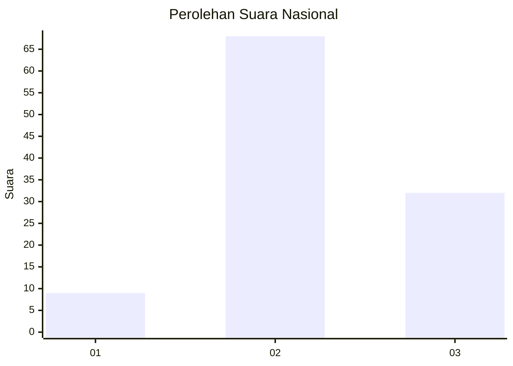
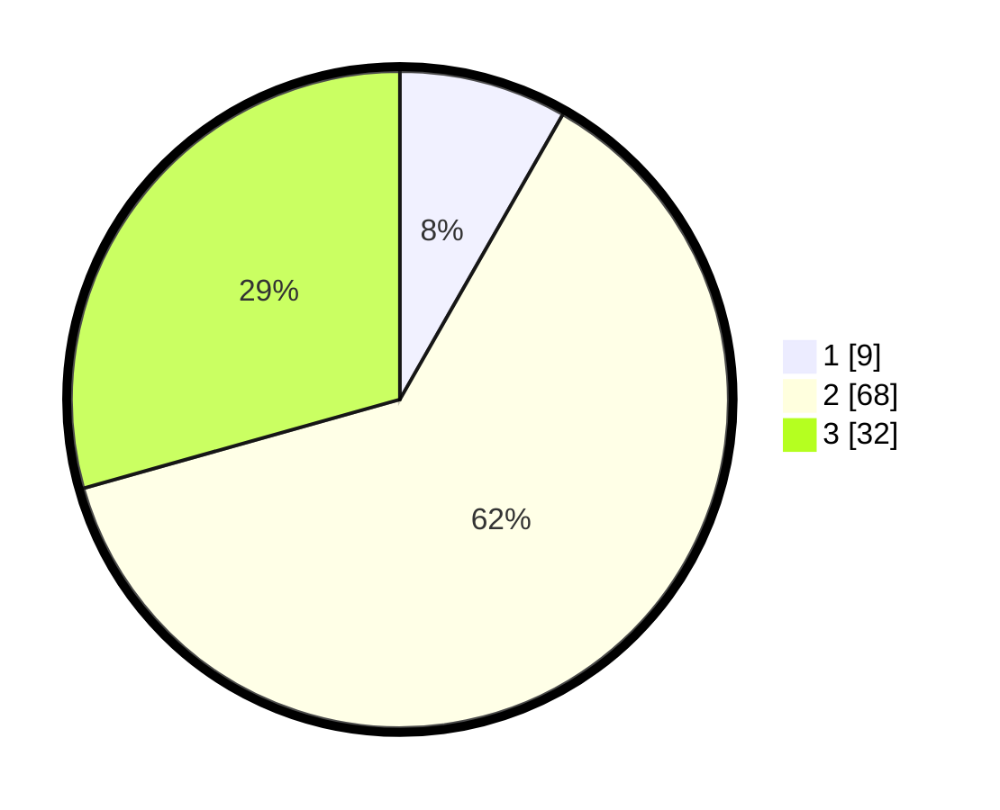

# Hasil

## Grafik

## Tabel

| No. | Nama Paslon    | Suara | Suara (raw) | Persentase |
|:--- |:-------------- | -----:| -----------:| ----------:|
| 1   | ANIES MUHAIMIN | 9     | [9][p-1]    | 8,26       |
| 2   | PRABOWO GIBRAN | 68    | [68][p-2]   | 62,39      |
| 3   | GANJAR MAHFUD  | 32    | [32][p-3]   | 29,36      |

[p-1]: https://github.com/gigit-pemilu/pemilu-2024/blob/main/pilpres/hitung-suara/sub/34-di-yogyakarta/sub/03-gunungkidul/sub/15-saptosari/sub/2006-monggol/sub/008-tps/sub/paslon-1.txt
[p-2]: https://github.com/gigit-pemilu/pemilu-2024/blob/main/pilpres/hitung-suara/sub/34-di-yogyakarta/sub/03-gunungkidul/sub/15-saptosari/sub/2006-monggol/sub/008-tps/sub/paslon-2.txt
[p-3]: https://github.com/gigit-pemilu/pemilu-2024/blob/main/pilpres/hitung-suara/sub/34-di-yogyakarta/sub/03-gunungkidul/sub/15-saptosari/sub/2006-monggol/sub/008-tps/sub/paslon-3.txt

## Foto C Plano

https://sirekap-obj-formc.kpu.go.id/0bda/pemilu/ppwp/34/03/15/20/06/3403152006008-20240216-135609--ba19834a-cfbc-49aa-ab0b-7e62c042794c.jpg

https://sirekap-obj-formc.kpu.go.id/0bda/pemilu/ppwp/34/03/15/20/06/3403152006008-20240216-135610--46da7a4d-4f31-4cd8-a179-2e43cecbcaaa.jpg

https://sirekap-obj-formc.kpu.go.id/0bda/pemilu/ppwp/34/03/15/20/06/3403152006008-20240216-135610--36e48a7b-622f-4043-b8da-d2c3398663bf.jpg

## Metadata

| Key        | Value               |
| ---------- | ------------------- |
| Time Stamp | 2024-02-17 13:37:34 |

## DATA PEMILIH TETAP

Jumlah pemilih dalam DPT: **125**.
 * L: **63**.
 * P: **62**.

## DATA PENGGUNA HAK PILIH

Jumlah pengguna hak pilih dalam DPT: **109**.
 * L: **58**.
 * P: **51**.

Jumlah pengguna hak pilih dalam DPTb: **0**.
 * L: **0**.
 * P: **0**.

Jumlah pengguna hak pilih dalam DPK: **0**.
 * L: **0**.
 * P: **0**.

Jumlah pengguna hak pilih: **109**.
 * L: **58**.
 * P: **51**.

## JUMLAH SUARA SAH DAN TIDAK SAH

JUMLAH SELURUH SUARA SAH: **109**.

JUMLAH SUARA TIDAK SAH: **0**.

JUMLAH SELURUH SUARA SAH DAN SUARA TIDAK SAH: **109**.

