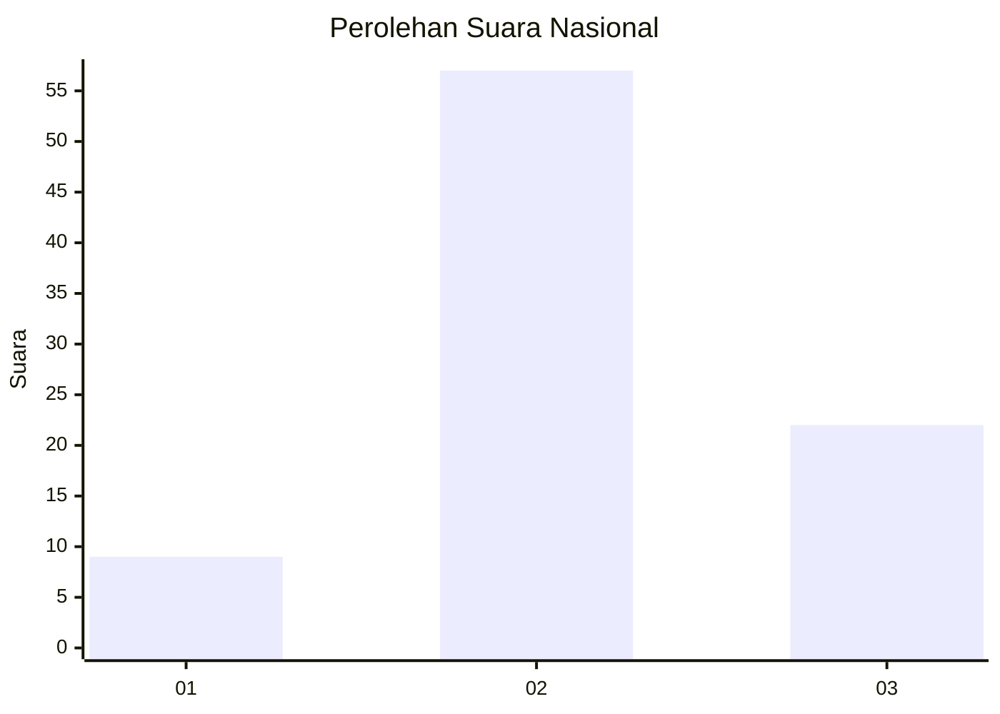
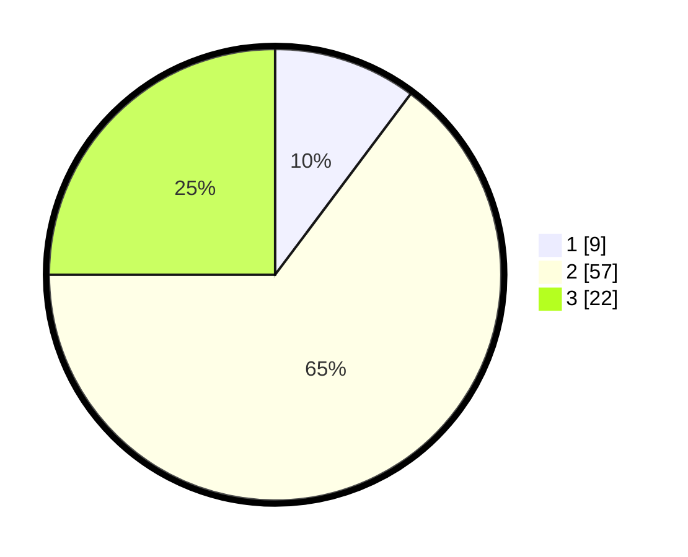

# Hasil

## Grafik

## Tabel

| No. | Nama Paslon    | Suara | Suara (raw) | Persentase |
|:--- |:-------------- | -----:| -----------:| ----------:|
| 1   | ANIES MUHAIMIN | 9     | [9][p-1]    | 10,23      |
| 2   | PRABOWO GIBRAN | 57    | [57][p-2]   | 64,77      |
| 3   | GANJAR MAHFUD  | 22    | [22][p-3]   | 25,00      |

[p-1]: https://github.com/gigit-pemilu/pemilu-2024/blob/main/pilpres/hitung-suara/sub/34-di-yogyakarta/sub/03-gunungkidul/sub/15-saptosari/sub/2007-planjan/sub/017-tps/sub/paslon-1.txt
[p-2]: https://github.com/gigit-pemilu/pemilu-2024/blob/main/pilpres/hitung-suara/sub/34-di-yogyakarta/sub/03-gunungkidul/sub/15-saptosari/sub/2007-planjan/sub/017-tps/sub/paslon-2.txt
[p-3]: https://github.com/gigit-pemilu/pemilu-2024/blob/main/pilpres/hitung-suara/sub/34-di-yogyakarta/sub/03-gunungkidul/sub/15-saptosari/sub/2007-planjan/sub/017-tps/sub/paslon-3.txt

## Foto C Plano

https://sirekap-obj-formc.kpu.go.id/389b/pemilu/ppwp/34/03/15/20/07/3403152007017-20240216-094316--f4d50f4f-bfab-4dff-95b4-e4b133ad4691.jpg

https://sirekap-obj-formc.kpu.go.id/389b/pemilu/ppwp/34/03/15/20/07/3403152007017-20240216-094322--96b256fe-122c-4b75-91b9-be3f0361b490.jpg

https://sirekap-obj-formc.kpu.go.id/389b/pemilu/ppwp/34/03/15/20/07/3403152007017-20240216-094321--bb463ab9-1200-45e2-aca9-cf5d5c25f310.jpg

## Metadata

| Key        | Value               |
| ---------- | ------------------- |
| Time Stamp | 2024-02-16 10:00:28 |

## DATA PEMILIH TETAP

Jumlah pemilih dalam DPT: **126**.
 * L: **65**.
 * P: **61**.

## DATA PENGGUNA HAK PILIH

Jumlah pengguna hak pilih dalam DPT: **104**.
 * L: **53**.
 * P: **51**.

Jumlah pengguna hak pilih dalam DPTb: **2**.
 * L: **1**.
 * P: **1**.

Jumlah pengguna hak pilih dalam DPK: **0**.
 * L: **0**.
 * P: **0**.

Jumlah pengguna hak pilih: **106**.
 * L: **54**.
 * P: **52**.

## JUMLAH SUARA SAH DAN TIDAK SAH

JUMLAH SELURUH SUARA SAH: **88**.

JUMLAH SUARA TIDAK SAH: **18**.

JUMLAH SELURUH SUARA SAH DAN SUARA TIDAK SAH: **106**.

