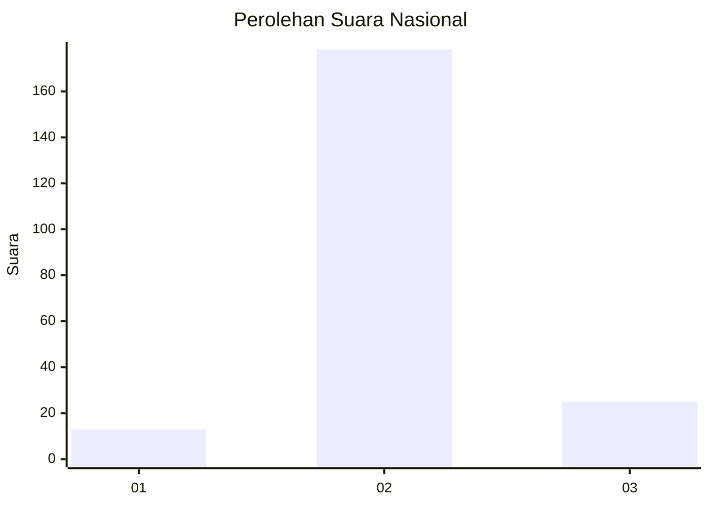
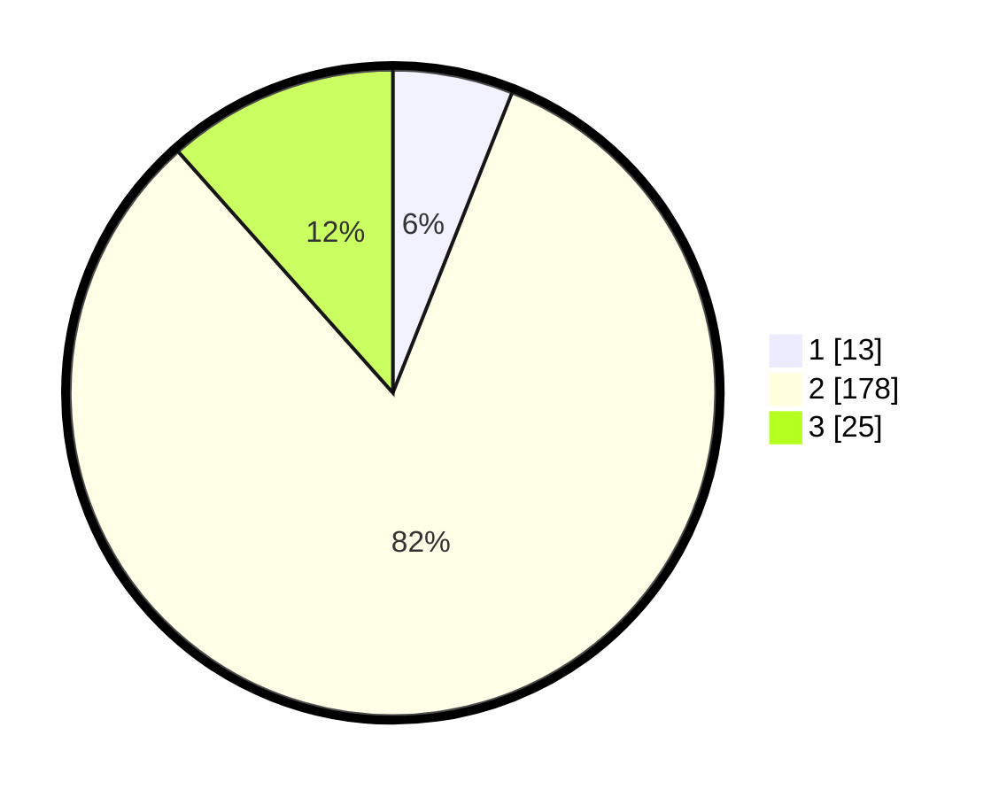

# Hasil

## Grafik

## Tabel

| No. | Nama Paslon    | Suara | Suara (raw) | Persentase |
|:--- |:-------------- | -----:| -----------:| ----------:|
| 1   | ANIES MUHAIMIN | 13    | [13][p-1]   | 6,02       |
| 2   | PRABOWO GIBRAN | 178   | [178][p-2]  | 82,41      |
| 3   | GANJAR MAHFUD  | 25    | [25][p-3]   | 11,57      |

[p-1]: https://github.com/gigit-pemilu/pemilu-2024/blob/main/pilpres/hitung-suara/sub/34-di-yogyakarta/sub/03-gunungkidul/sub/16-girisubo/sub/2001-balong/sub/001-tps/sub/paslon-1.txt
[p-2]: https://github.com/gigit-pemilu/pemilu-2024/blob/main/pilpres/hitung-suara/sub/34-di-yogyakarta/sub/03-gunungkidul/sub/16-girisubo/sub/2001-balong/sub/001-tps/sub/paslon-2.txt
[p-3]: https://github.com/gigit-pemilu/pemilu-2024/blob/main/pilpres/hitung-suara/sub/34-di-yogyakarta/sub/03-gunungkidul/sub/16-girisubo/sub/2001-balong/sub/001-tps/sub/paslon-3.txt

## Foto C Plano

https://sirekap-obj-formc.kpu.go.id/378e/pemilu/ppwp/34/03/16/20/01/3403162001001-20240216-124832--339226db-e61d-4bcc-b4c9-f28c10cc6f6b.jpg

https://sirekap-obj-formc.kpu.go.id/378e/pemilu/ppwp/34/03/16/20/01/3403162001001-20240216-124837--8026d2d8-5480-4559-8e4c-c253d2c0aa97.jpg

https://sirekap-obj-formc.kpu.go.id/378e/pemilu/ppwp/34/03/16/20/01/3403162001001-20240216-124834--e6fa698b-1a64-415d-a811-b3c86236b365.jpg

## Metadata

| Key        | Value               |
| ---------- | ------------------- |
| Time Stamp | 2024-02-16 14:30:33 |

## DATA PEMILIH TETAP

Jumlah pemilih dalam DPT: **277**.
 * L: **129**.
 * P: **148**.

## DATA PENGGUNA HAK PILIH

Jumlah pengguna hak pilih dalam DPT: **220**.
 * L: **104**.
 * P: **116**.

Jumlah pengguna hak pilih dalam DPTb: **0**.
 * L: **0**.
 * P: **0**.

Jumlah pengguna hak pilih dalam DPK: **0**.
 * L: **0**.
 * P: **0**.

Jumlah pengguna hak pilih: **220**.
 * L: **104**.
 * P: **116**.

## JUMLAH SUARA SAH DAN TIDAK SAH

JUMLAH SELURUH SUARA SAH: **216**.

JUMLAH SUARA TIDAK SAH: **4**.

JUMLAH SELURUH SUARA SAH DAN SUARA TIDAK SAH: **220**.

