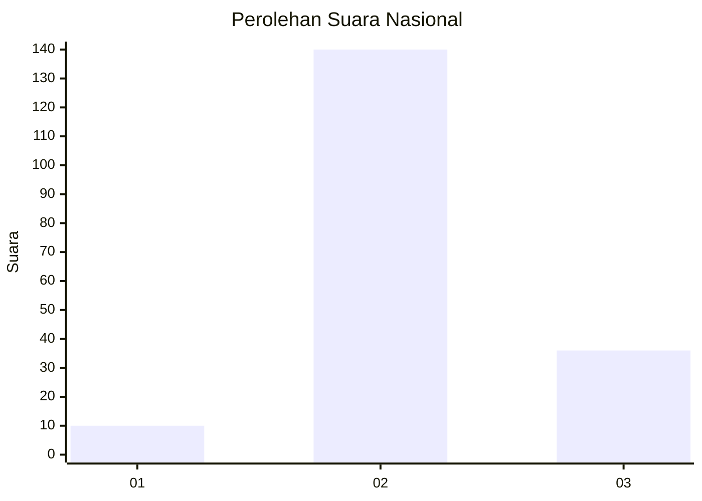
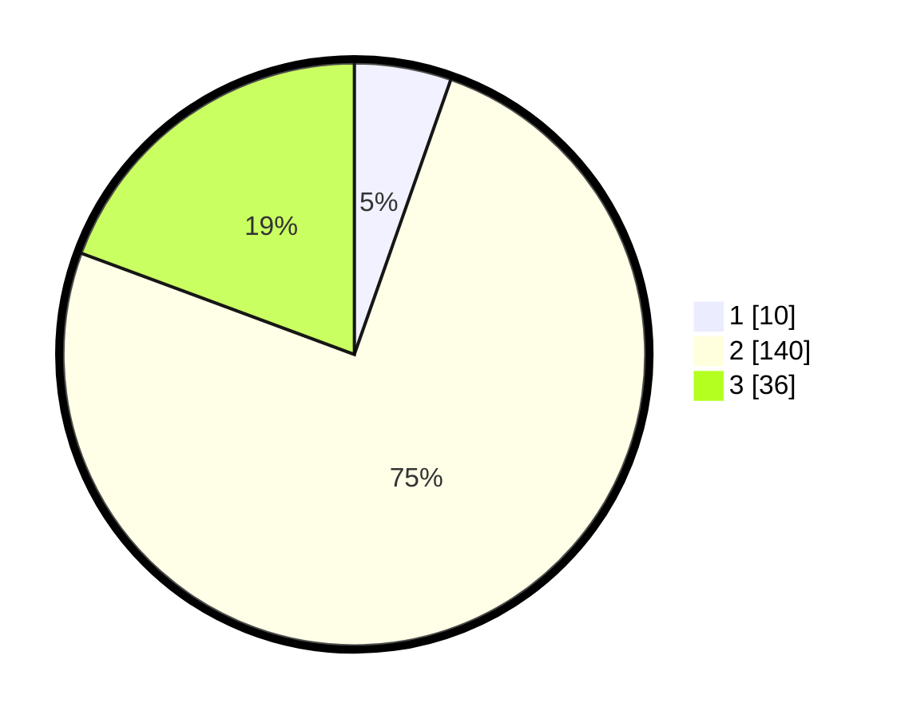

# Hasil

## Grafik

## Tabel

| No. | Nama Paslon    | Suara | Suara (raw) | Persentase |
|:--- |:-------------- | -----:| -----------:| ----------:|
| 1   | ANIES MUHAIMIN | 10    | [10][p-1]   | 5,38       |
| 2   | PRABOWO GIBRAN | 140   | [140][p-2]  | 75,27      |
| 3   | GANJAR MAHFUD  | 36    | [36][p-3]   | 19,35      |

[p-1]: https://github.com/gigit-pemilu/pemilu-2024/blob/main/pilpres/hitung-suara/sub/34-di-yogyakarta/sub/03-gunungkidul/sub/16-girisubo/sub/2001-balong/sub/002-tps/sub/paslon-1.txt
[p-2]: https://github.com/gigit-pemilu/pemilu-2024/blob/main/pilpres/hitung-suara/sub/34-di-yogyakarta/sub/03-gunungkidul/sub/16-girisubo/sub/2001-balong/sub/002-tps/sub/paslon-2.txt
[p-3]: https://github.com/gigit-pemilu/pemilu-2024/blob/main/pilpres/hitung-suara/sub/34-di-yogyakarta/sub/03-gunungkidul/sub/16-girisubo/sub/2001-balong/sub/002-tps/sub/paslon-3.txt

## Foto C Plano

https://sirekap-obj-formc.kpu.go.id/5ea8/pemilu/ppwp/34/03/16/20/01/3403162001002-20240215-164128--deb5637c-ee7e-40d6-983e-7b4c9faa8b1f.jpg

https://sirekap-obj-formc.kpu.go.id/5ea8/pemilu/ppwp/34/03/16/20/01/3403162001002-20240215-164149--85977e09-0dd8-46aa-8418-56cdbeffe76f.jpg

https://sirekap-obj-formc.kpu.go.id/5ea8/pemilu/ppwp/34/03/16/20/01/3403162001002-20240215-164138--9c5719ae-435b-4f4f-849e-6c44178200a9.jpg

## Metadata

| Key        | Value               |
| ---------- | ------------------- |
| Time Stamp | 2024-02-15 17:00:25 |

## DATA PEMILIH TETAP

Jumlah pemilih dalam DPT: **239**.
 * L: **121**.
 * P: **118**.

## DATA PENGGUNA HAK PILIH

Jumlah pengguna hak pilih dalam DPT: **190**.
 * L: **95**.
 * P: **95**.

Jumlah pengguna hak pilih dalam DPTb: **1**.
 * L: **0**.
 * P: **1**.

Jumlah pengguna hak pilih dalam DPK: **2**.
 * L: **1**.
 * P: **1**.

Jumlah pengguna hak pilih: **193**.
 * L: **96**.
 * P: **97**.

## JUMLAH SUARA SAH DAN TIDAK SAH

JUMLAH SELURUH SUARA SAH: **186**.

JUMLAH SUARA TIDAK SAH: **7**.

JUMLAH SELURUH SUARA SAH DAN SUARA TIDAK SAH: **193**.

