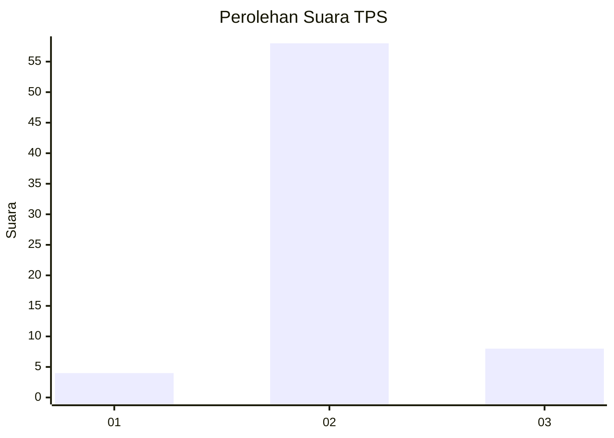
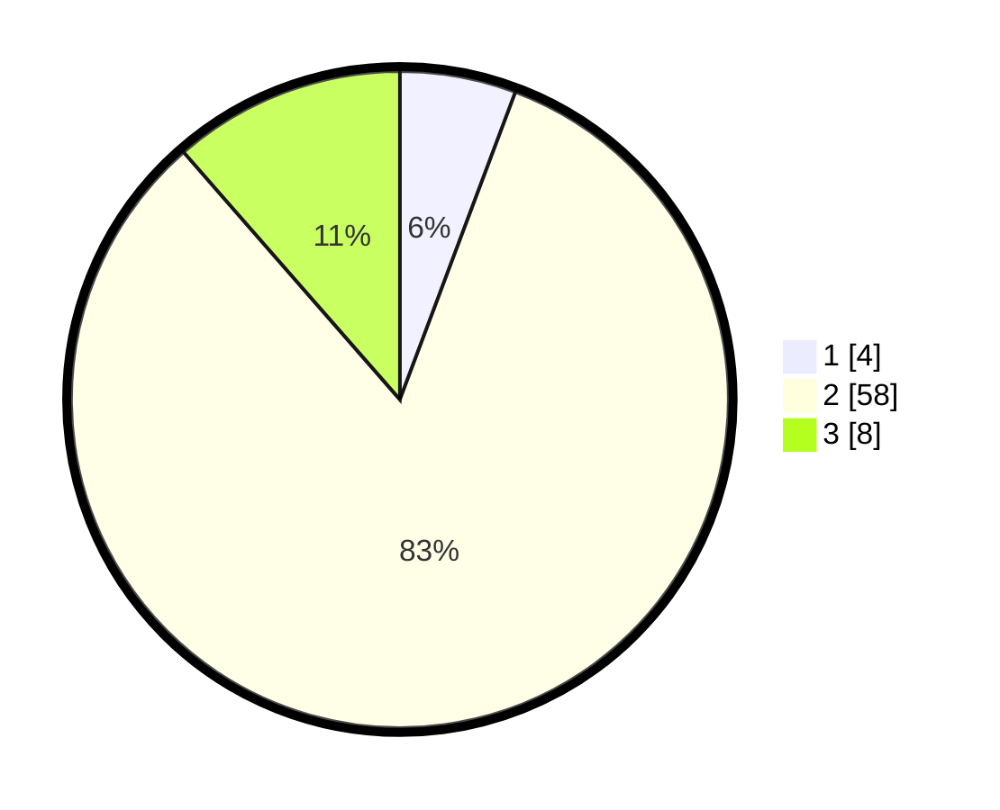

# Hasil

## Grafik

## Tabel

| No. | Nama Paslon    | Suara | Suara (raw) | Persentase |
|:--- |:-------------- | -----:| -----------:| ----------:|
| 1   | ANIES MUHAIMIN | 4     | [4][p-1]    | 5,71       |
| 2   | PRABOWO GIBRAN | 58    | [58][p-2]   | 82,86      |
| 3   | GANJAR MAHFUD  | 8     | [8][p-3]    | 11,43      |

[p-1]: https://github.com/gigit-pemilu/pemilu-2024-34-di-yogyakarta/blob/main/pilpres/hitung-suara/sub/34-di-yogyakarta/sub/03-gunungkidul/sub/16-girisubo/sub/2002-jepitu/sub/001-tps/sub/paslon-1.txt
[p-2]: https://github.com/gigit-pemilu/pemilu-2024-34-di-yogyakarta/blob/main/pilpres/hitung-suara/sub/34-di-yogyakarta/sub/03-gunungkidul/sub/16-girisubo/sub/2002-jepitu/sub/001-tps/sub/paslon-2.txt
[p-3]: https://github.com/gigit-pemilu/pemilu-2024-34-di-yogyakarta/blob/main/pilpres/hitung-suara/sub/34-di-yogyakarta/sub/03-gunungkidul/sub/16-girisubo/sub/2002-jepitu/sub/001-tps/sub/paslon-3.txt

## Foto C Plano

https://sirekap-obj-formc.kpu.go.id/c06e/pemilu/ppwp/34/03/16/20/02/3403162002001-20240216-213038--6e34c860-784e-420e-8cbf-661aa5db4e70.jpg

https://sirekap-obj-formc.kpu.go.id/c06e/pemilu/ppwp/34/03/16/20/02/3403162002001-20240216-191854--e428e60e-e000-42d8-a893-27a828022676.jpg

https://sirekap-obj-formc.kpu.go.id/c06e/pemilu/ppwp/34/03/16/20/02/3403162002001-20240216-192044--0621f4b8-7cb5-46fd-8b39-23934914da83.jpg

## Metadata

| Key        | Value               |
| ---------- | ------------------- |
| Time Stamp | 2024-02-17 10:00:02 |

## DATA PEMILIH TETAP

Jumlah pemilih dalam DPT: **117**.
 * L: **57**.
 * P: **60**.

## DATA PENGGUNA HAK PILIH

Jumlah pengguna hak pilih dalam DPT: **70**.
 * L: **33**.
 * P: **37**.

Jumlah pengguna hak pilih dalam DPTb: **1**.
 * L: **1**.
 * P: **0**.

Jumlah pengguna hak pilih dalam DPK: **0**.
 * L: **0**.
 * P: **0**.

Jumlah pengguna hak pilih: **71**.
 * L: **34**.
 * P: **37**.

## JUMLAH SUARA SAH DAN TIDAK SAH

JUMLAH SELURUH SUARA SAH: **70**.

JUMLAH SUARA TIDAK SAH: **1**.

JUMLAH SELURUH SUARA SAH DAN SUARA TIDAK SAH: **71**.

