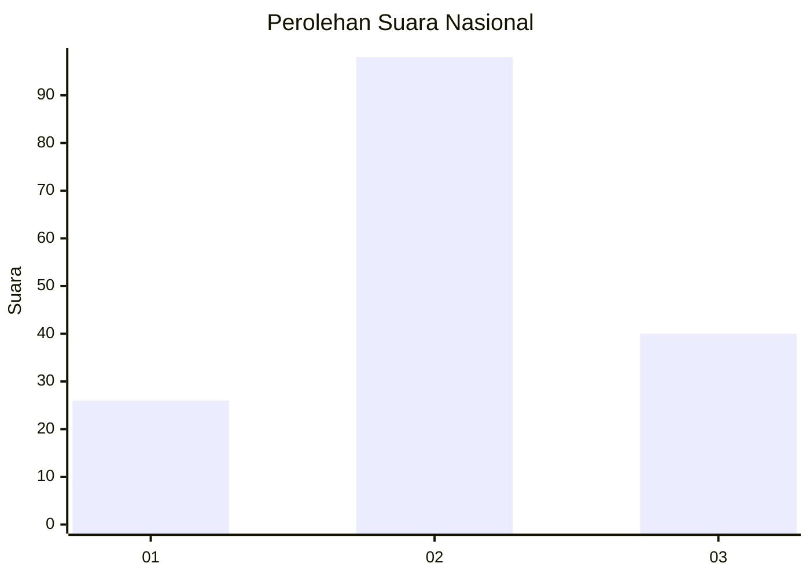
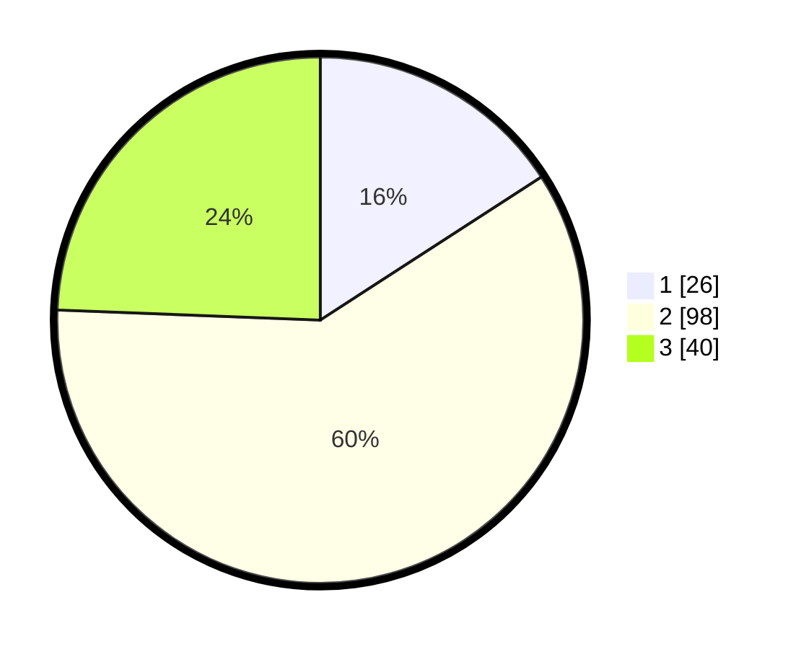

# Hasil

## Grafik

## Tabel

| No. | Nama Paslon    | Suara | Suara (raw) | Persentase |
|:--- |:-------------- | -----:| -----------:| ----------:|
| 1   | ANIES MUHAIMIN | 26    | [26][p-1]   | 15,85      |
| 2   | PRABOWO GIBRAN | 98    | [98][p-2]   | 59,76      |
| 3   | GANJAR MAHFUD  | 40    | [40][p-3]   | 24,39      |

[p-1]: https://github.com/gigit-pemilu/pemilu-2024/blob/main/pilpres/hitung-suara/sub/34-di-yogyakarta/sub/03-gunungkidul/sub/16-girisubo/sub/2002-jepitu/sub/003-tps/sub/paslon-1.txt
[p-2]: https://github.com/gigit-pemilu/pemilu-2024/blob/main/pilpres/hitung-suara/sub/34-di-yogyakarta/sub/03-gunungkidul/sub/16-girisubo/sub/2002-jepitu/sub/003-tps/sub/paslon-2.txt
[p-3]: https://github.com/gigit-pemilu/pemilu-2024/blob/main/pilpres/hitung-suara/sub/34-di-yogyakarta/sub/03-gunungkidul/sub/16-girisubo/sub/2002-jepitu/sub/003-tps/sub/paslon-3.txt

## Foto C Plano

https://sirekap-obj-formc.kpu.go.id/2632/pemilu/ppwp/34/03/16/20/02/3403162002003-20240217-065457--aa88fae6-7542-4b52-a8a9-5c289aac4864.jpg

https://sirekap-obj-formc.kpu.go.id/2632/pemilu/ppwp/34/03/16/20/02/3403162002003-20240215-140838--97ff231d-9302-4df2-9fda-02470a6027d5.jpg

https://sirekap-obj-formc.kpu.go.id/2632/pemilu/ppwp/34/03/16/20/02/3403162002003-20240215-140901--fd1eefe1-0cc0-40b6-9dda-76a2d3f6a933.jpg

## Metadata

| Key        | Value               |
| ---------- | ------------------- |
| Time Stamp | 2024-02-17 07:00:02 |

## DATA PEMILIH TETAP

Jumlah pemilih dalam DPT: **208**.
 * L: **101**.
 * P: **107**.

## DATA PENGGUNA HAK PILIH

Jumlah pengguna hak pilih dalam DPT: **167**.
 * L: **75**.
 * P: **92**.

Jumlah pengguna hak pilih dalam DPTb: **0**.
 * L: **0**.
 * P: **0**.

Jumlah pengguna hak pilih dalam DPK: **0**.
 * L: **0**.
 * P: **0**.

Jumlah pengguna hak pilih: **167**.
 * L: **75**.
 * P: **92**.

## JUMLAH SUARA SAH DAN TIDAK SAH

JUMLAH SELURUH SUARA SAH: **164**.

JUMLAH SUARA TIDAK SAH: **3**.

JUMLAH SELURUH SUARA SAH DAN SUARA TIDAK SAH: **167**.

