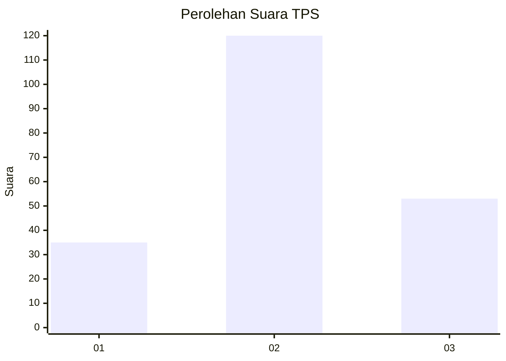
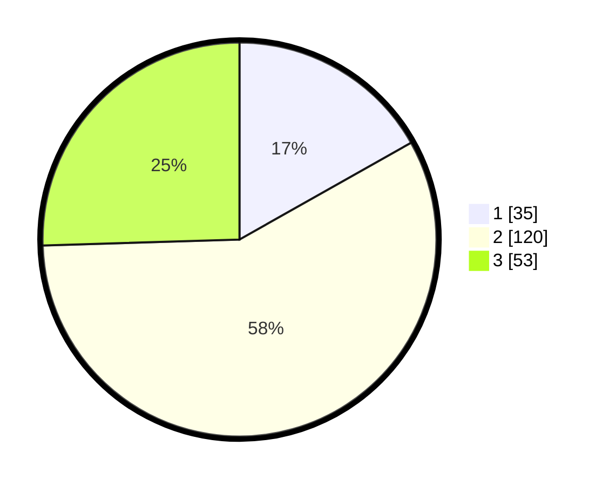

# Hasil

## Grafik

## Tabel

| No. | Nama Paslon    | Suara | Suara (raw) | Persentase |
|:--- |:-------------- | -----:| -----------:| ----------:|
| 1   | ANIES MUHAIMIN | 35    | [35][p-1]   | 16,83      |
| 2   | PRABOWO GIBRAN | 120   | [120][p-2]  | 57,69      |
| 3   | GANJAR MAHFUD  | 53    | [53][p-3]   | 25,48      |

[p-1]: https://github.com/gigit-pemilu/pemilu-2024-34-di-yogyakarta/blob/main/pilpres/hitung-suara/sub/34-di-yogyakarta/sub/03-gunungkidul/sub/16-girisubo/sub/2002-jepitu/sub/010-tps/sub/paslon-1.txt
[p-2]: https://github.com/gigit-pemilu/pemilu-2024-34-di-yogyakarta/blob/main/pilpres/hitung-suara/sub/34-di-yogyakarta/sub/03-gunungkidul/sub/16-girisubo/sub/2002-jepitu/sub/010-tps/sub/paslon-2.txt
[p-3]: https://github.com/gigit-pemilu/pemilu-2024-34-di-yogyakarta/blob/main/pilpres/hitung-suara/sub/34-di-yogyakarta/sub/03-gunungkidul/sub/16-girisubo/sub/2002-jepitu/sub/010-tps/sub/paslon-3.txt

## Foto C Plano

https://sirekap-obj-formc.kpu.go.id/5084/pemilu/ppwp/34/03/16/20/02/3403162002010-20240215-133236--ea2b0ab5-e965-4206-a201-07606337c1ac.jpg

https://sirekap-obj-formc.kpu.go.id/5084/pemilu/ppwp/34/03/16/20/02/3403162002010-20240215-202555--7cf926ff-f36f-4fda-8169-031af61faf65.jpg

https://sirekap-obj-formc.kpu.go.id/5084/pemilu/ppwp/34/03/16/20/02/3403162002010-20240215-204422--1a50dd0f-205d-4e77-b588-4e3f65803cfc.jpg

## Metadata

| Key        | Value               |
| ---------- | ------------------- |
| Time Stamp | 2024-02-15 22:00:27 |

