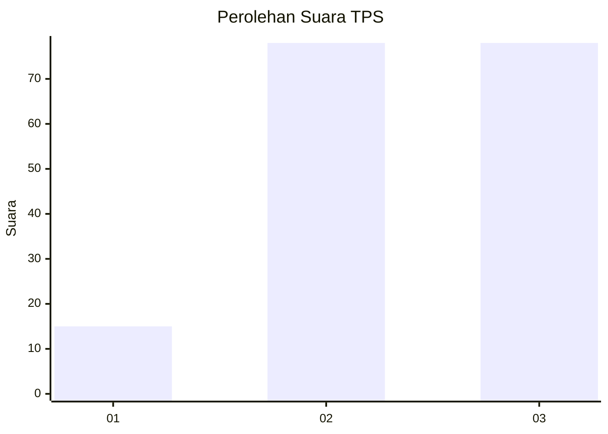
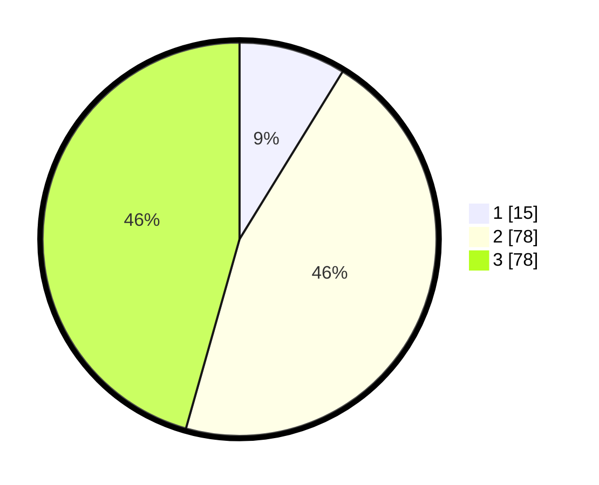

# Hasil

## Grafik

## Tabel

| No. | Nama Paslon    | Suara | Suara (raw) | Persentase |
|:--- |:-------------- | -----:| -----------:| ----------:|
| 1   | ANIES MUHAIMIN | 15    | [15][p-1]   | 8,77       |
| 2   | PRABOWO GIBRAN | 78    | [78][p-2]   | 45,61      |
| 3   | GANJAR MAHFUD  | 78    | [78][p-3]   | 45,61      |

[p-1]: https://github.com/gigit-pemilu/pemilu-2024-34-di-yogyakarta/blob/main/pilpres/hitung-suara/sub/34-di-yogyakarta/sub/03-gunungkidul/sub/16-girisubo/sub/2006-tileng/sub/008-tps/sub/paslon-1.txt
[p-2]: https://github.com/gigit-pemilu/pemilu-2024-34-di-yogyakarta/blob/main/pilpres/hitung-suara/sub/34-di-yogyakarta/sub/03-gunungkidul/sub/16-girisubo/sub/2006-tileng/sub/008-tps/sub/paslon-2.txt
[p-3]: https://github.com/gigit-pemilu/pemilu-2024-34-di-yogyakarta/blob/main/pilpres/hitung-suara/sub/34-di-yogyakarta/sub/03-gunungkidul/sub/16-girisubo/sub/2006-tileng/sub/008-tps/sub/paslon-3.txt

## Foto C Plano

https://sirekap-obj-formc.kpu.go.id/8a6f/pemilu/ppwp/34/03/16/20/06/3403162006008-20240216-022145--4ffaff27-4a43-4d41-b233-9dfc8c0cfc58.jpg

https://sirekap-obj-formc.kpu.go.id/8a6f/pemilu/ppwp/34/03/16/20/06/3403162006008-20240216-022151--d9567b0f-f7d3-47c2-9c27-fd392651d0e3.jpg

https://sirekap-obj-formc.kpu.go.id/8a6f/pemilu/ppwp/34/03/16/20/06/3403162006008-20240216-022147--6c0ebac3-b5a1-482a-a62d-c696784fe7db.jpg

## Metadata

| Key        | Value               |
| ---------- | ------------------- |
| Time Stamp | 2024-02-17 10:30:03 |

## DATA PEMILIH TETAP

Jumlah pemilih dalam DPT: **220**.
 * L: **101**.
 * P: **119**.

## DATA PENGGUNA HAK PILIH

Jumlah pengguna hak pilih dalam DPT: **192**.
 * L: **93**.
 * P: **99**.

Jumlah pengguna hak pilih dalam DPTb: **3**.
 * L: **2**.
 * P: **1**.

Jumlah pengguna hak pilih dalam DPK: **0**.
 * L: **0**.
 * P: **0**.

Jumlah pengguna hak pilih: **195**.
 * L: **95**.
 * P: **100**.

## JUMLAH SUARA SAH DAN TIDAK SAH

JUMLAH SELURUH SUARA SAH: **171**.

JUMLAH SUARA TIDAK SAH: **24**.

JUMLAH SELURUH SUARA SAH DAN SUARA TIDAK SAH: **195**.

