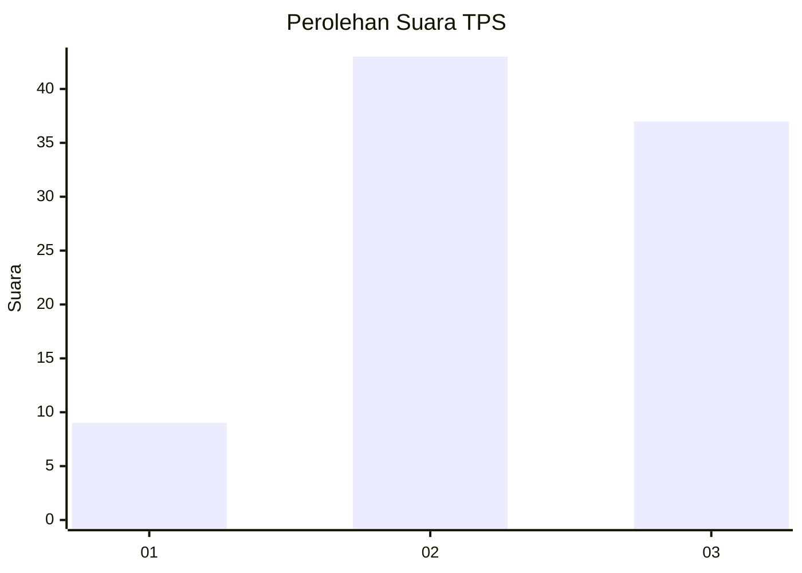
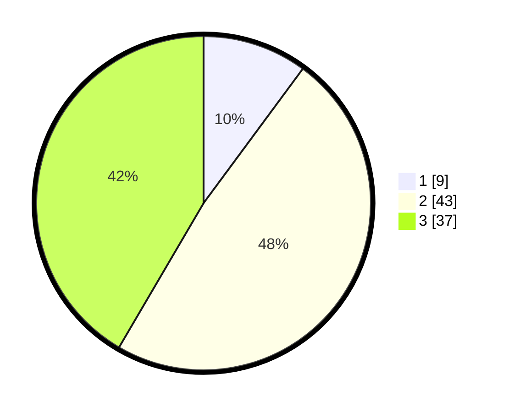

# Hasil

## Grafik

## Tabel

| No. | Nama Paslon    | Suara | Suara (raw) | Persentase |
|:--- |:-------------- | -----:| -----------:| ----------:|
| 1   | ANIES MUHAIMIN | 9     | [9][p-1]    | 10,11      |
| 2   | PRABOWO GIBRAN | 43    | [43][p-2]   | 48,31      |
| 3   | GANJAR MAHFUD  | 37    | [37][p-3]   | 41,57      |

[p-1]: https://github.com/gigit-pemilu/pemilu-2024-34-di-yogyakarta/blob/main/pilpres/hitung-suara/sub/34-di-yogyakarta/sub/03-gunungkidul/sub/16-girisubo/sub/2007-pucung/sub/001-tps/sub/paslon-1.txt
[p-2]: https://github.com/gigit-pemilu/pemilu-2024-34-di-yogyakarta/blob/main/pilpres/hitung-suara/sub/34-di-yogyakarta/sub/03-gunungkidul/sub/16-girisubo/sub/2007-pucung/sub/001-tps/sub/paslon-2.txt
[p-3]: https://github.com/gigit-pemilu/pemilu-2024-34-di-yogyakarta/blob/main/pilpres/hitung-suara/sub/34-di-yogyakarta/sub/03-gunungkidul/sub/16-girisubo/sub/2007-pucung/sub/001-tps/sub/paslon-3.txt

## Foto C Plano

https://sirekap-obj-formc.kpu.go.id/0dc8/pemilu/ppwp/34/03/16/20/07/3403162007001-20240215-021654--fac5e501-79d8-46b3-b611-c05aaa304ec5.jpg

https://sirekap-obj-formc.kpu.go.id/0dc8/pemilu/ppwp/34/03/16/20/07/3403162007001-20240215-021717--ca4fd7e8-9ee5-4b7f-a0b4-0301cda9354d.jpg

https://sirekap-obj-formc.kpu.go.id/0dc8/pemilu/ppwp/34/03/16/20/07/3403162007001-20240215-021730--9a17d602-0c0f-4414-a428-8642ae1d8e0b.jpg

## Metadata

| Key        | Value               |
| ---------- | ------------------- |
| Time Stamp | 2024-02-15 16:30:25 |

## DATA PEMILIH TETAP

Jumlah pemilih dalam DPT: **146**.
 * L: **74**.
 * P: **72**.

## DATA PENGGUNA HAK PILIH

Jumlah pengguna hak pilih dalam DPT: **93**.
 * L: **38**.
 * P: **55**.

Jumlah pengguna hak pilih dalam DPTb: **0**.
 * L: **0**.
 * P: **0**.

Jumlah pengguna hak pilih dalam DPK: **0**.
 * L: **0**.
 * P: **0**.

Jumlah pengguna hak pilih: **93**.
 * L: **38**.
 * P: **55**.

## JUMLAH SUARA SAH DAN TIDAK SAH

JUMLAH SELURUH SUARA SAH: **89**.

JUMLAH SUARA TIDAK SAH: **4**.

JUMLAH SELURUH SUARA SAH DAN SUARA TIDAK SAH: **93**.

