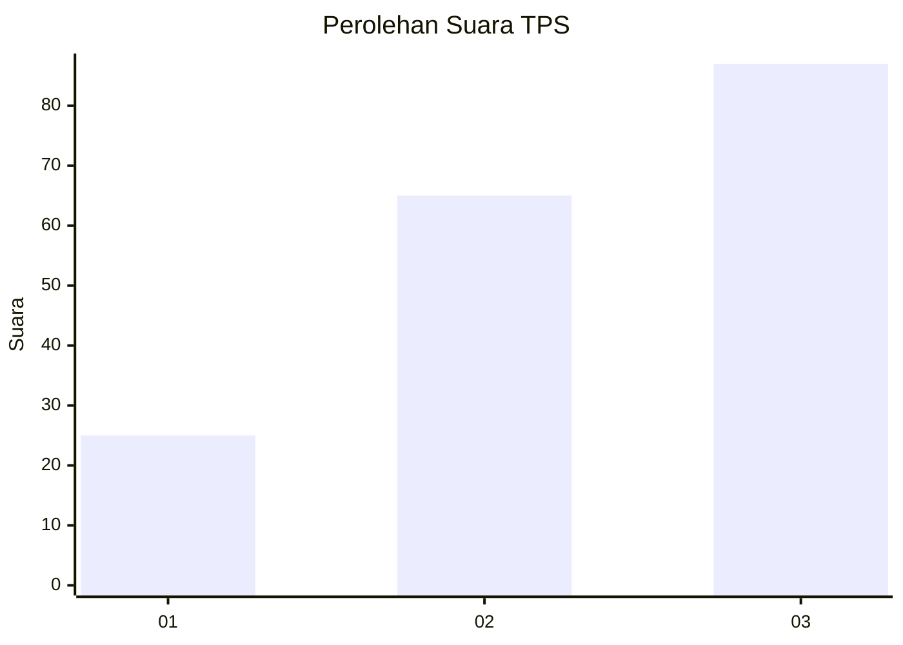
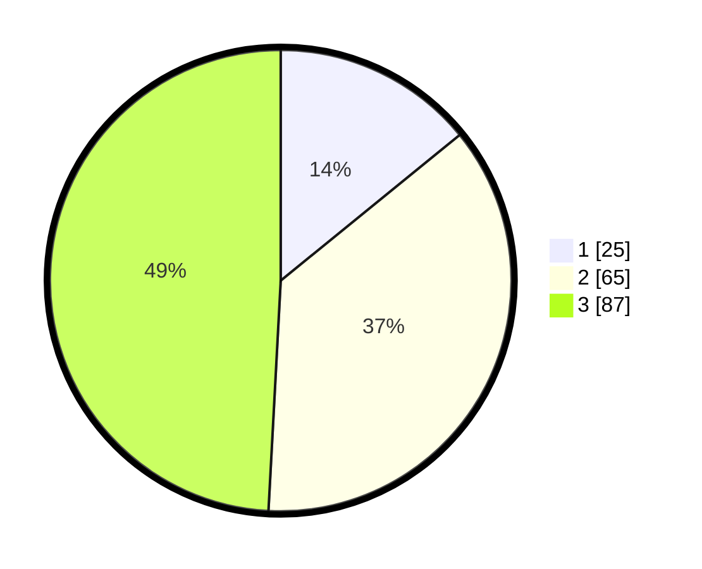

# Hasil

## Grafik

## Tabel

| No. | Nama Paslon    | Suara | Suara (raw) | Persentase |
|:--- |:-------------- | -----:| -----------:| ----------:|
| 1   | ANIES MUHAIMIN | 25    | [25][p-1]   | 14,12      |
| 2   | PRABOWO GIBRAN | 65    | [65][p-2]   | 36,72      |
| 3   | GANJAR MAHFUD  | 87    | [87][p-3]   | 49,15      |

[p-1]: https://github.com/gigit-pemilu/pemilu-2024-34-di-yogyakarta/blob/main/pilpres/hitung-suara/sub/34-di-yogyakarta/sub/03-gunungkidul/sub/16-girisubo/sub/2008-songbanyu/sub/001-tps/sub/paslon-1.txt
[p-2]: https://github.com/gigit-pemilu/pemilu-2024-34-di-yogyakarta/blob/main/pilpres/hitung-suara/sub/34-di-yogyakarta/sub/03-gunungkidul/sub/16-girisubo/sub/2008-songbanyu/sub/001-tps/sub/paslon-2.txt
[p-3]: https://github.com/gigit-pemilu/pemilu-2024-34-di-yogyakarta/blob/main/pilpres/hitung-suara/sub/34-di-yogyakarta/sub/03-gunungkidul/sub/16-girisubo/sub/2008-songbanyu/sub/001-tps/sub/paslon-3.txt

## Foto C Plano

https://sirekap-obj-formc.kpu.go.id/7e51/pemilu/ppwp/34/03/16/20/08/3403162008001-20240216-081023--81349ab0-6be0-4f9c-a6a5-93225cbfe4f7.jpg

https://sirekap-obj-formc.kpu.go.id/7e51/pemilu/ppwp/34/03/16/20/08/3403162008001-20240216-081036--aa17ab59-f59c-4809-ac98-2ae72e0872fc.jpg

https://sirekap-obj-formc.kpu.go.id/7e51/pemilu/ppwp/34/03/16/20/08/3403162008001-20240216-081027--5ce297cb-6334-4651-9a78-d081d3b5c120.jpg

## Metadata

| Key        | Value               |
| ---------- | ------------------- |
| Time Stamp | 2024-02-17 11:00:02 |

## DATA PEMILIH TETAP

Jumlah pemilih dalam DPT: **244**.
 * L: **116**.
 * P: **128**.

## DATA PENGGUNA HAK PILIH

Jumlah pengguna hak pilih dalam DPT: **205**.
 * L: **96**.
 * P: **109**.

Jumlah pengguna hak pilih dalam DPTb: **0**.
 * L: **0**.
 * P: **0**.

Jumlah pengguna hak pilih dalam DPK: **0**.
 * L: **0**.
 * P: **0**.

Jumlah pengguna hak pilih: **205**.
 * L: **96**.
 * P: **109**.

## JUMLAH SUARA SAH DAN TIDAK SAH

JUMLAH SELURUH SUARA SAH: **177**.

JUMLAH SUARA TIDAK SAH: **28**.

JUMLAH SELURUH SUARA SAH DAN SUARA TIDAK SAH: **205**.

