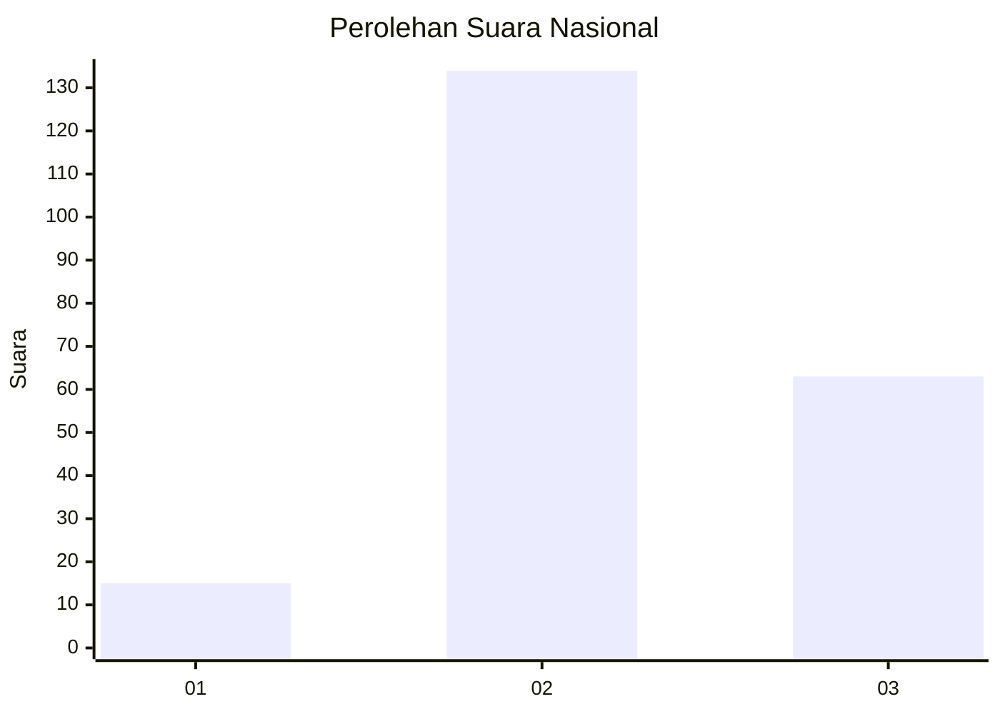
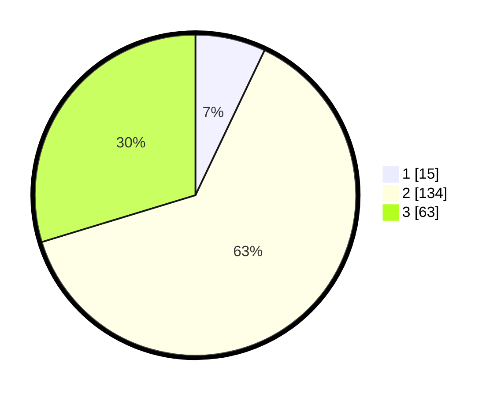

# Hasil

## Grafik

## Tabel

| No. | Nama Paslon    | Suara | Suara (raw) | Persentase |
|:--- |:-------------- | -----:| -----------:| ----------:|
| 1   | ANIES MUHAIMIN | 15    | [15][p-1]   | 7,08       |
| 2   | PRABOWO GIBRAN | 134   | [134][p-2]  | 63,21      |
| 3   | GANJAR MAHFUD  | 63    | [63][p-3]   | 29,72      |

[p-1]: https://github.com/gigit-pemilu/pemilu-2024/blob/main/pilpres/hitung-suara/sub/34-di-yogyakarta/sub/03-gunungkidul/sub/16-girisubo/sub/2008-songbanyu/sub/007-tps/sub/paslon-1.txt
[p-2]: https://github.com/gigit-pemilu/pemilu-2024/blob/main/pilpres/hitung-suara/sub/34-di-yogyakarta/sub/03-gunungkidul/sub/16-girisubo/sub/2008-songbanyu/sub/007-tps/sub/paslon-2.txt
[p-3]: https://github.com/gigit-pemilu/pemilu-2024/blob/main/pilpres/hitung-suara/sub/34-di-yogyakarta/sub/03-gunungkidul/sub/16-girisubo/sub/2008-songbanyu/sub/007-tps/sub/paslon-3.txt

## Foto C Plano

https://sirekap-obj-formc.kpu.go.id/ee30/pemilu/ppwp/34/03/16/20/08/3403162008007-20240215-075824--af63bf09-c1ee-4693-9587-774a7eed6d71.jpg

https://sirekap-obj-formc.kpu.go.id/ee30/pemilu/ppwp/34/03/16/20/08/3403162008007-20240215-075810--56ee5f1c-2695-41b9-b7a9-a1c2cef5770c.jpg

https://sirekap-obj-formc.kpu.go.id/ee30/pemilu/ppwp/34/03/16/20/08/3403162008007-20240215-075851--8c3ddc24-e73d-4c8d-9c52-349a33c9ba66.jpg

## Metadata

| Key        | Value               |
| ---------- | ------------------- |
| Time Stamp | 2024-02-15 19:00:26 |

