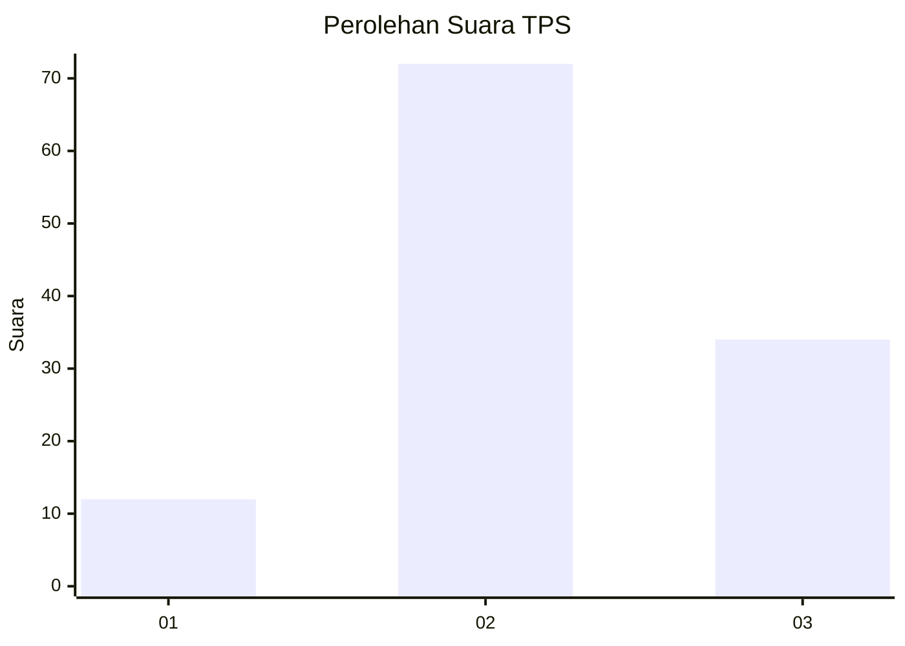
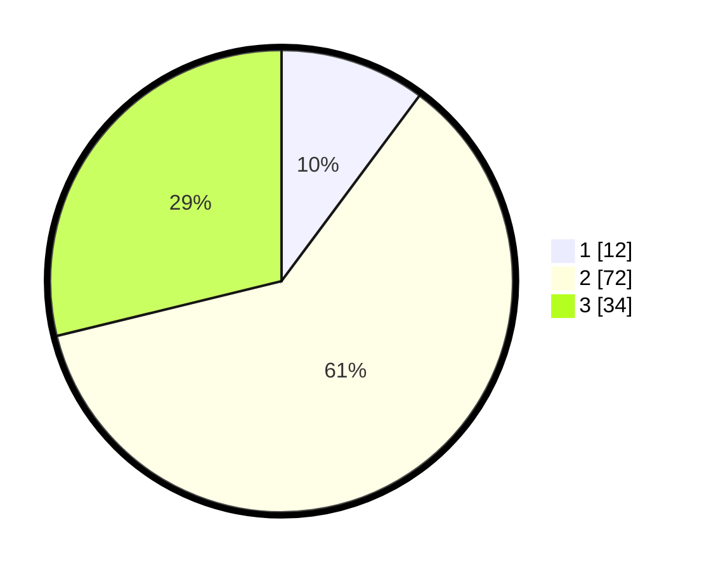

# Hasil

## Grafik

## Tabel

| No. | Nama Paslon    | Suara | Suara (raw) | Persentase |
|:--- |:-------------- | -----:| -----------:| ----------:|
| 1   | ANIES MUHAIMIN | 12    | [12][p-1]   | 10,17      |
| 2   | PRABOWO GIBRAN | 72    | [72][p-2]   | 61,02      |
| 3   | GANJAR MAHFUD  | 34    | [34][p-3]   | 28,81      |

[p-1]: https://github.com/gigit-pemilu/pemilu-2024-34-di-yogyakarta/blob/main/pilpres/hitung-suara/sub/34-di-yogyakarta/sub/03-gunungkidul/sub/17-tanjungsari/sub/2001-hargosari/sub/002-tps/sub/paslon-1.txt
[p-2]: https://github.com/gigit-pemilu/pemilu-2024-34-di-yogyakarta/blob/main/pilpres/hitung-suara/sub/34-di-yogyakarta/sub/03-gunungkidul/sub/17-tanjungsari/sub/2001-hargosari/sub/002-tps/sub/paslon-2.txt
[p-3]: https://github.com/gigit-pemilu/pemilu-2024-34-di-yogyakarta/blob/main/pilpres/hitung-suara/sub/34-di-yogyakarta/sub/03-gunungkidul/sub/17-tanjungsari/sub/2001-hargosari/sub/002-tps/sub/paslon-3.txt

## Foto C Plano

https://sirekap-obj-formc.kpu.go.id/6aff/pemilu/ppwp/34/03/17/20/01/3403172001002-20240216-021300--fa4e16aa-1f32-4963-bb82-030db30b38e0.jpg

https://sirekap-obj-formc.kpu.go.id/6aff/pemilu/ppwp/34/03/17/20/01/3403172001002-20240216-021316--ea87e0fc-f3e0-43f5-aa7e-b4ddbed126fb.jpg

https://sirekap-obj-formc.kpu.go.id/6aff/pemilu/ppwp/34/03/17/20/01/3403172001002-20240216-021308--064f2210-4062-4374-abc8-dd8b53c98f48.jpg

## Metadata

| Key        | Value               |
| ---------- | ------------------- |
| Time Stamp | 2024-02-17 11:30:03 |

## DATA PEMILIH TETAP

Jumlah pemilih dalam DPT: **131**.
 * L: **59**.
 * P: **72**.

## DATA PENGGUNA HAK PILIH

Jumlah pengguna hak pilih dalam DPT: **118**.
 * L: **54**.
 * P: **64**.

Jumlah pengguna hak pilih dalam DPTb: **3**.
 * L: **1**.
 * P: **2**.

Jumlah pengguna hak pilih dalam DPK: **0**.
 * L: **0**.
 * P: **0**.

Jumlah pengguna hak pilih: **121**.
 * L: **55**.
 * P: **66**.

## JUMLAH SUARA SAH DAN TIDAK SAH

JUMLAH SELURUH SUARA SAH: **118**.

JUMLAH SUARA TIDAK SAH: **3**.

JUMLAH SELURUH SUARA SAH DAN SUARA TIDAK SAH: **121**.

