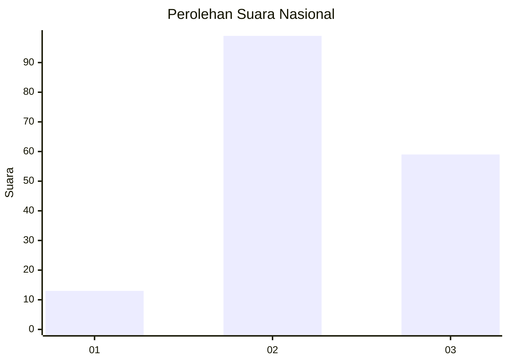
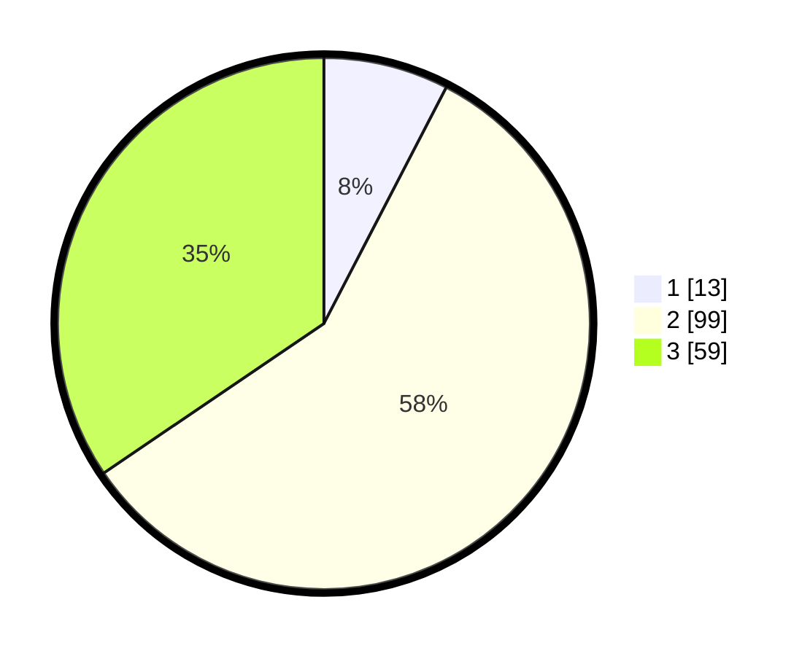

# Hasil

## Grafik

## Tabel

| No. | Nama Paslon    | Suara | Suara (raw) | Persentase |
|:--- |:-------------- | -----:| -----------:| ----------:|
| 1   | ANIES MUHAIMIN | 13    | [13][p-1]   | 7,60       |
| 2   | PRABOWO GIBRAN | 99    | [99][p-2]   | 57,89      |
| 3   | GANJAR MAHFUD  | 59    | [59][p-3]   | 34,50      |

[p-1]: https://github.com/gigit-pemilu/pemilu-2024/blob/main/pilpres/hitung-suara/sub/34-di-yogyakarta/sub/03-gunungkidul/sub/17-tanjungsari/sub/2001-hargosari/sub/003-tps/sub/paslon-1.txt
[p-2]: https://github.com/gigit-pemilu/pemilu-2024/blob/main/pilpres/hitung-suara/sub/34-di-yogyakarta/sub/03-gunungkidul/sub/17-tanjungsari/sub/2001-hargosari/sub/003-tps/sub/paslon-2.txt
[p-3]: https://github.com/gigit-pemilu/pemilu-2024/blob/main/pilpres/hitung-suara/sub/34-di-yogyakarta/sub/03-gunungkidul/sub/17-tanjungsari/sub/2001-hargosari/sub/003-tps/sub/paslon-3.txt

## Foto C Plano

https://sirekap-obj-formc.kpu.go.id/887f/pemilu/ppwp/34/03/17/20/01/3403172001003-20240216-094318--4c7de3ec-492a-420d-98c0-6e6bc129e05b.jpg

https://sirekap-obj-formc.kpu.go.id/887f/pemilu/ppwp/34/03/17/20/01/3403172001003-20240216-094320--c6f4c568-7647-4040-b45d-43fa90ba32e4.jpg

https://sirekap-obj-formc.kpu.go.id/887f/pemilu/ppwp/34/03/17/20/01/3403172001003-20240216-094319--f269dd16-5e38-454a-b8ef-e8c7e1efd1b0.jpg

## Metadata

| Key        | Value               |
| ---------- | ------------------- |
| Time Stamp | 2024-02-17 11:30:03 |

## DATA PEMILIH TETAP

Jumlah pemilih dalam DPT: **205**.
 * L: **102**.
 * P: **103**.

## DATA PENGGUNA HAK PILIH

Jumlah pengguna hak pilih dalam DPT: **179**.
 * L: **90**.
 * P: **89**.

Jumlah pengguna hak pilih dalam DPTb: **3**.
 * L: **1**.
 * P: **2**.

Jumlah pengguna hak pilih dalam DPK: **1**.
 * L: **0**.
 * P: **1**.

Jumlah pengguna hak pilih: **183**.
 * L: **91**.
 * P: **92**.

## JUMLAH SUARA SAH DAN TIDAK SAH

JUMLAH SELURUH SUARA SAH: **171**.

JUMLAH SUARA TIDAK SAH: **12**.

JUMLAH SELURUH SUARA SAH DAN SUARA TIDAK SAH: **183**.

