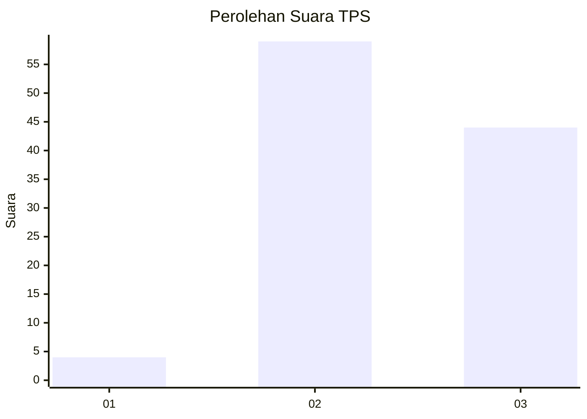
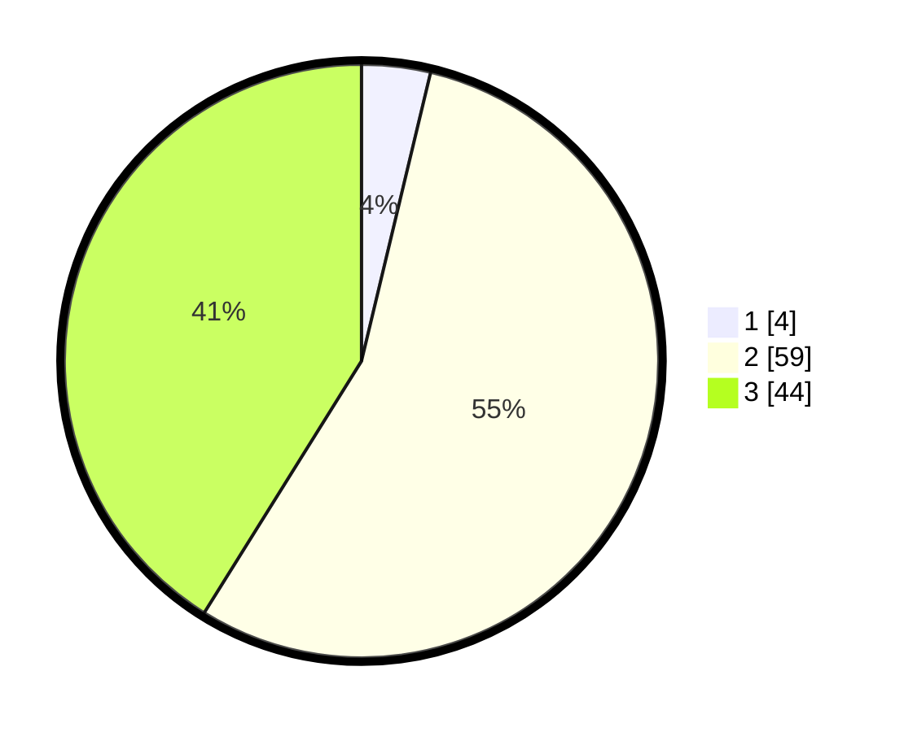

# Hasil

## Grafik

## Tabel

| No. | Nama Paslon    | Suara | Suara (raw) | Persentase |
|:--- |:-------------- | -----:| -----------:| ----------:|
| 1   | ANIES MUHAIMIN | 4     | [4][p-1]    | 3,74       |
| 2   | PRABOWO GIBRAN | 59    | [59][p-2]   | 55,14      |
| 3   | GANJAR MAHFUD  | 44    | [44][p-3]   | 41,12      |

[p-1]: https://github.com/gigit-pemilu/pemilu-2024-34-di-yogyakarta/blob/main/pilpres/hitung-suara/sub/34-di-yogyakarta/sub/03-gunungkidul/sub/17-tanjungsari/sub/2003-kemadang/sub/003-tps/sub/paslon-1.txt
[p-2]: https://github.com/gigit-pemilu/pemilu-2024-34-di-yogyakarta/blob/main/pilpres/hitung-suara/sub/34-di-yogyakarta/sub/03-gunungkidul/sub/17-tanjungsari/sub/2003-kemadang/sub/003-tps/sub/paslon-2.txt
[p-3]: https://github.com/gigit-pemilu/pemilu-2024-34-di-yogyakarta/blob/main/pilpres/hitung-suara/sub/34-di-yogyakarta/sub/03-gunungkidul/sub/17-tanjungsari/sub/2003-kemadang/sub/003-tps/sub/paslon-3.txt

## Foto C Plano

https://sirekap-obj-formc.kpu.go.id/a94f/pemilu/ppwp/34/03/17/20/03/3403172003003-20240216-144801--a4816f9c-4fab-4f29-a2fc-f49d1b414fd1.jpg

https://sirekap-obj-formc.kpu.go.id/a94f/pemilu/ppwp/34/03/17/20/03/3403172003003-20240216-144802--64ec597d-8f0d-4e7d-a5c1-f1175470103e.jpg

https://sirekap-obj-formc.kpu.go.id/a94f/pemilu/ppwp/34/03/17/20/03/3403172003003-20240216-144801--f6f3c5da-228b-427d-82c5-b742e8f85eee.jpg

## Metadata

| Key        | Value               |
| ---------- | ------------------- |
| Time Stamp | 2024-02-17 11:30:03 |

## DATA PEMILIH TETAP

Jumlah pemilih dalam DPT: **125**.
 * L: **66**.
 * P: **59**.

## DATA PENGGUNA HAK PILIH

Jumlah pengguna hak pilih dalam DPT: **103**.
 * L: **51**.
 * P: **52**.

Jumlah pengguna hak pilih dalam DPTb: **4**.
 * L: **1**.
 * P: **3**.

Jumlah pengguna hak pilih dalam DPK: **0**.
 * L: **0**.
 * P: **0**.

Jumlah pengguna hak pilih: **107**.
 * L: **52**.
 * P: **55**.

## JUMLAH SUARA SAH DAN TIDAK SAH

JUMLAH SELURUH SUARA SAH: **107**.

JUMLAH SUARA TIDAK SAH: **0**.

JUMLAH SELURUH SUARA SAH DAN SUARA TIDAK SAH: **107**.

