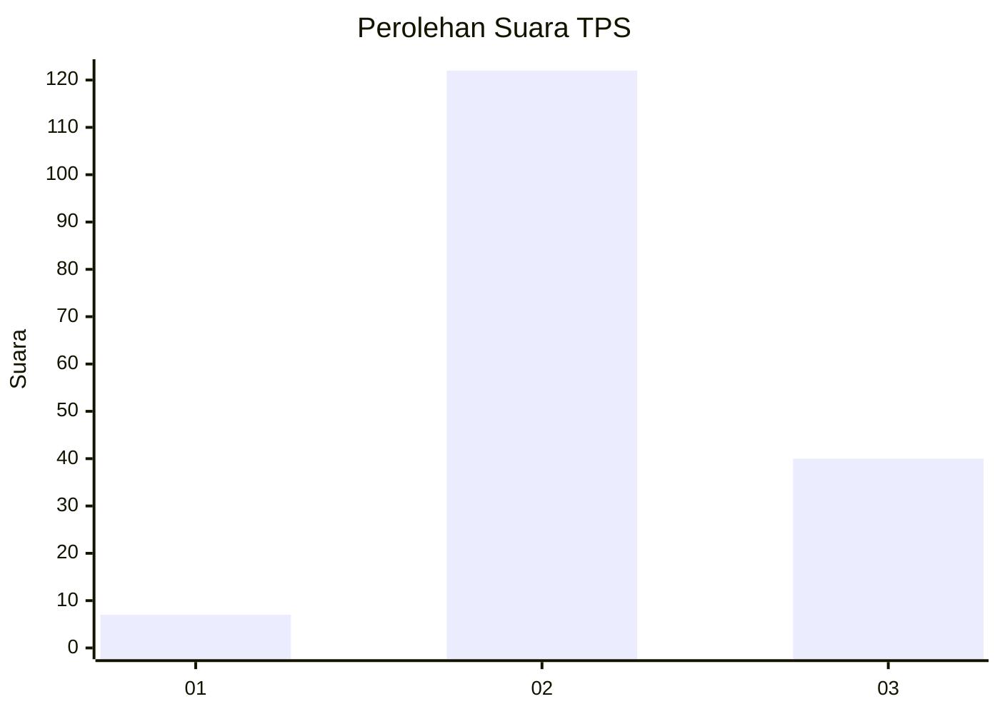
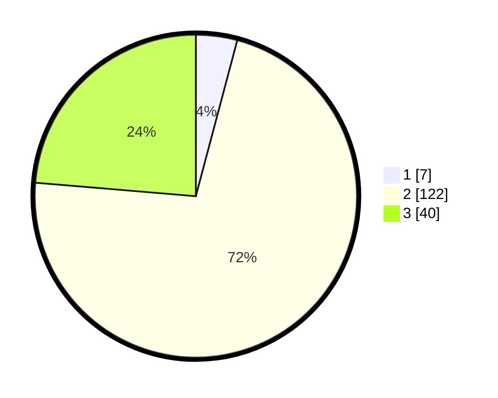

# Hasil

## Grafik

## Tabel

| No. | Nama Paslon    | Suara | Suara (raw) | Persentase |
|:--- |:-------------- | -----:| -----------:| ----------:|
| 1   | ANIES MUHAIMIN | 7     | [7][p-1]    | 4,14       |
| 2   | PRABOWO GIBRAN | 122   | [122][p-2]  | 72,19      |
| 3   | GANJAR MAHFUD  | 40    | [40][p-3]   | 23,67      |

[p-1]: https://github.com/gigit-pemilu/pemilu-2024-34-di-yogyakarta/blob/main/pilpres/hitung-suara/sub/34-di-yogyakarta/sub/03-gunungkidul/sub/17-tanjungsari/sub/2004-banjarejo/sub/009-tps/sub/paslon-1.txt
[p-2]: https://github.com/gigit-pemilu/pemilu-2024-34-di-yogyakarta/blob/main/pilpres/hitung-suara/sub/34-di-yogyakarta/sub/03-gunungkidul/sub/17-tanjungsari/sub/2004-banjarejo/sub/009-tps/sub/paslon-2.txt
[p-3]: https://github.com/gigit-pemilu/pemilu-2024-34-di-yogyakarta/blob/main/pilpres/hitung-suara/sub/34-di-yogyakarta/sub/03-gunungkidul/sub/17-tanjungsari/sub/2004-banjarejo/sub/009-tps/sub/paslon-3.txt

## Foto C Plano

https://sirekap-obj-formc.kpu.go.id/5457/pemilu/ppwp/34/03/17/20/04/3403172004009-20240215-001610--5601e366-1e88-44d1-b271-32f8b510eb78.jpg

https://sirekap-obj-formc.kpu.go.id/5457/pemilu/ppwp/34/03/17/20/04/3403172004009-20240215-001716--c9db19de-809c-427e-aff6-603cb527059d.jpg

https://sirekap-obj-formc.kpu.go.id/5457/pemilu/ppwp/34/03/17/20/04/3403172004009-20240215-001856--0bd47dba-d3df-401f-86d7-11fe10bd11d3.jpg

## Metadata

| Key        | Value               |
| ---------- | ------------------- |
| Time Stamp | 2024-02-17 19:30:00 |

