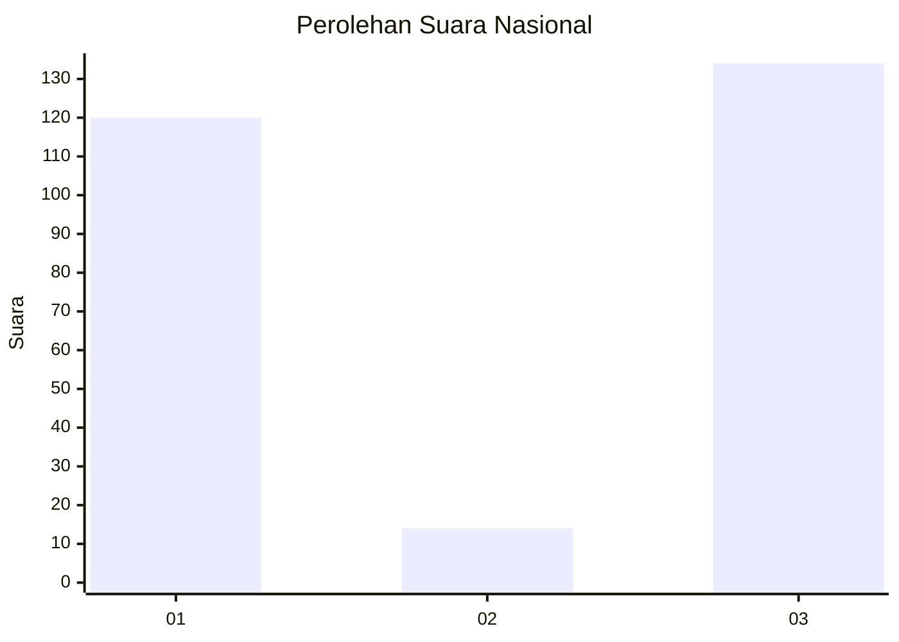
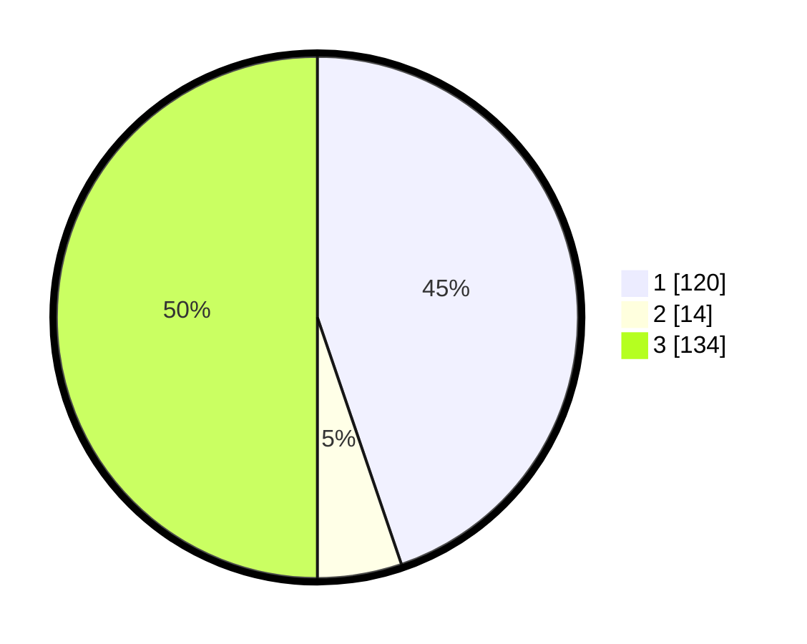

# Hasil

## Grafik

## Tabel

| No. | Nama Paslon    | Suara | Suara (raw) | Persentase |
|:--- |:-------------- | -----:| -----------:| ----------:|
| 1   | ANIES MUHAIMIN | 120   | [120][p-1]  | 44,78      |
| 2   | PRABOWO GIBRAN | 14    | [14][p-2]   | 5,22       |
| 3   | GANJAR MAHFUD  | 134   | [134][p-3]  | 50,00      |

[p-1]: https://github.com/gigit-pemilu/pemilu-2024/blob/main/pilpres/hitung-suara/sub/34-di-yogyakarta/sub/03-gunungkidul/sub/17-tanjungsari/sub/2004-banjarejo/sub/010-tps/sub/paslon-1.txt
[p-2]: https://github.com/gigit-pemilu/pemilu-2024/blob/main/pilpres/hitung-suara/sub/34-di-yogyakarta/sub/03-gunungkidul/sub/17-tanjungsari/sub/2004-banjarejo/sub/010-tps/sub/paslon-2.txt
[p-3]: https://github.com/gigit-pemilu/pemilu-2024/blob/main/pilpres/hitung-suara/sub/34-di-yogyakarta/sub/03-gunungkidul/sub/17-tanjungsari/sub/2004-banjarejo/sub/010-tps/sub/paslon-3.txt

## Foto C Plano

https://sirekap-obj-formc.kpu.go.id/5a25/pemilu/ppwp/34/03/17/20/04/3403172004010-20240214-200443--43a78f63-cf75-4379-b21c-cbb7ca6c417a.jpg

https://sirekap-obj-formc.kpu.go.id/5a25/pemilu/ppwp/34/03/17/20/04/3403172004010-20240214-200502--7bde8f1e-f080-43bc-8b2b-0de647eebf48.jpg

https://sirekap-obj-formc.kpu.go.id/5a25/pemilu/ppwp/34/03/17/20/04/3403172004010-20240214-200517--09dfe40e-8cf9-4e12-9b4e-aee7a0fe8169.jpg

## Metadata

| Key        | Value               |
| ---------- | ------------------- |
| Time Stamp | 2024-02-24 22:31:28 |

