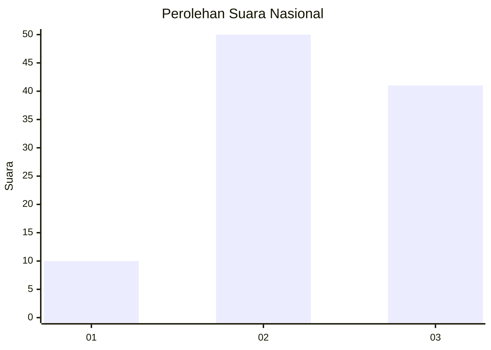
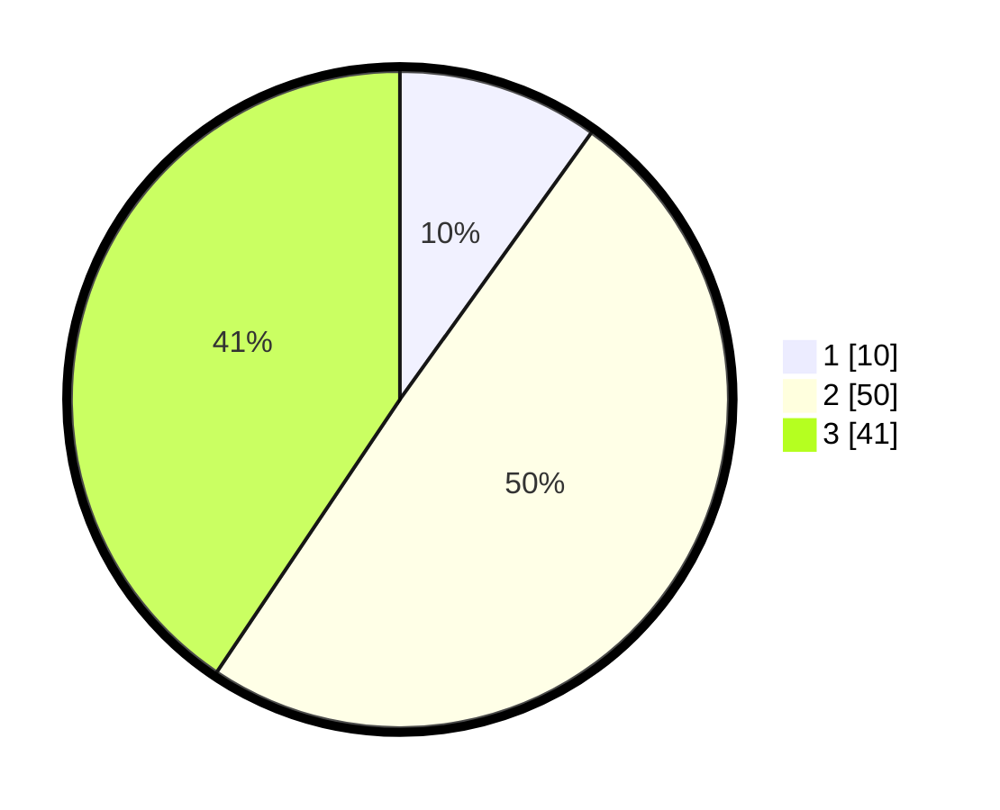

# Hasil

## Grafik

## Tabel

| No. | Nama Paslon    | Suara | Suara (raw) | Persentase |
|:--- |:-------------- | -----:| -----------:| ----------:|
| 1   | ANIES MUHAIMIN | 10    | [10][p-1]   | 9,90       |
| 2   | PRABOWO GIBRAN | 50    | [50][p-2]   | 49,50      |
| 3   | GANJAR MAHFUD  | 41    | [41][p-3]   | 40,59      |

[p-1]: https://github.com/gigit-pemilu/pemilu-2024/blob/main/pilpres/hitung-suara/sub/34-di-yogyakarta/sub/03-gunungkidul/sub/17-tanjungsari/sub/2004-banjarejo/sub/024-tps/sub/paslon-1.txt
[p-2]: https://github.com/gigit-pemilu/pemilu-2024/blob/main/pilpres/hitung-suara/sub/34-di-yogyakarta/sub/03-gunungkidul/sub/17-tanjungsari/sub/2004-banjarejo/sub/024-tps/sub/paslon-2.txt
[p-3]: https://github.com/gigit-pemilu/pemilu-2024/blob/main/pilpres/hitung-suara/sub/34-di-yogyakarta/sub/03-gunungkidul/sub/17-tanjungsari/sub/2004-banjarejo/sub/024-tps/sub/paslon-3.txt

## Foto C Plano

https://sirekap-obj-formc.kpu.go.id/eaee/pemilu/ppwp/34/03/17/20/04/3403172004024-20240217-065104--aa2c8c42-3f6b-4f3c-a450-2229448fe634.jpg

https://sirekap-obj-formc.kpu.go.id/eaee/pemilu/ppwp/34/03/17/20/04/3403172004024-20240217-065105--43bf714b-1eaf-41c0-8f1b-a31210ef7520.jpg

https://sirekap-obj-formc.kpu.go.id/eaee/pemilu/ppwp/34/03/17/20/04/3403172004024-20240217-065104--81c93775-81ea-499d-8133-a8ed1e6144c5.jpg

## Metadata

| Key        | Value               |
| ---------- | ------------------- |
| Time Stamp | 2024-02-17 13:37:34 |

## DATA PEMILIH TETAP

Jumlah pemilih dalam DPT: **108**.
 * L: **50**.
 * P: **58**.

## DATA PENGGUNA HAK PILIH

Jumlah pengguna hak pilih dalam DPT: **99**.
 * L: **46**.
 * P: **53**.

Jumlah pengguna hak pilih dalam DPTb: **4**.
 * L: **0**.
 * P: **4**.

Jumlah pengguna hak pilih dalam DPK: **2**.
 * L: **0**.
 * P: **2**.

Jumlah pengguna hak pilih: **105**.
 * L: **46**.
 * P: **59**.

## JUMLAH SUARA SAH DAN TIDAK SAH

JUMLAH SELURUH SUARA SAH: **101**.

JUMLAH SUARA TIDAK SAH: **4**.

JUMLAH SELURUH SUARA SAH DAN SUARA TIDAK SAH: **105**.

