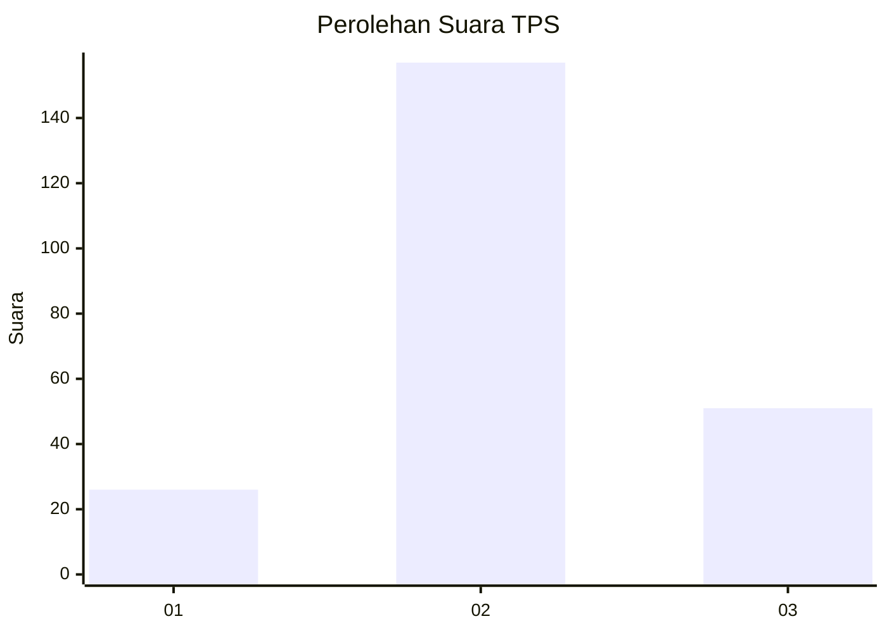
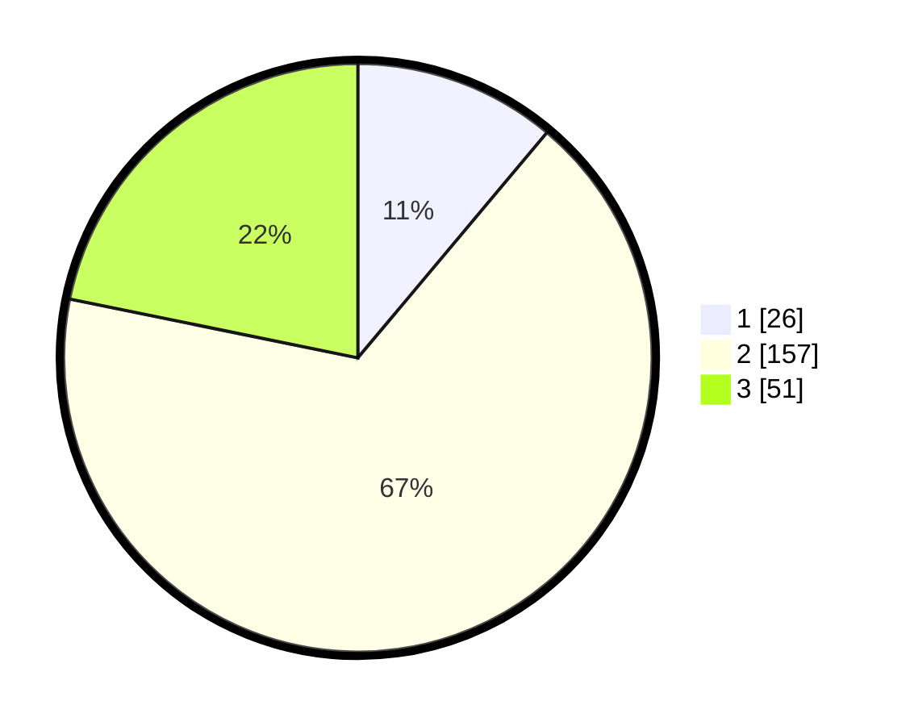

# Hasil

## Grafik

## Tabel

| No. | Nama Paslon    | Suara | Suara (raw) | Persentase |
|:--- |:-------------- | -----:| -----------:| ----------:|
| 1   | ANIES MUHAIMIN | 26    | [26][p-1]   | 11,11      |
| 2   | PRABOWO GIBRAN | 157   | [157][p-2]  | 67,09      |
| 3   | GANJAR MAHFUD  | 51    | [51][p-3]   | 21,79      |

[p-1]: https://github.com/gigit-pemilu/pemilu-2024-34-di-yogyakarta/blob/main/pilpres/hitung-suara/sub/34-di-yogyakarta/sub/03-gunungkidul/sub/18-purwosari/sub/2001-giripurwo/sub/001-tps/sub/paslon-1.txt
[p-2]: https://github.com/gigit-pemilu/pemilu-2024-34-di-yogyakarta/blob/main/pilpres/hitung-suara/sub/34-di-yogyakarta/sub/03-gunungkidul/sub/18-purwosari/sub/2001-giripurwo/sub/001-tps/sub/paslon-2.txt
[p-3]: https://github.com/gigit-pemilu/pemilu-2024-34-di-yogyakarta/blob/main/pilpres/hitung-suara/sub/34-di-yogyakarta/sub/03-gunungkidul/sub/18-purwosari/sub/2001-giripurwo/sub/001-tps/sub/paslon-3.txt

## Foto C Plano

https://sirekap-obj-formc.kpu.go.id/4511/pemilu/ppwp/34/03/18/20/01/3403182001001-20240216-010618--cd8e8f40-e985-4df9-9894-85bae79b6b00.jpg

https://sirekap-obj-formc.kpu.go.id/4511/pemilu/ppwp/34/03/18/20/01/3403182001001-20240216-010634--2441c0cc-d8d7-445b-82a4-391ce8fafcd9.jpg

https://sirekap-obj-formc.kpu.go.id/4511/pemilu/ppwp/34/03/18/20/01/3403182001001-20240216-010628--b1f007a2-535a-42b5-9541-9d187ffe4a19.jpg

## Metadata

| Key        | Value               |
| ---------- | ------------------- |
| Time Stamp | 2024-02-16 10:30:29 |

## DATA PEMILIH TETAP

Jumlah pemilih dalam DPT: **266**.
 * L: **131**.
 * P: **135**.

## DATA PENGGUNA HAK PILIH

Jumlah pengguna hak pilih dalam DPT: **235**.
 * L: **111**.
 * P: **124**.

Jumlah pengguna hak pilih dalam DPTb: **8**.
 * L: **5**.
 * P: **3**.

Jumlah pengguna hak pilih dalam DPK: **0**.
 * L: **0**.
 * P: **0**.

Jumlah pengguna hak pilih: **243**.
 * L: **116**.
 * P: **127**.

## JUMLAH SUARA SAH DAN TIDAK SAH

JUMLAH SELURUH SUARA SAH: **234**.

JUMLAH SUARA TIDAK SAH: **9**.

JUMLAH SELURUH SUARA SAH DAN SUARA TIDAK SAH: **243**.

