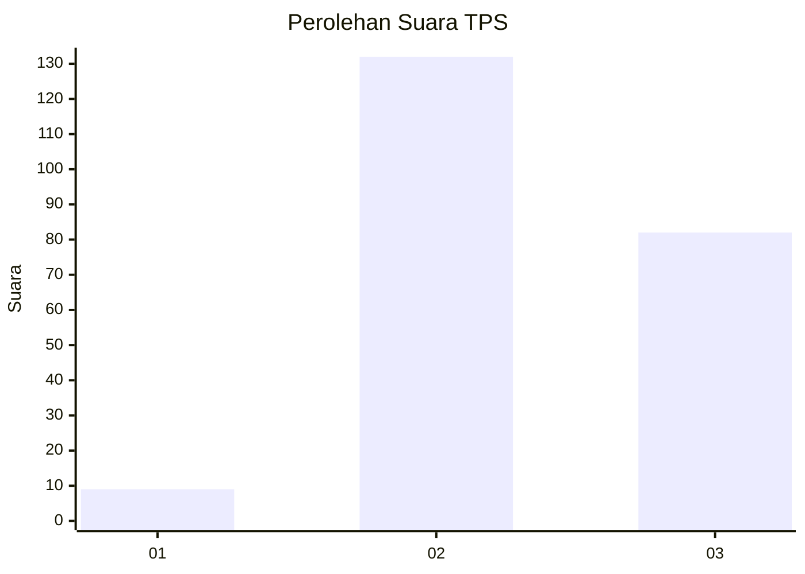
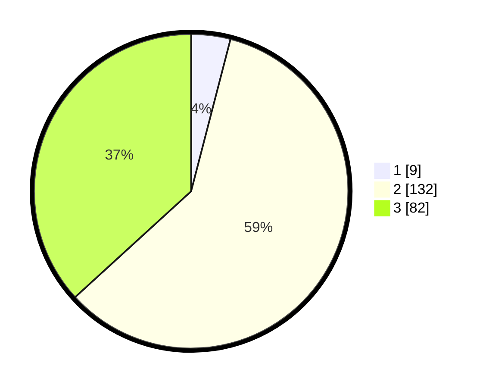

# Hasil

## Grafik

## Tabel

| No. | Nama Paslon    | Suara | Suara (raw) | Persentase |
|:--- |:-------------- | -----:| -----------:| ----------:|
| 1   | ANIES MUHAIMIN | 9     | [9][p-1]    | 4,04       |
| 2   | PRABOWO GIBRAN | 132   | [132][p-2]  | 59,19      |
| 3   | GANJAR MAHFUD  | 82    | [82][p-3]   | 36,77      |

[p-1]: https://github.com/gigit-pemilu/pemilu-2024-34-di-yogyakarta/blob/main/pilpres/hitung-suara/sub/34-di-yogyakarta/sub/03-gunungkidul/sub/18-purwosari/sub/2001-giripurwo/sub/003-tps/sub/paslon-1.txt
[p-2]: https://github.com/gigit-pemilu/pemilu-2024-34-di-yogyakarta/blob/main/pilpres/hitung-suara/sub/34-di-yogyakarta/sub/03-gunungkidul/sub/18-purwosari/sub/2001-giripurwo/sub/003-tps/sub/paslon-2.txt
[p-3]: https://github.com/gigit-pemilu/pemilu-2024-34-di-yogyakarta/blob/main/pilpres/hitung-suara/sub/34-di-yogyakarta/sub/03-gunungkidul/sub/18-purwosari/sub/2001-giripurwo/sub/003-tps/sub/paslon-3.txt

## Foto C Plano

https://sirekap-obj-formc.kpu.go.id/f291/pemilu/ppwp/34/03/18/20/01/3403182001003-20240214-234219--2f86a6db-18f1-45bf-9306-2ee14f6cde76.jpg

https://sirekap-obj-formc.kpu.go.id/f291/pemilu/ppwp/34/03/18/20/01/3403182001003-20240214-234302--c8512e75-3749-4446-8717-195df0d2621d.jpg

https://sirekap-obj-formc.kpu.go.id/f291/pemilu/ppwp/34/03/18/20/01/3403182001003-20240214-234444--74085c58-01c8-4423-a5a2-87fc1e32f3c9.jpg

## Metadata

| Key        | Value               |
| ---------- | ------------------- |
| Time Stamp | 2024-02-15 15:00:29 |

