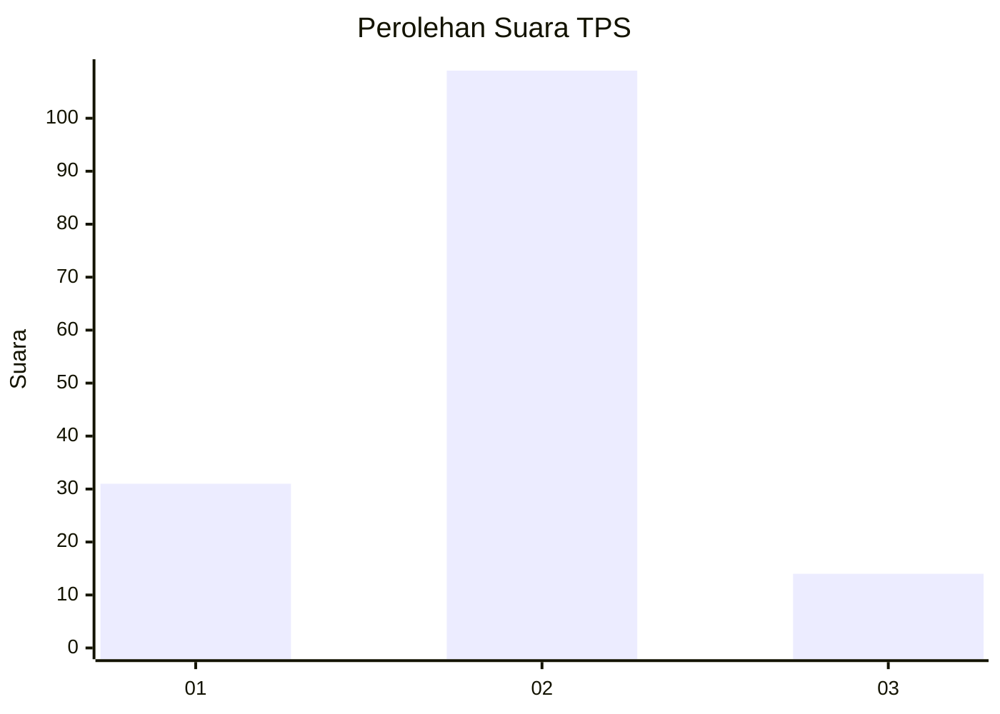

# Hasil

## Grafik

## Tabel

| No. | Nama Paslon    | Suara | Suara (raw) | Persentase |
|:--- |:-------------- | -----:| -----------:| ----------:|
| 1   | ANIES MUHAIMIN | 31    | [31][p-1]   | 20,13      |
| 2   | PRABOWO GIBRAN | 109   | [109][p-2]  | 70,78      |
| 3   | GANJAR MAHFUD  | 14    | [14][p-3]   | 9,09       |

[p-1]: https://github.com/gigit-pemilu/pemilu-2024-34-di-yogyakarta/blob/main/pilpres/hitung-suara/sub/34-di-yogyakarta/sub/03-gunungkidul/sub/18-purwosari/sub/2001-giripurwo/sub/006-tps/sub/paslon-1.txt
[p-2]: https://github.com/gigit-pemilu/pemilu-2024-34-di-yogyakarta/blob/main/pilpres/hitung-suara/sub/34-di-yogyakarta/sub/03-gunungkidul/sub/18-purwosari/sub/2001-giripurwo/sub/006-tps/sub/paslon-2.txt
[p-3]: https://github.com/gigit-pemilu/pemilu-2024-34-di-yogyakarta/blob/main/pilpres/hitung-suara/sub/34-di-yogyakarta/sub/03-gunungkidul/sub/18-purwosari/sub/2001-giripurwo/sub/006-tps/sub/paslon-3.txt

## Foto C Plano

https://sirekap-obj-formc.kpu.go.id/b4eb/pemilu/ppwp/34/03/18/20/01/3403182001006-20240217-170831--409ec1f4-230a-49c7-81fd-43e7777adcf8.jpg

https://sirekap-obj-formc.kpu.go.id/b4eb/pemilu/ppwp/34/03/18/20/01/3403182001006-20240217-170832--82d08c0c-79d2-4054-8166-5a17a89f911b.jpg

https://sirekap-obj-formc.kpu.go.id/b4eb/pemilu/ppwp/34/03/18/20/01/3403182001006-20240217-170832--8d25e5ec-2317-4ce0-abf2-b8667853d02b.jpg

## Metadata

| Key        | Value               |
| ---------- | ------------------- |
| Time Stamp | 2024-02-21 17:00:00 |

## DATA PEMILIH TETAP

Jumlah pemilih dalam DPT: **72**.
 * L: **78**.
 * P: **94**.

## DATA PENGGUNA HAK PILIH

Jumlah pengguna hak pilih dalam DPT: **155**.
 * L: **73**.
 * P: **82**.

Jumlah pengguna hak pilih dalam DPTb: **3**.
 * L: **3**.
 * P: **0**.

Jumlah pengguna hak pilih dalam DPK: **1**.
 * L: **1**.
 * P: **0**.

Jumlah pengguna hak pilih: **159**.
 * L: **77**.
 * P: **82**.

## JUMLAH SUARA SAH DAN TIDAK SAH

JUMLAH SELURUH SUARA SAH: **154**.

JUMLAH SUARA TIDAK SAH: **5**.

JUMLAH SELURUH SUARA SAH DAN SUARA TIDAK SAH: **159**.

