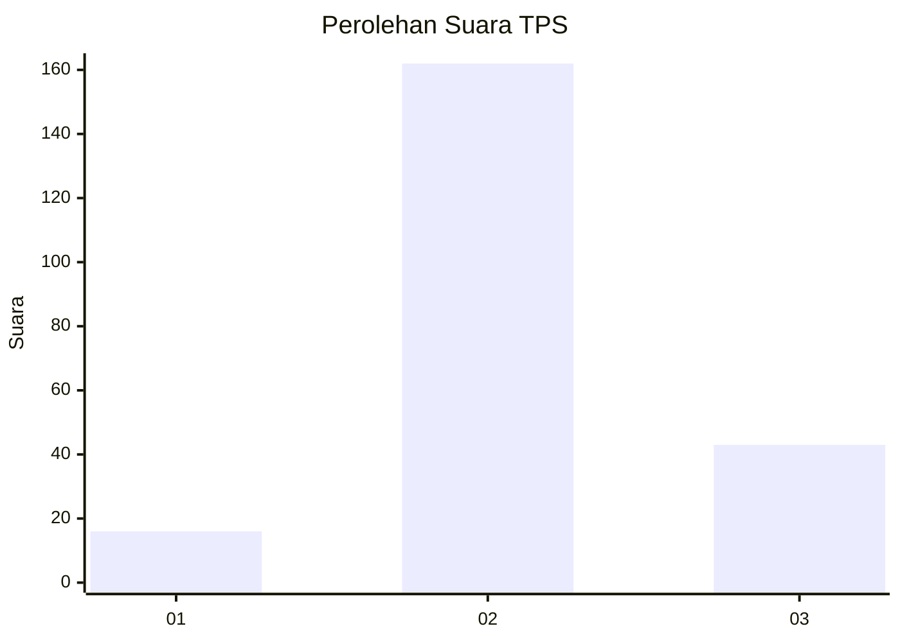
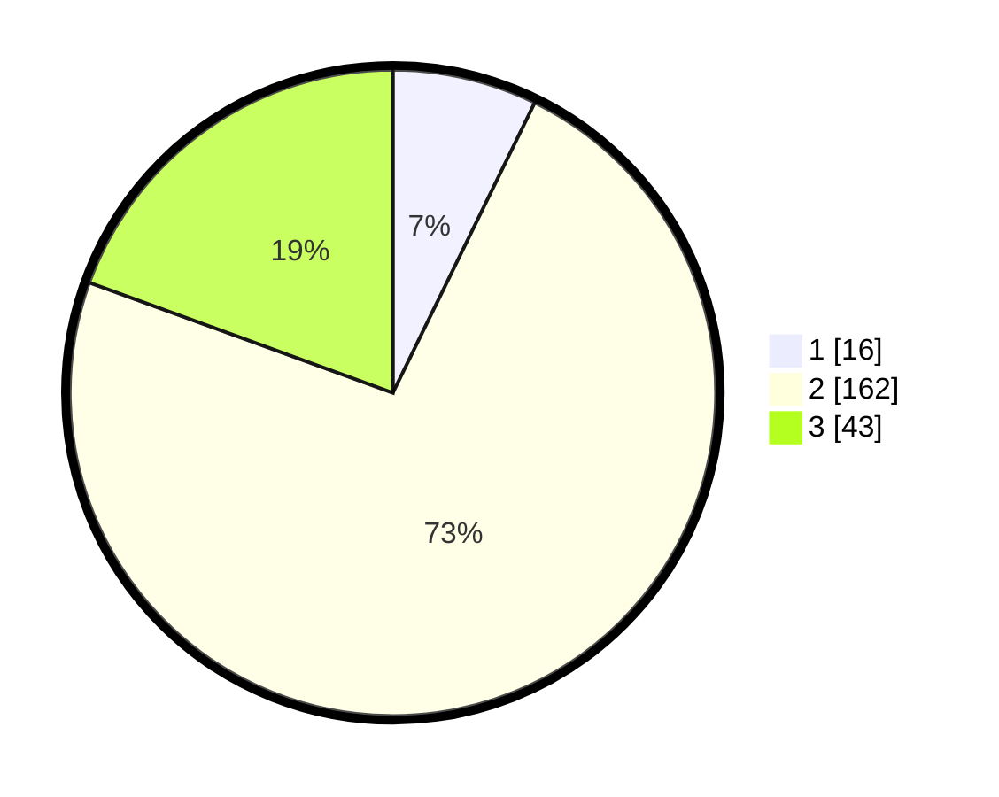

# Hasil

## Grafik

## Tabel

| No. | Nama Paslon    | Suara | Suara (raw) | Persentase |
|:--- |:-------------- | -----:| -----------:| ----------:|
| 1   | ANIES MUHAIMIN | 16    | [16][p-1]   | 7,24       |
| 2   | PRABOWO GIBRAN | 162   | [162][p-2]  | 73,30      |
| 3   | GANJAR MAHFUD  | 43    | [43][p-3]   | 19,46      |

[p-1]: https://github.com/gigit-pemilu/pemilu-2024-34-di-yogyakarta/blob/main/pilpres/hitung-suara/sub/34-di-yogyakarta/sub/03-gunungkidul/sub/18-purwosari/sub/2002-giricahyo/sub/005-tps/sub/paslon-1.txt
[p-2]: https://github.com/gigit-pemilu/pemilu-2024-34-di-yogyakarta/blob/main/pilpres/hitung-suara/sub/34-di-yogyakarta/sub/03-gunungkidul/sub/18-purwosari/sub/2002-giricahyo/sub/005-tps/sub/paslon-2.txt
[p-3]: https://github.com/gigit-pemilu/pemilu-2024-34-di-yogyakarta/blob/main/pilpres/hitung-suara/sub/34-di-yogyakarta/sub/03-gunungkidul/sub/18-purwosari/sub/2002-giricahyo/sub/005-tps/sub/paslon-3.txt

## Foto C Plano

https://sirekap-obj-formc.kpu.go.id/cdf9/pemilu/ppwp/34/03/18/20/02/3403182002005-20240215-015624--b66b3e4e-1d2f-4164-a88f-109c9019369e.jpg

https://sirekap-obj-formc.kpu.go.id/cdf9/pemilu/ppwp/34/03/18/20/02/3403182002005-20240215-015645--e15b556c-5800-4a00-8aec-2fdb22ee1c64.jpg

https://sirekap-obj-formc.kpu.go.id/cdf9/pemilu/ppwp/34/03/18/20/02/3403182002005-20240215-015635--4510d6fa-b100-4352-ac04-c97cf091b998.jpg

## Metadata

| Key        | Value               |
| ---------- | ------------------- |
| Time Stamp | 2024-02-15 15:00:29 |

## DATA PEMILIH TETAP

Jumlah pemilih dalam DPT: **279**.
 * L: **135**.
 * P: **144**.

## DATA PENGGUNA HAK PILIH

Jumlah pengguna hak pilih dalam DPT: **240**.
 * L: **116**.
 * P: **124**.

Jumlah pengguna hak pilih dalam DPTb: **4**.
 * L: **3**.
 * P: **1**.

Jumlah pengguna hak pilih dalam DPK: **4**.
 * L: **2**.
 * P: **2**.

Jumlah pengguna hak pilih: **248**.
 * L: **121**.
 * P: **127**.

## JUMLAH SUARA SAH DAN TIDAK SAH

JUMLAH SELURUH SUARA SAH: **221**.

JUMLAH SUARA TIDAK SAH: **27**.

JUMLAH SELURUH SUARA SAH DAN SUARA TIDAK SAH: **248**.

