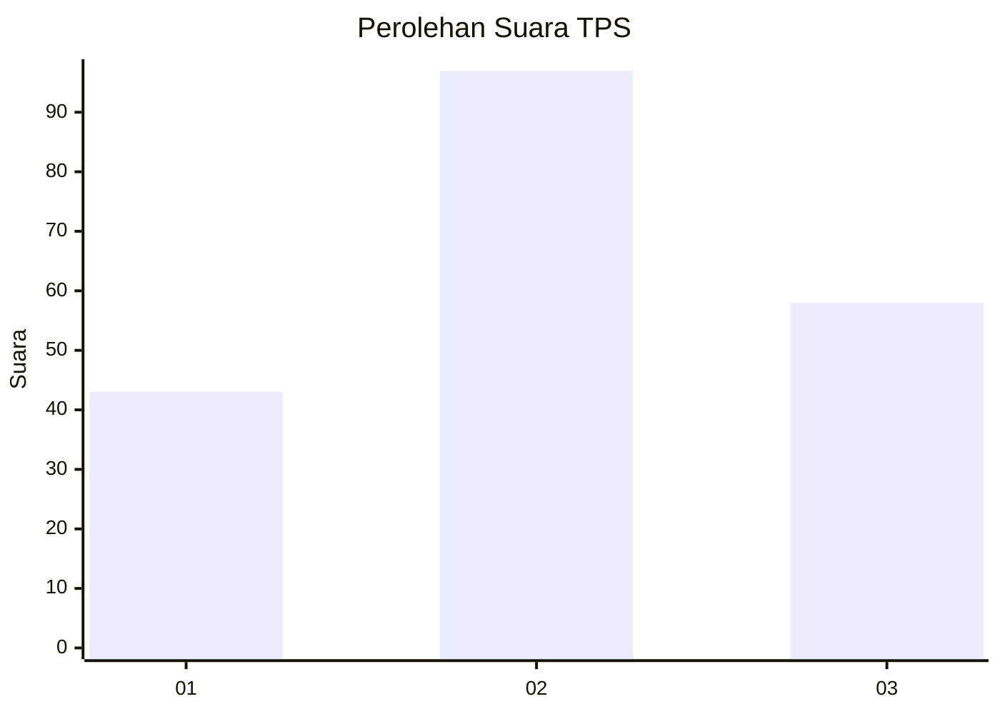
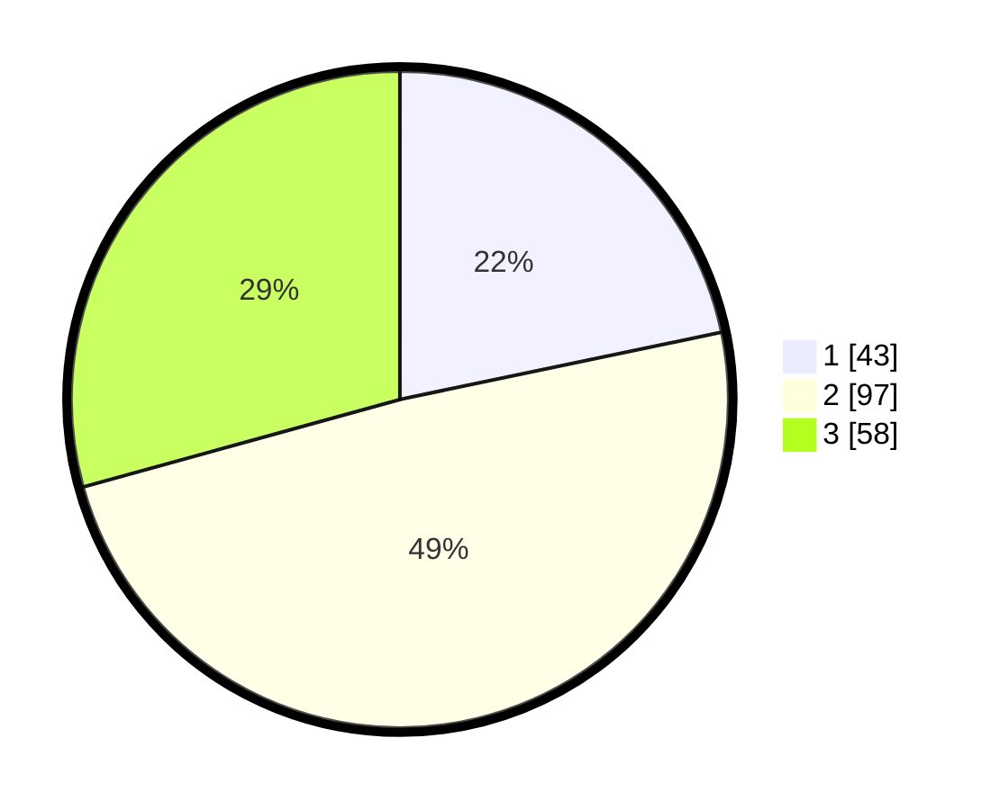

# Hasil

## Grafik

## Tabel

| No. | Nama Paslon    | Suara | Suara (raw) | Persentase |
|:--- |:-------------- | -----:| -----------:| ----------:|
| 1   | ANIES MUHAIMIN | 43    | [43][p-1]   | 21,72      |
| 2   | PRABOWO GIBRAN | 97    | [97][p-2]   | 48,99      |
| 3   | GANJAR MAHFUD  | 58    | [58][p-3]   | 29,29      |

[p-1]: https://github.com/gigit-pemilu/pemilu-2024-34-di-yogyakarta/blob/main/pilpres/hitung-suara/sub/34-di-yogyakarta/sub/04-sleman/sub/01-gamping/sub/2001-balecatur/sub/001-tps/sub/paslon-1.txt
[p-2]: https://github.com/gigit-pemilu/pemilu-2024-34-di-yogyakarta/blob/main/pilpres/hitung-suara/sub/34-di-yogyakarta/sub/04-sleman/sub/01-gamping/sub/2001-balecatur/sub/001-tps/sub/paslon-2.txt
[p-3]: https://github.com/gigit-pemilu/pemilu-2024-34-di-yogyakarta/blob/main/pilpres/hitung-suara/sub/34-di-yogyakarta/sub/04-sleman/sub/01-gamping/sub/2001-balecatur/sub/001-tps/sub/paslon-3.txt

## Foto C Plano

https://sirekap-obj-formc.kpu.go.id/3121/pemilu/ppwp/34/04/01/20/01/3404012001001-20240214-230705--324a1c00-7905-4395-ae92-03f9b4da67fc.jpg

https://sirekap-obj-formc.kpu.go.id/3121/pemilu/ppwp/34/04/01/20/01/3404012001001-20240215-044819--de1270e3-b09f-44d2-b104-0bb15f19453a.jpg

https://sirekap-obj-formc.kpu.go.id/3121/pemilu/ppwp/34/04/01/20/01/3404012001001-20240215-044847--62db6c83-72e2-4082-9361-bfdbd0381d1c.jpg

## Metadata

| Key        | Value               |
| ---------- | ------------------- |
| Time Stamp | 2024-02-15 20:00:44 |

