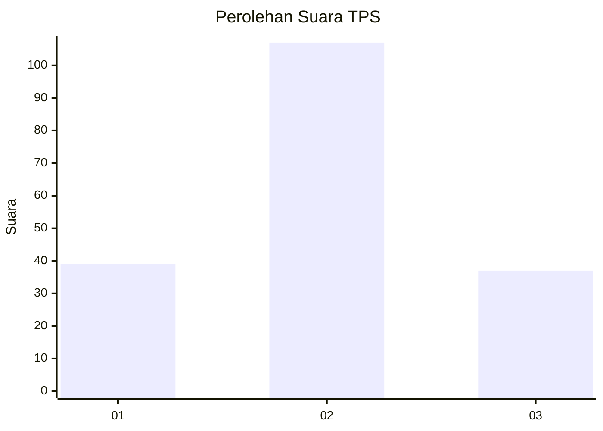
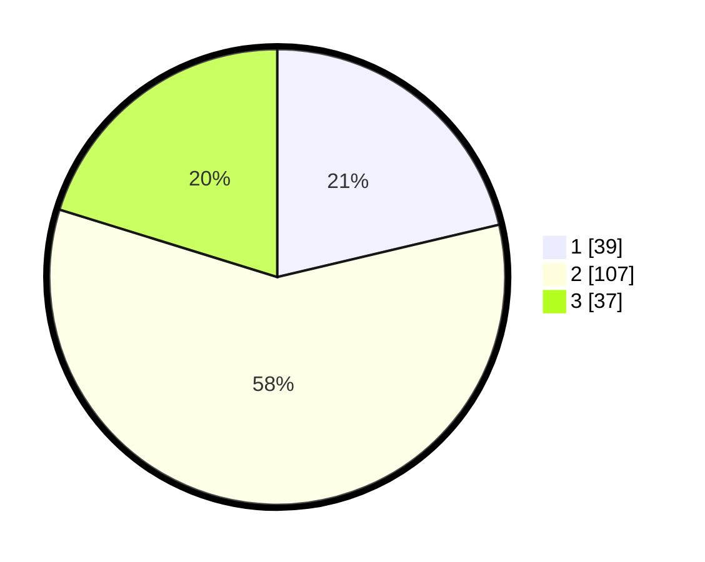

# Hasil

## Grafik

## Tabel

| No. | Nama Paslon    | Suara | Suara (raw) | Persentase |
|:--- |:-------------- | -----:| -----------:| ----------:|
| 1   | ANIES MUHAIMIN | 39    | [39][p-1]   | 21,31      |
| 2   | PRABOWO GIBRAN | 107   | [107][p-2]  | 58,47      |
| 3   | GANJAR MAHFUD  | 37    | [37][p-3]   | 20,22      |

[p-1]: https://github.com/gigit-pemilu/pemilu-2024-34-di-yogyakarta/blob/main/pilpres/hitung-suara/sub/34-di-yogyakarta/sub/04-sleman/sub/01-gamping/sub/2001-balecatur/sub/002-tps/sub/paslon-1.txt
[p-2]: https://github.com/gigit-pemilu/pemilu-2024-34-di-yogyakarta/blob/main/pilpres/hitung-suara/sub/34-di-yogyakarta/sub/04-sleman/sub/01-gamping/sub/2001-balecatur/sub/002-tps/sub/paslon-2.txt
[p-3]: https://github.com/gigit-pemilu/pemilu-2024-34-di-yogyakarta/blob/main/pilpres/hitung-suara/sub/34-di-yogyakarta/sub/04-sleman/sub/01-gamping/sub/2001-balecatur/sub/002-tps/sub/paslon-3.txt

## Foto C Plano

https://sirekap-obj-formc.kpu.go.id/6abf/pemilu/ppwp/34/04/01/20/01/3404012001002-20240215-004631--ae48c5fe-58a7-402f-bc2b-d34c67cf2339.jpg

https://sirekap-obj-formc.kpu.go.id/6abf/pemilu/ppwp/34/04/01/20/01/3404012001002-20240215-004639--865bb29e-58ee-44de-977f-74adc4b01cde.jpg

https://sirekap-obj-formc.kpu.go.id/6abf/pemilu/ppwp/34/04/01/20/01/3404012001002-20240215-004646--2e6ac50f-5f1e-4472-8dae-3ff79f5a86db.jpg

## Metadata

| Key        | Value               |
| ---------- | ------------------- |
| Time Stamp | 2024-02-15 12:00:28 |

