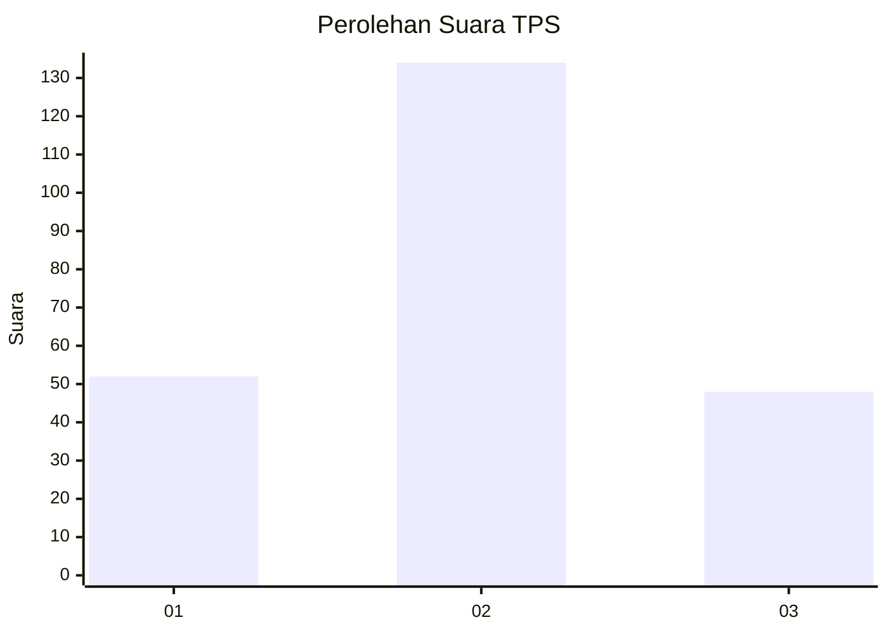
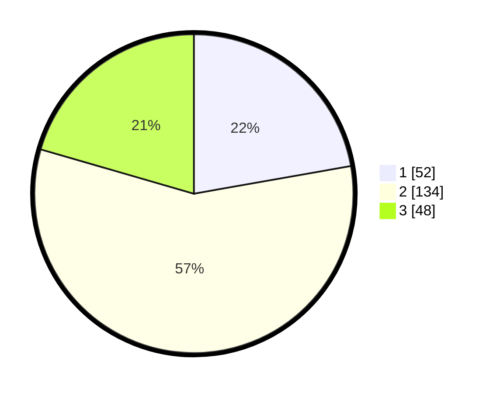

# Hasil

## Grafik

## Tabel

| No. | Nama Paslon    | Suara | Suara (raw) | Persentase |
|:--- |:-------------- | -----:| -----------:| ----------:|
| 1   | ANIES MUHAIMIN | 52    | [52][p-1]   | 22,22      |
| 2   | PRABOWO GIBRAN | 134   | [134][p-2]  | 57,26      |
| 3   | GANJAR MAHFUD  | 48    | [48][p-3]   | 20,51      |

[p-1]: https://github.com/gigit-pemilu/pemilu-2024-34-di-yogyakarta/blob/main/pilpres/hitung-suara/sub/34-di-yogyakarta/sub/04-sleman/sub/01-gamping/sub/2001-balecatur/sub/003-tps/sub/paslon-1.txt
[p-2]: https://github.com/gigit-pemilu/pemilu-2024-34-di-yogyakarta/blob/main/pilpres/hitung-suara/sub/34-di-yogyakarta/sub/04-sleman/sub/01-gamping/sub/2001-balecatur/sub/003-tps/sub/paslon-2.txt
[p-3]: https://github.com/gigit-pemilu/pemilu-2024-34-di-yogyakarta/blob/main/pilpres/hitung-suara/sub/34-di-yogyakarta/sub/04-sleman/sub/01-gamping/sub/2001-balecatur/sub/003-tps/sub/paslon-3.txt

## Foto C Plano

https://sirekap-obj-formc.kpu.go.id/8b5c/pemilu/ppwp/34/04/01/20/01/3404012001003-20240214-232210--af11c0eb-ae86-4a3a-8eee-b4e2db320e0c.jpg

https://sirekap-obj-formc.kpu.go.id/8b5c/pemilu/ppwp/34/04/01/20/01/3404012001003-20240214-214101--c2014d0d-385f-46c4-ab6b-d6db2a7e0af2.jpg

https://sirekap-obj-formc.kpu.go.id/8b5c/pemilu/ppwp/34/04/01/20/01/3404012001003-20240214-232425--c490ae97-9b4d-4c43-85ed-764c30b4a904.jpg

## Metadata

| Key        | Value               |
| ---------- | ------------------- |
| Time Stamp | 2024-02-15 20:30:46 |

