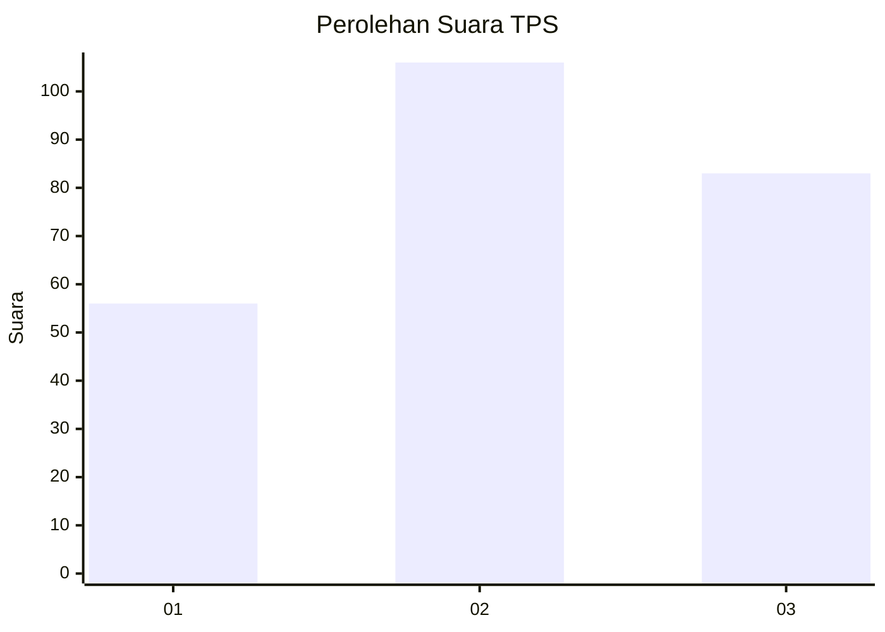
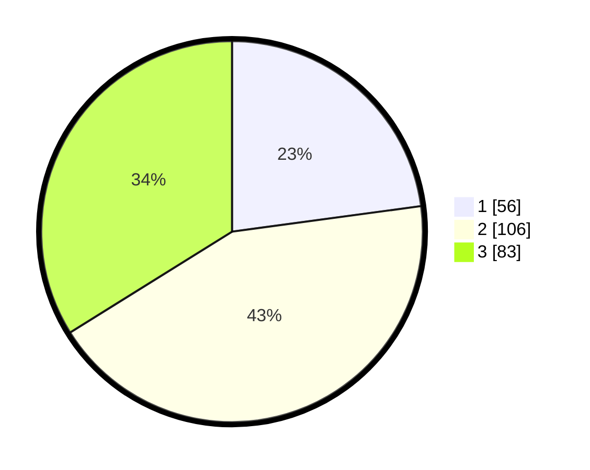

# Hasil

## Grafik

## Tabel

| No. | Nama Paslon    | Suara | Suara (raw) | Persentase |
|:--- |:-------------- | -----:| -----------:| ----------:|
| 1   | ANIES MUHAIMIN | 56    | [56][p-1]   | 22,86      |
| 2   | PRABOWO GIBRAN | 106   | [106][p-2]  | 43,27      |
| 3   | GANJAR MAHFUD  | 83    | [83][p-3]   | 33,88      |

[p-1]: https://github.com/gigit-pemilu/pemilu-2024-34-di-yogyakarta/blob/main/pilpres/hitung-suara/sub/34-di-yogyakarta/sub/04-sleman/sub/01-gamping/sub/2001-balecatur/sub/004-tps/sub/paslon-1.txt
[p-2]: https://github.com/gigit-pemilu/pemilu-2024-34-di-yogyakarta/blob/main/pilpres/hitung-suara/sub/34-di-yogyakarta/sub/04-sleman/sub/01-gamping/sub/2001-balecatur/sub/004-tps/sub/paslon-2.txt
[p-3]: https://github.com/gigit-pemilu/pemilu-2024-34-di-yogyakarta/blob/main/pilpres/hitung-suara/sub/34-di-yogyakarta/sub/04-sleman/sub/01-gamping/sub/2001-balecatur/sub/004-tps/sub/paslon-3.txt

## Foto C Plano

https://sirekap-obj-formc.kpu.go.id/05d0/pemilu/ppwp/34/04/01/20/01/3404012001004-20240214-205157--484bdb88-a5fa-46ef-95f1-10b4bab2988e.jpg

https://sirekap-obj-formc.kpu.go.id/05d0/pemilu/ppwp/34/04/01/20/01/3404012001004-20240214-205739--7e9b3cf9-7831-456f-ac36-2c7b41154052.jpg

https://sirekap-obj-formc.kpu.go.id/05d0/pemilu/ppwp/34/04/01/20/01/3404012001004-20240214-213713--4bd16ec6-c635-4a57-b7c0-75c0daf89e4e.jpg

## Metadata

| Key        | Value               |
| ---------- | ------------------- |
| Time Stamp | 2024-02-15 20:30:46 |

## DATA PEMILIH TETAP

Jumlah pemilih dalam DPT: **266**.
 * L: **132**.
 * P: **134**.

## DATA PENGGUNA HAK PILIH

Jumlah pengguna hak pilih dalam DPT: **241**.
 * L: **124**.
 * P: **117**.

Jumlah pengguna hak pilih dalam DPTb: **6**.
 * L: **0**.
 * P: **6**.

Jumlah pengguna hak pilih dalam DPK: **1**.
 * L: **1**.
 * P: **0**.

Jumlah pengguna hak pilih: **248**.
 * L: **125**.
 * P: **123**.

## JUMLAH SUARA SAH DAN TIDAK SAH

JUMLAH SELURUH SUARA SAH: **245**.

JUMLAH SUARA TIDAK SAH: **3**.

JUMLAH SELURUH SUARA SAH DAN SUARA TIDAK SAH: **248**.

