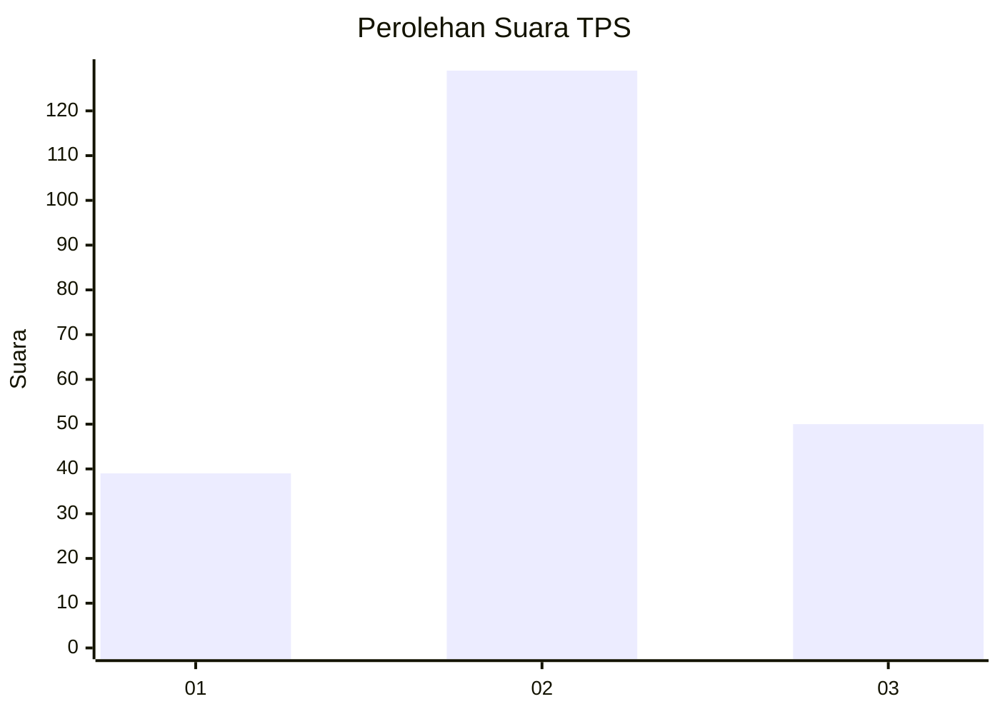
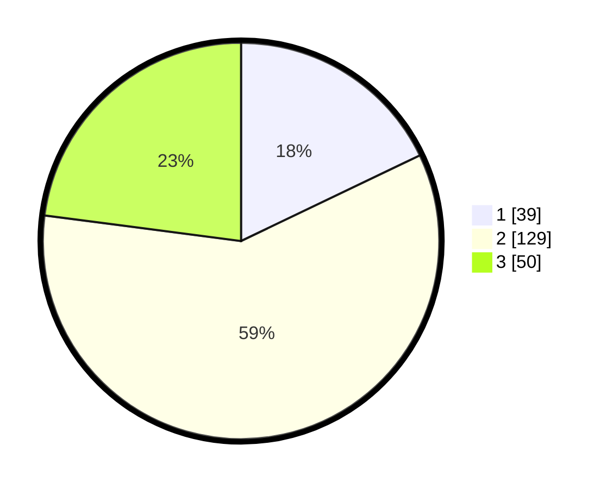

# Hasil

## Grafik

## Tabel

| No. | Nama Paslon    | Suara | Suara (raw) | Persentase |
|:--- |:-------------- | -----:| -----------:| ----------:|
| 1   | ANIES MUHAIMIN | 39    | [39][p-1]   | 17,89      |
| 2   | PRABOWO GIBRAN | 129   | [129][p-2]  | 59,17      |
| 3   | GANJAR MAHFUD  | 50    | [50][p-3]   | 22,94      |

[p-1]: https://github.com/gigit-pemilu/pemilu-2024-34-di-yogyakarta/blob/main/pilpres/hitung-suara/sub/34-di-yogyakarta/sub/04-sleman/sub/01-gamping/sub/2001-balecatur/sub/006-tps/sub/paslon-1.txt
[p-2]: https://github.com/gigit-pemilu/pemilu-2024-34-di-yogyakarta/blob/main/pilpres/hitung-suara/sub/34-di-yogyakarta/sub/04-sleman/sub/01-gamping/sub/2001-balecatur/sub/006-tps/sub/paslon-2.txt
[p-3]: https://github.com/gigit-pemilu/pemilu-2024-34-di-yogyakarta/blob/main/pilpres/hitung-suara/sub/34-di-yogyakarta/sub/04-sleman/sub/01-gamping/sub/2001-balecatur/sub/006-tps/sub/paslon-3.txt

## Foto C Plano

https://sirekap-obj-formc.kpu.go.id/40f4/pemilu/ppwp/34/04/01/20/01/3404012001006-20240215-050640--c58332d2-4ed3-4955-ba22-2a8940eb430f.jpg

https://sirekap-obj-formc.kpu.go.id/40f4/pemilu/ppwp/34/04/01/20/01/3404012001006-20240215-051005--d6976882-8e68-42c3-a6f8-6b0b47c6b72d.jpg

https://sirekap-obj-formc.kpu.go.id/40f4/pemilu/ppwp/34/04/01/20/01/3404012001006-20240215-051054--eb1a7160-1977-4780-8931-9d7e599bd886.jpg

## Metadata

| Key        | Value               |
| ---------- | ------------------- |
| Time Stamp | 2024-02-15 15:00:29 |

## DATA PEMILIH TETAP

Jumlah pemilih dalam DPT: **238**.
 * L: **113**.
 * P: **125**.

## DATA PENGGUNA HAK PILIH

Jumlah pengguna hak pilih dalam DPT: **214**.
 * L: **100**.
 * P: **114**.

Jumlah pengguna hak pilih dalam DPTb: **5**.
 * L: **1**.
 * P: **4**.

Jumlah pengguna hak pilih dalam DPK: **3**.
 * L: **1**.
 * P: **2**.

Jumlah pengguna hak pilih: **222**.
 * L: **102**.
 * P: **120**.

## JUMLAH SUARA SAH DAN TIDAK SAH

JUMLAH SELURUH SUARA SAH: **218**.

JUMLAH SUARA TIDAK SAH: **4**.

JUMLAH SELURUH SUARA SAH DAN SUARA TIDAK SAH: **222**.

