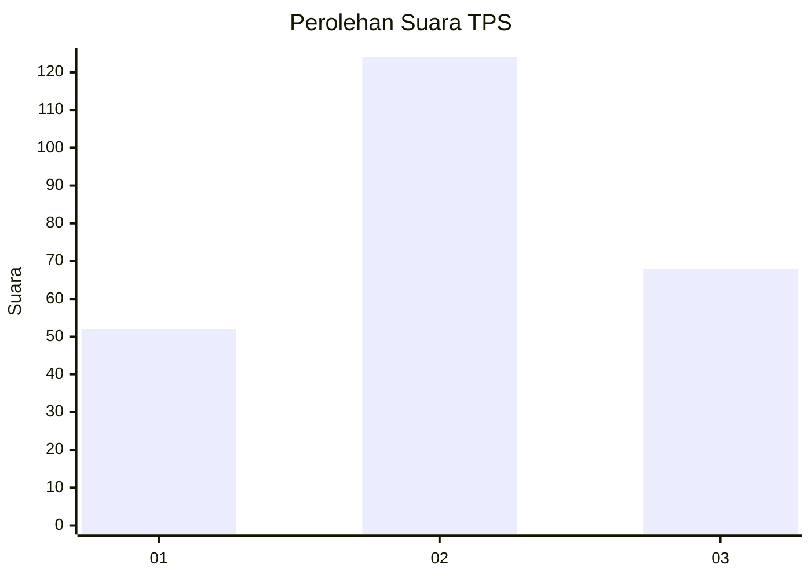
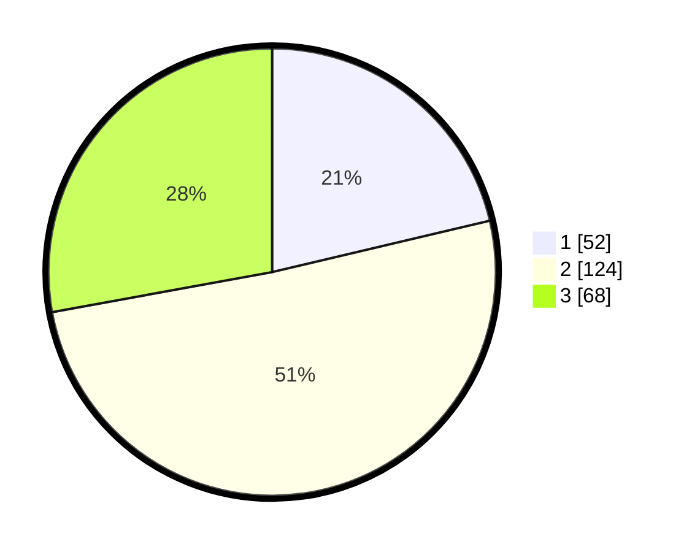

# Hasil

## Grafik

## Tabel

| No. | Nama Paslon    | Suara | Suara (raw) | Persentase |
|:--- |:-------------- | -----:| -----------:| ----------:|
| 1   | ANIES MUHAIMIN | 52    | [52][p-1]   | 21,31      |
| 2   | PRABOWO GIBRAN | 124   | [124][p-2]  | 50,82      |
| 3   | GANJAR MAHFUD  | 68    | [68][p-3]   | 27,87      |

[p-1]: https://github.com/gigit-pemilu/pemilu-2024-34-di-yogyakarta/blob/main/pilpres/hitung-suara/sub/34-di-yogyakarta/sub/04-sleman/sub/01-gamping/sub/2001-balecatur/sub/008-tps/sub/paslon-1.txt
[p-2]: https://github.com/gigit-pemilu/pemilu-2024-34-di-yogyakarta/blob/main/pilpres/hitung-suara/sub/34-di-yogyakarta/sub/04-sleman/sub/01-gamping/sub/2001-balecatur/sub/008-tps/sub/paslon-2.txt
[p-3]: https://github.com/gigit-pemilu/pemilu-2024-34-di-yogyakarta/blob/main/pilpres/hitung-suara/sub/34-di-yogyakarta/sub/04-sleman/sub/01-gamping/sub/2001-balecatur/sub/008-tps/sub/paslon-3.txt

## Foto C Plano

https://sirekap-obj-formc.kpu.go.id/c290/pemilu/ppwp/34/04/01/20/01/3404012001008-20240215-032731--f4d19d21-c352-472a-a1e9-c4fb84836225.jpg

https://sirekap-obj-formc.kpu.go.id/c290/pemilu/ppwp/34/04/01/20/01/3404012001008-20240215-032655--01d24099-ca6d-4e28-99b7-19328f70bf64.jpg

https://sirekap-obj-formc.kpu.go.id/c290/pemilu/ppwp/34/04/01/20/01/3404012001008-20240215-070118--feed57e1-86f2-4a9a-b867-192816b175b3.jpg

## Metadata

| Key        | Value               |
| ---------- | ------------------- |
| Time Stamp | 2024-02-15 17:30:25 |

