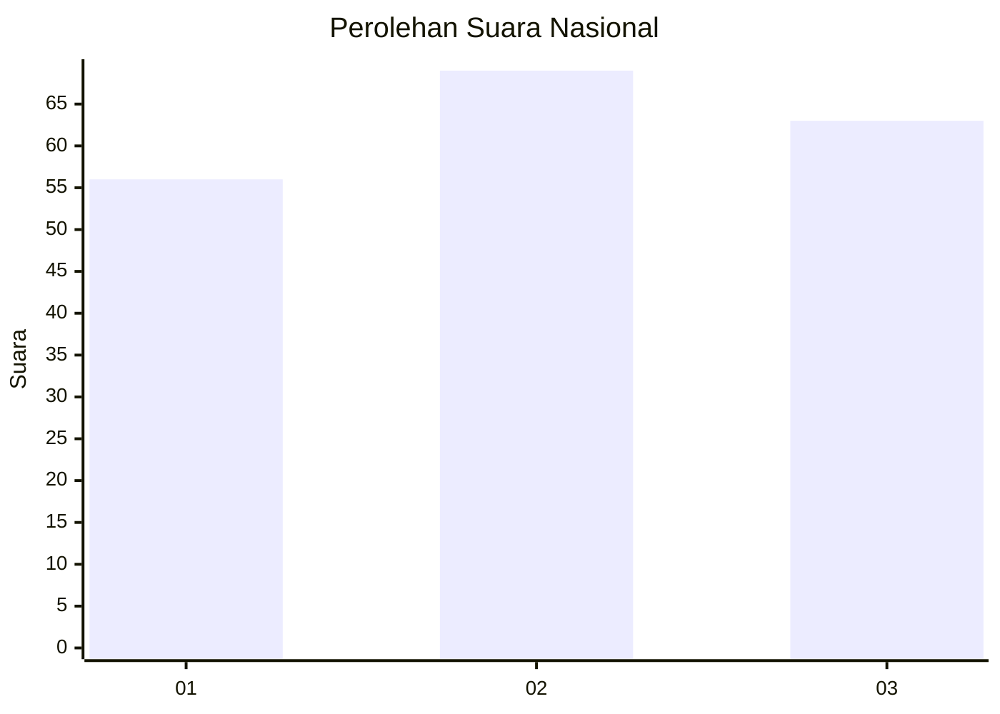
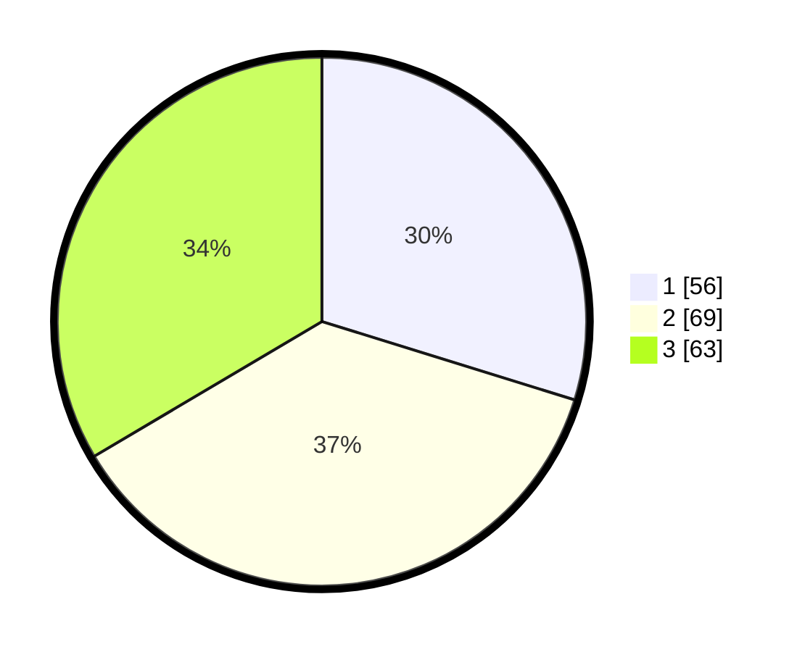

# Hasil

## Grafik

## Tabel

| No. | Nama Paslon    | Suara | Suara (raw) | Persentase |
|:--- |:-------------- | -----:| -----------:| ----------:|
| 1   | ANIES MUHAIMIN | 56    | [56][p-1]   | 29,79      |
| 2   | PRABOWO GIBRAN | 69    | [69][p-2]   | 36,70      |
| 3   | GANJAR MAHFUD  | 63    | [63][p-3]   | 33,51      |

[p-1]: https://github.com/gigit-pemilu/pemilu-2024/blob/main/pilpres/hitung-suara/sub/34-di-yogyakarta/sub/04-sleman/sub/01-gamping/sub/2001-balecatur/sub/011-tps/sub/paslon-1.txt
[p-2]: https://github.com/gigit-pemilu/pemilu-2024/blob/main/pilpres/hitung-suara/sub/34-di-yogyakarta/sub/04-sleman/sub/01-gamping/sub/2001-balecatur/sub/011-tps/sub/paslon-2.txt
[p-3]: https://github.com/gigit-pemilu/pemilu-2024/blob/main/pilpres/hitung-suara/sub/34-di-yogyakarta/sub/04-sleman/sub/01-gamping/sub/2001-balecatur/sub/011-tps/sub/paslon-3.txt

## Foto C Plano

https://sirekap-obj-formc.kpu.go.id/0738/pemilu/ppwp/34/04/01/20/01/3404012001011-20240214-215739--3211812a-5fab-4562-881a-ac696f33348c.jpg

https://sirekap-obj-formc.kpu.go.id/0738/pemilu/ppwp/34/04/01/20/01/3404012001011-20240215-021900--c1ff0957-7030-432e-bc7b-bf66f740d574.jpg

https://sirekap-obj-formc.kpu.go.id/0738/pemilu/ppwp/34/04/01/20/01/3404012001011-20240214-215937--6562f5b9-f292-4735-a890-9f0fed4cb644.jpg

## Metadata

| Key        | Value               |
| ---------- | ------------------- |
| Time Stamp | 2024-02-15 12:00:28 |

