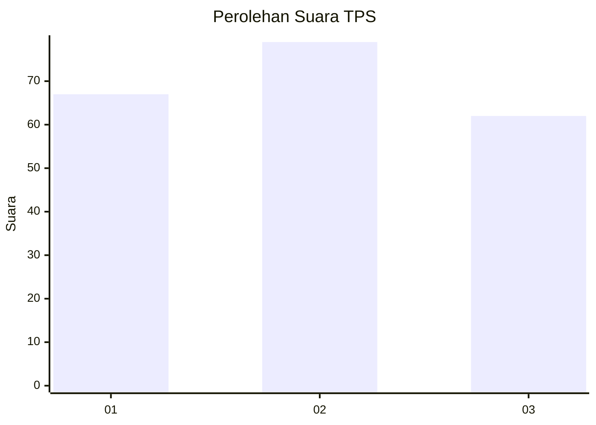
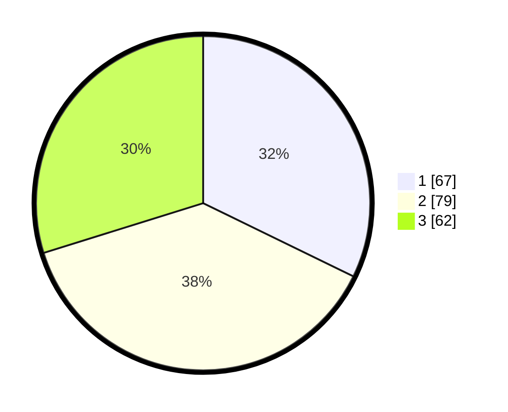

# Hasil

## Grafik

## Tabel

| No. | Nama Paslon    | Suara | Suara (raw) | Persentase |
|:--- |:-------------- | -----:| -----------:| ----------:|
| 1   | ANIES MUHAIMIN | 67    | [67][p-1]   | 32,21      |
| 2   | PRABOWO GIBRAN | 79    | [79][p-2]   | 37,98      |
| 3   | GANJAR MAHFUD  | 62    | [62][p-3]   | 29,81      |

[p-1]: https://github.com/gigit-pemilu/pemilu-2024-34-di-yogyakarta/blob/main/pilpres/hitung-suara/sub/34-di-yogyakarta/sub/04-sleman/sub/01-gamping/sub/2001-balecatur/sub/013-tps/sub/paslon-1.txt
[p-2]: https://github.com/gigit-pemilu/pemilu-2024-34-di-yogyakarta/blob/main/pilpres/hitung-suara/sub/34-di-yogyakarta/sub/04-sleman/sub/01-gamping/sub/2001-balecatur/sub/013-tps/sub/paslon-2.txt
[p-3]: https://github.com/gigit-pemilu/pemilu-2024-34-di-yogyakarta/blob/main/pilpres/hitung-suara/sub/34-di-yogyakarta/sub/04-sleman/sub/01-gamping/sub/2001-balecatur/sub/013-tps/sub/paslon-3.txt

## Foto C Plano

https://sirekap-obj-formc.kpu.go.id/98e0/pemilu/ppwp/34/04/01/20/01/3404012001013-20240214-234947--e6fa13fe-5d86-4e90-8030-0fa90f63f810.jpg

https://sirekap-obj-formc.kpu.go.id/98e0/pemilu/ppwp/34/04/01/20/01/3404012001013-20240214-235332--74156821-8962-4fda-b6dc-58027ffaf676.jpg

https://sirekap-obj-formc.kpu.go.id/98e0/pemilu/ppwp/34/04/01/20/01/3404012001013-20240214-235415--7d8b909e-6732-4628-a500-e0776dc76da3.jpg

## Metadata

| Key        | Value               |
| ---------- | ------------------- |
| Time Stamp | 2024-02-16 14:30:33 |

