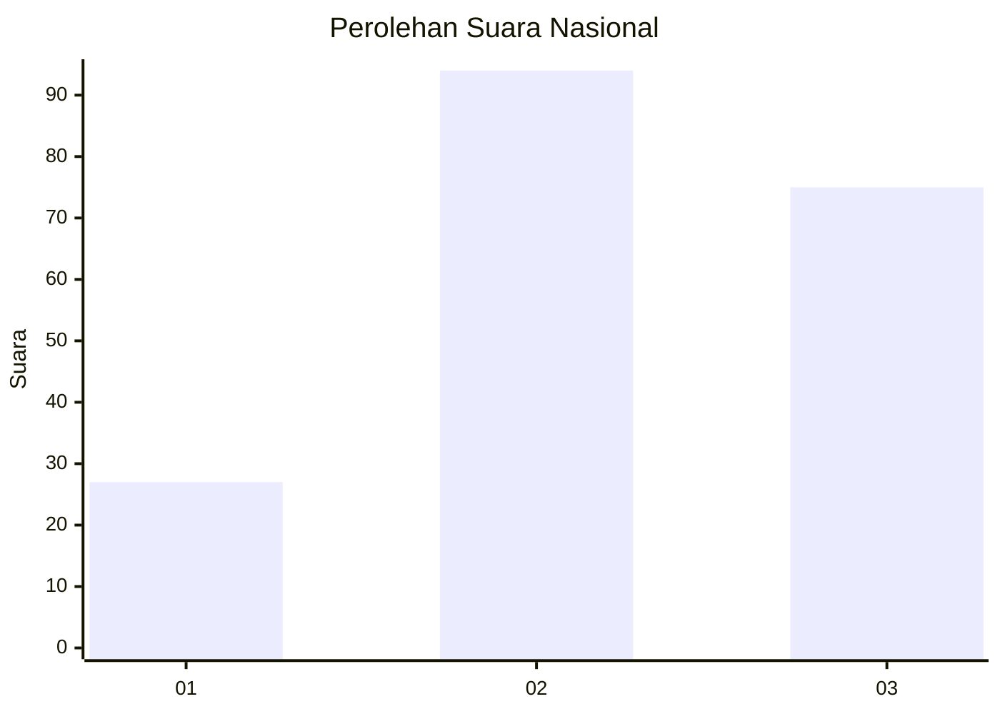
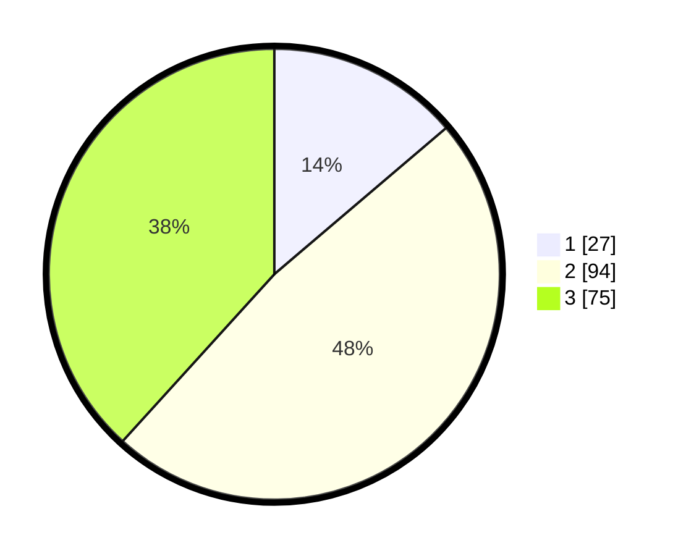

# Hasil

## Grafik

## Tabel

| No. | Nama Paslon    | Suara | Suara (raw) | Persentase |
|:--- |:-------------- | -----:| -----------:| ----------:|
| 1   | ANIES MUHAIMIN | 27    | [27][p-1]   | 13,78      |
| 2   | PRABOWO GIBRAN | 94    | [94][p-2]   | 47,96      |
| 3   | GANJAR MAHFUD  | 75    | [75][p-3]   | 38,27      |

[p-1]: https://github.com/gigit-pemilu/pemilu-2024/blob/main/pilpres/hitung-suara/sub/34-di-yogyakarta/sub/04-sleman/sub/01-gamping/sub/2001-balecatur/sub/016-tps/sub/paslon-1.txt
[p-2]: https://github.com/gigit-pemilu/pemilu-2024/blob/main/pilpres/hitung-suara/sub/34-di-yogyakarta/sub/04-sleman/sub/01-gamping/sub/2001-balecatur/sub/016-tps/sub/paslon-2.txt
[p-3]: https://github.com/gigit-pemilu/pemilu-2024/blob/main/pilpres/hitung-suara/sub/34-di-yogyakarta/sub/04-sleman/sub/01-gamping/sub/2001-balecatur/sub/016-tps/sub/paslon-3.txt

## Foto C Plano

https://sirekap-obj-formc.kpu.go.id/e0a8/pemilu/ppwp/34/04/01/20/01/3404012001016-20240214-222918--fdf3bc7f-5e00-46c7-be53-a72defe300d5.jpg

https://sirekap-obj-formc.kpu.go.id/e0a8/pemilu/ppwp/34/04/01/20/01/3404012001016-20240214-223012--bbcb0e41-ad96-4327-aa7a-0f70cb2aefee.jpg

https://sirekap-obj-formc.kpu.go.id/e0a8/pemilu/ppwp/34/04/01/20/01/3404012001016-20240214-223051--b7be5551-9d16-4314-82da-15efbd28c71f.jpg

## Metadata

| Key        | Value               |
| ---------- | ------------------- |
| Time Stamp | 2024-02-15 15:00:29 |

